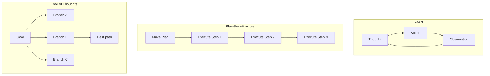

# Agent Planning là gì

## ⚡ Tóm tắt ngắn (30s)
* **Agent Planning** = quá trình agent **quyết định sequence các bước** để hoàn thành goal. Khác với **reactive** (cứ thấy → react), planning là **proactive** (suy nghĩ trước).
* **3 patterns chính**:
  1. **ReAct (Reason + Act)**: cứ Reason → Act → Observe → Reason → ... cho mỗi step. Phản ứng theo từng tình huống.
  2. **Plan-then-Execute**: LLM lập plan trước → execute từng step. Phù hợp task định hình.
  3. **Tree of Thoughts / DAG**: explore nhiều plan paths, vote/score, chọn best.
* **Khi nào dùng planning explicit**:
  * Task multi-step phức tạp (>5 step).
  * Cần cost prediction (plan trước → biết tool cost).
  * Cần human-in-loop (review plan trước execute).
* **Thảm họa thực chiến**: Agent ReAct gọi tool 1 → fail → retry tool 1 → fail → retry... loop 20 lần. Cost $5/request. Senior fix: plan-then-execute + max retry, step limit.

---

## 🔍 Chi tiết patterns

### 1. ReAct (Reasoning + Acting)
Paper: Yao et al. 2022. Pattern dominant cho agent.

```
Thought: Tôi cần biết status của đơn hàng abc-123 trước.
Action: get_order(abc-123)
Observation: status = shipped, customer = alice@x.com

Thought: Bây giờ tôi cần gửi email cho alice.
Action: send_email(alice@x.com, "Đơn đã ship")
Observation: sent = true

Thought: Done. Trả lời user.
Answer: Đã gửi email thông báo.
```

Pros: simple, adapt theo result.
Cons: có thể loop, không cost predictable.

### 2. Plan-then-Execute

```
PLAN:
  Step 1: Get order info for abc-123
  Step 2: If shipped, send email
  Step 3: Notify user

EXECUTE:
  Step 1: get_order(abc-123) → success
  Step 2: shipped=true → send_email
  Step 3: return "Done"
```

Pros: cost predictable, can be reviewed by human.
Cons: ít flexible với surprise.

### 3. Tree of Thoughts (ToT)

Cho complex problem (e.g. math, puzzle):
* Generate multiple thought branches.
* Evaluate each.
* Continue from best.

Đắt nhưng quality cao cho hard tasks.

### 4. Decomposition

Sub-pattern: break complex task into simpler sub-tasks.
```
Task: "Đánh giá tài chính công ty"
  ↓
Sub-task 1: Lấy báo cáo doanh thu.
Sub-task 2: Phân tích chi phí.
Sub-task 3: Tính ratios.
Sub-task 4: Summary.
```

Mỗi sub-task có thể là 1 agent độc lập.

---

## 🎨 Sơ đồ patterns



---

## 💻 Code thực chiến

### 1. ReAct loop (manual)

```python
def react_agent(goal: str, max_steps: int = 10):
    history = []
    for step in range(max_steps):
        # LLM reason + decide action
        thought_action = llm.chat(SYSTEM, f"Goal: {goal}\nHistory:\n{history}")
        
        if "FINAL_ANSWER" in thought_action:
            return extract_answer(thought_action)
        
        action, args = parse_action(thought_action)
        result = execute_tool(action, args)
        history.append({"thought_action": thought_action, "observation": result})
    
    raise RuntimeError("Max steps")
```

### 2. Plan-then-Execute

```python
def plan_execute_agent(goal: str):
    # Phase 1: Plan
    plan = llm.chat("Create step-by-step plan for: " + goal)
    steps = parse_plan(plan)
    
    # (Optional) Human review plan trước execute
    if requires_approval(plan):
        if not human_approves(plan):
            return "Cancelled"
    
    # Phase 2: Execute
    context = {}
    for step in steps:
        result = execute_step(step, context)
        context[step.name] = result
    
    return summarize(context)
```

### 3. Spring AI orchestrator

```java
@Service
public class PlanExecuteAgent {

    private final ChatClient planner;
    private final ChatClient executor;

    public PlanExecuteAgent(ChatClient.Builder b, ToolRegistry tools) {
        this.planner = b.build();
        this.executor = b.defaultTools(tools).build();
    }

    public String run(String goal) {
        // Generate plan
        String planText = planner.prompt()
            .system("Generate step-by-step plan. Each step is one tool call.")
            .user(goal)
            .call().content();

        List<PlanStep> steps = parsePlan(planText);

        // Execute
        Map<String, Object> context = new HashMap<>();
        for (PlanStep step : steps) {
            String result = executor.prompt()
                .user("Step: " + step.description() + "\nContext: " + context)
                .call().content();
            context.put(step.id(), result);
        }

        return summarize(context);
    }

    record PlanStep(String id, String description) {}
    List<PlanStep> parsePlan(String s) { return List.of(); }
    String summarize(Map<String,Object> c) { return ""; }
}
```

---

## 📊 So sánh patterns

| Pattern | Step prediction | Cost | Flexibility | Khi dùng |
| :--- | :---: | :---: | :---: | :--- |
| ReAct | Unpredictable | Trung bình | Cao | Default |
| Plan-then-Execute | Predictable | Trung bình | Trung bình | Approval workflow |
| Tree of Thoughts | Predictable | Cao | Cao | Hard problems |
| Decomposition | Predictable | Trung bình | Cao | Modular tasks |

---

## ⚠️ Gotchas

1. **ReAct loop**: cap step count.
2. **Plan stale**: world thay đổi giữa plan và execute → execute fail → cần re-plan.
3. **Cost prediction sai**: plan có 5 step, execute thực 15 vì retry.

**Interviewer follow-up: "Khi nào ReAct fail, fallback gì?"**
- Detect: same tool failing 2 lần liên tiếp.
- Action: re-plan from scratch hoặc abort + human escalate.
- Logging: trace mọi attempt để debug.
