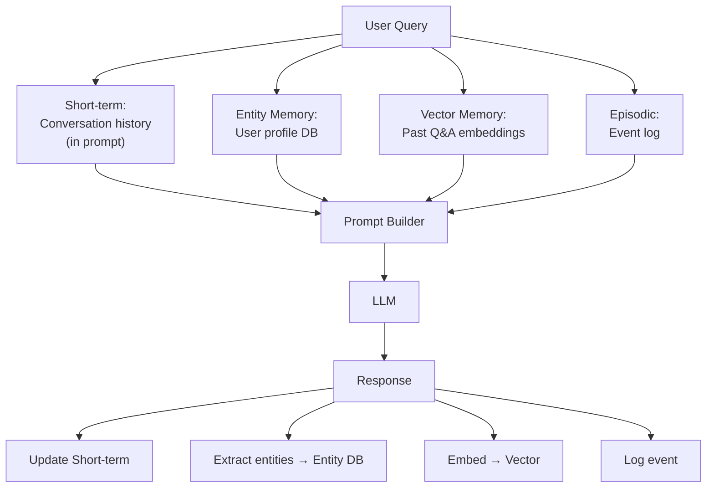

# Agent Memory — Có nên lưu Memory Dài hạn không

## ⚡ Tóm tắt ngắn (30s)
* **Agent memory** chia 2 loại:
  * **Short-term**: trong cùng session (conversation history). Lưu trong prompt hoặc Redis với TTL ngắn.
  * **Long-term**: cross session/user. Lưu fact về user (preferences, past interactions, profile).
* **Câu trả lời câu hỏi**: **CÓ** lưu long-term nhưng phải cẩn thận. Lợi: personalize, không hỏi lặp lại. Hại: privacy, stale info, lock-in cost.
* **Mô hình memory phổ biến**:
  1. **Conversation history** (short): last N turns trong prompt.
  2. **Summary buffer**: summarize old turns, giữ recent raw.
  3. **Entity memory**: extract entities (user prefs, names, dates) → DB lookup.
  4. **Vector memory**: embed past interactions → retrieve relevant.
  5. **Episodic memory**: lưu "events" — what happened khi nào.
* **Thảm họa thực chiến**: Agent có long-term memory không TTL. Lưu "User X thích pizza, ghét cá" 2 năm trước. User đổi taste, agent vẫn recommend pizza → CSAT giảm. Senior fix: TTL + decay + active retrieval (recent > old).

---

## 🔍 Chi tiết các loại memory

### 1. Short-term (session memory)

* Conversation history: array `[{role, content}]` trong prompt.
* Limit ~10-20 turns hoặc 4-8k token.
* Khi vượt → summarize old + giữ recent.

### 2. Summary buffer

```
After 20 turns:
  Old turns (1-15) → summarize → "User asked about Java, Spring Boot, prefers concise answers"
  Recent (16-20) → raw
```

Cost summarize bằng LLM nhỏ.

### 3. Entity memory

Extract structured info:
```json
{
  "user_id": "alice",
  "preferences": {
    "language": "vietnamese",
    "answer_style": "concise",
    "expertise": "senior backend"
  },
  "interactions": [
    {"timestamp": "2026-05-01", "topic": "Spring Boot tuning"}
  ]
}
```

Persist DB, retrieve khi user open session mới.

### 4. Vector memory

Embed previous Q&A pairs → vector DB. Khi user hỏi mới → search past relevant → bơm vào context.

Pros: scale tốt với 1000+ past interactions.
Cons: privacy (embed PII), staleness.

### 5. Episodic memory

Track "events":
- "Alice on 2026-05-01 asked refund for order X."
- "Bob on 2026-05-15 escalated to manager."

Hữu ích cho support agent biết history.

---

## 🎨 Memory architecture



---

## 💻 Code thực chiến

### 1. Short-term + Summary buffer

```java
@Service
public class ConversationMemory {

    private static final int MAX_RAW_TURNS = 10;
    private final ChatClient summarizer;
    private final ReactiveStringRedisTemplate redis;

    public List<Message> getMemory(String sessionId) {
        return loadFromRedis(sessionId);  // [Message] up to N turns + summary
    }

    public void append(String sessionId, Message turn) {
        var memory = loadFromRedis(sessionId);
        memory.add(turn);

        if (memory.size() > MAX_RAW_TURNS + 5) {  // threshold to summarize
            var toSummarize = memory.subList(0, memory.size() - MAX_RAW_TURNS);
            String summary = summarizer.prompt()
                .user("Summarize: " + toSummarize)
                .call().content();
            var newMemory = new ArrayList<Message>();
            newMemory.add(new Message("system", "Prior conversation summary: " + summary));
            newMemory.addAll(memory.subList(memory.size() - MAX_RAW_TURNS, memory.size()));
            saveToRedis(sessionId, newMemory);
        } else {
            saveToRedis(sessionId, memory);
        }
    }

    private List<Message> loadFromRedis(String sid) { return new ArrayList<>(); }
    private void saveToRedis(String sid, List<Message> m) { }
    public record Message(String role, String content) {}
}
```

### 2. Entity memory (DB)

```java
@Service
public class EntityMemoryService {

    private final JdbcTemplate jdbc;
    private final ChatClient extractor;

    public Map<String,Object> getUserProfile(String userId) {
        return jdbc.queryForObject(
            "SELECT preferences FROM user_memory WHERE user_id = ?",
            (rs, n) -> parseJson(rs.getString("preferences")),
            userId);
    }

    public void updateFromConversation(String userId, String conversation) {
        // LLM extract structured updates
        String json = extractor.prompt()
            .system("Extract user preferences as JSON. Only NEW/UPDATED info.")
            .user(conversation)
            .call().content();
        
        // Merge với existing
        var existing = getUserProfile(userId);
        var updates = parseJson(json);
        existing.putAll(updates);
        
        jdbc.update(
            "UPDATE user_memory SET preferences = ?::jsonb, updated_at = NOW() WHERE user_id = ?",
            toJsonString(existing), userId);
    }

    private Map<String,Object> parseJson(String s) { return Map.of(); }
    private String toJsonString(Object o) { return ""; }
}
```

### 3. Vector memory

```python
def retrieve_relevant_memory(user_id: str, current_query: str, k: int = 3):
    """Find past interactions semantically similar."""
    q_emb = embed(current_query)
    
    results = vector_db.search(
        q_emb,
        filter={"user_id": user_id},
        top_k=k
    )
    return [{"q": r.metadata["question"], "a": r.metadata["answer"]} for r in results]

def store_interaction(user_id: str, question: str, answer: str):
    """Store after each turn."""
    emb = embed(f"Q: {question}\nA: {answer}")
    vector_db.upsert({
        "id": str(uuid.uuid4()),
        "vector": emb,
        "metadata": {
            "user_id": user_id,
            "question": question,
            "answer": answer,
            "timestamp": datetime.now().isoformat()
        }
    })
```

---

## 📊 Bảng so sánh memory types

| Type | Latency | Storage | Privacy risk | Khi dùng |
| :--- | :---: | :---: | :---: | :--- |
| Short-term (prompt) | 0ms | Token | Thấp | Mọi chatbot |
| Summary buffer | Compress cost | Token + DB | Thấp | Long chat |
| Entity memory | <50ms | DB nhỏ | Trung bình | Personalization |
| Vector memory | 30-100ms | Vector DB | Cao | Cross-session recall |
| Episodic | <50ms | DB | Trung bình | Audit, support |

---

## ⚠️ Gotchas + Interviewer

### 1. Privacy: lưu PII vào memory
Phải comply GDPR right-to-be-forgotten.

### 2. Stale info
TTL hoặc decay. Recent > old when retrieve.

### 3. Cost
Memory size lớn → prompt dài → cost tăng. Balance.

### Interviewer follow-up: "User yêu cầu xóa memory. Implement thế nào?"
1. **DELETE endpoint**: `/users/{id}/memory`.
2. **Cascade**: delete entity memory, vector embeddings, episodic events.
3. **Audit log**: ai approve, when.
4. **30-day grace** trước hard delete.
5. **Verify**: penetration test "after delete, agent không nhớ".
