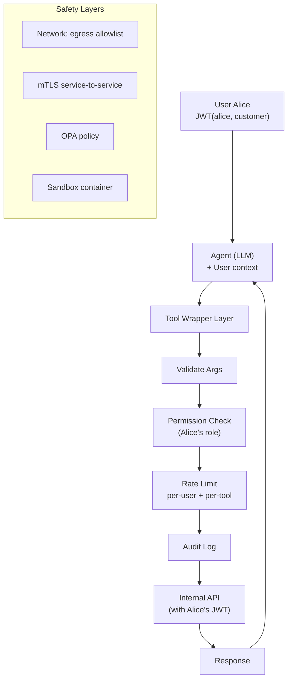

# Agent gọi API Nội bộ Như thế nào cho An toàn

## ⚡ Tóm tắt ngắn (30s)
* **Agent gọi internal API** = nguy cơ lớn nhất nếu không thiết kế đúng: agent có thể bị prompt injection để gọi API nguy hiểm, hoặc agent có quyền vượt thẩm quyền user.
* **6 nguyên tắc Senior**:
  1. **Tool wrapper** chứ không expose raw API: tool có validation, permission check, audit.
  2. **Least privilege**: agent có "service account" với quyền tối thiểu cần thiết.
  3. **User context propagation**: agent action ON BEHALF của user → check user's permission, không agent's.
  4. **Idempotency**: mọi action sensitive có idempotency key.
  5. **Rate limit per agent + per user**.
  6. **Audit log**: mọi tool call có user_id, timestamp, args, result.
* **Thảm họa thực chiến**: Agent có service account quyền admin (dễ implement). Một user prompt-inject "delete all my orders" → agent gọi `deleteOrders(userId=X)` thành công vì admin role. Senior fix: agent dùng user's JWT, mọi tool authorize theo user → admin role không leak.

---

## 🔍 Chi tiết best practices

### 1. Tool wrapper pattern

NEVER expose raw API directly. Always wrap:

```java
@Tool(description = "Get order info for current user only")
public OrderInfo getOrder(String orderId) {
    // 1. Validate input
    if (!isValidUuid(orderId)) throw new IllegalArgumentException();
    
    // 2. Get current user context
    String userId = SecurityContextHolder.getContext().getAuthentication().getName();
    
    // 3. Check permission (user MUST own order)
    if (!orderRepo.existsByIdAndUserId(orderId, userId)) {
        throw new AccessDeniedException("Order not found or not yours");
    }
    
    // 4. Audit log
    auditLog.record(userId, "get_order", Map.of("orderId", orderId));
    
    // 5. Execute
    return orderService.getInfo(orderId);
}
```

### 2. User context propagation

Agent runs **on behalf of** a specific user. Tool calls must check user's permission, NOT agent's service account.

```
[User Alice's JWT]
   ↓
[Agent receives JWT]
   ↓
[Agent calls tool with Alice's user_id]
   ↓
[Tool checks: does Alice have permission for this action?]
   ↓
[Execute or refuse]
```

**Anti-pattern**: agent uses admin service account → bypasses user permission.

### 3. Tool categories by risk

| Category | Examples | Defense |
| :--- | :--- | :--- |
| **Read-only safe** | `getOrder`, `searchFaq` | Normal permission check |
| **Read-only sensitive** | `getCustomerPii` | Strict permission + audit |
| **Write idempotent** | `updateProfile` | Idempotency key |
| **Write non-idempotent** | `sendEmail` | Dedup by content + cooldown |
| **Irreversible** | `deleteAccount`, `refund`, `transfer` | Human-in-loop (NOT agent direct) |

### 4. Service mesh authorization

Internal API call qua service mesh (Istio) có:
* mTLS giữa services.
* AuthN: JWT validation.
* AuthZ: OPA policy ("agent X được gọi API Y on behalf user Z?").

### 5. Sandboxing

* Agent chạy trong container với network egress restrict (chỉ tới allowed APIs).
* Per-tool timeout.
* Resource limit (CPU/memory).

---

## 🎨 Sơ đồ secure agent → API



---

## 💻 Code thực chiến

### 1. User context propagation (Spring)

```java
@Service
public class SecureOrderTools {

    private final OrderService orderService;
    private final AuditService audit;

    @Tool(description = "Get order info for CURRENT USER's order only")
    public OrderInfo getOrder(@ToolParam(description = "Order UUID") String orderId) {
        // Get user from security context (set by JWT filter)
        String userId = SecurityContextHolder.getContext()
            .getAuthentication().getName();

        // Validate input
        if (!orderId.matches("[0-9a-f-]{36}")) {
            throw new IllegalArgumentException("Invalid order_id format");
        }

        // Permission check
        var order = orderService.findByIdAndUserId(orderId, userId)
            .orElseThrow(() -> new AccessDeniedException(
                "Order not found or not owned by current user"));

        // Audit
        audit.record(userId, "get_order", Map.of("orderId", orderId, "result", "success"));

        return order;
    }
}
```

### 2. Tool with idempotency key

```java
@Tool(description = "Cancel order. Requires human approval before execution.")
public CancelResult cancelOrder(String orderId, String idempotencyKey) {
    String userId = currentUserId();

    // Check approval flow
    if (!approvalService.isApproved(idempotencyKey)) {
        return CancelResult.pendingApproval(
            approvalService.createPendingRequest(userId, "cancel_order", orderId));
    }

    // Idempotency check (Redis)
    String cacheKey = "tool:cancel:" + idempotencyKey;
    var cached = redis.opsForValue().get(cacheKey);
    if (cached != null) return CancelResult.fromCache(cached);

    // Execute
    var result = orderService.cancel(orderId, userId);
    redis.opsForValue().set(cacheKey, result.toJson(), Duration.ofMinutes(10));
    audit.record(userId, "cancel_order", Map.of("orderId", orderId));
    return result;
}
```

### 3. Egress network policy (Kubernetes NetworkPolicy)

```yaml
apiVersion: networking.k8s.io/v1
kind: NetworkPolicy
metadata:
  name: agent-egress-allowlist
  namespace: ai-agents
spec:
  podSelector:
    matchLabels:
      app: ai-agent
  policyTypes:
    - Egress
  egress:
    # Allow internal services
    - to:
        - namespaceSelector:
            matchLabels:
              name: api-services
      ports:
        - protocol: TCP
          port: 443
    # Allow LLM provider
    - to:
        - ipBlock:
            cidr: 0.0.0.0/0
            except:
              - 10.0.0.0/8
              - 172.16.0.0/12
              - 192.168.0.0/16
      ports:
        - protocol: TCP
          port: 443
    # Deny everything else implicitly
```

### 4. OPA policy

```rego
# policies/agent_access.rego
package agent.access

default allow = false

# Agent có thể gọi tool nếu user có permission
allow {
    input.tool == "get_order"
    input.user.role == "customer"
    input.user.id == data.orders[input.order_id].owner_id
}

allow {
    input.tool == "send_email"
    input.user.role == "customer"
    # Rate limit: max 10/hour
    count_recent_calls(input.user.id, "send_email", 3600) < 10
}

# Cancel order: BẮT BUỘC human approval
allow {
    input.tool == "cancel_order"
    input.approval_id
    data.approvals[input.approval_id].status == "approved"
}
```

---

## 📊 Bảng risk matrix tool actions

| Action | Risk | Defense |
| :--- | :---: | :--- |
| Read public info | Thấp | Auth + rate limit |
| Read user-owned data | Trung bình | Owner check |
| Read other user PII | Cao | Strict role + audit |
| Update non-sensitive | Trung bình | Idempotency |
| Send notification | Trung bình | Rate limit + dedup |
| Update payment info | Rất cao | Human approval |
| Delete data | Rất cao | Human approval + soft delete |
| Money transfer | Cực cao | Human approval + 2FA + audit |

---

## ⚠️ Gotchas + Interviewer

### 1. Service account quá rộng quyền
**Vấn đề**: Agent dùng admin SA → mọi action thành công bất kể user permission.
**Fix**: SA = empty permission. Tool check theo user JWT.

### 2. SQL injection qua args
**Vấn đề**: LLM sinh args `"id": "1; DROP TABLE"`.
**Fix**: Type validation strict, parametrized SQL.

### 3. Interviewer follow-up: "Agent prompt-inject để gọi tool admin. Defense?"
1. **Least privilege**: agent service account empty quyền.
2. **User context**: tool authorize theo user, không agent.
3. **Sensitive tool**: human-in-loop bắt buộc.
4. **Output classifier**: detect suspicious patterns.
5. **Rate limit**: spam call = trigger anomaly alert.
6. **Sandbox**: container, network policy.
