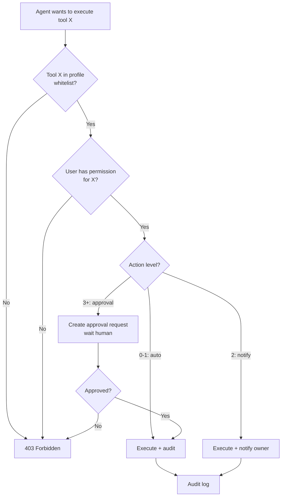

# Giới hạn Quyền của Agent

## ⚡ Tóm tắt ngắn (30s)
* **Principle of Least Privilege** cho agent: chỉ cho phép TỐI THIỂU tools/permissions cần thiết cho task. Mặc định DENY, allow specific.
* **5 cấp giới hạn**:
  1. **Tool selection**: chỉ register tools agent cần. KHÔNG register all available.
  2. **Per-tool permission**: tool check user role, ownership trước execute.
  3. **Resource limit**: rate limit, quota, max_tokens, max_steps.
  4. **Scope limit**: tenant_id, region, data range.
  5. **Action level**: read-only safe, write idempotent, irreversible cần approval.
* **Pattern Senior**: agent có "capability profile" (e.g. `customer-support-tier1`, `billing-admin`) → mỗi profile có whitelist tools.
* **Thảm họa thực chiến**: Agent customer support có quyền `cancel_order` (vì 5% case cần). User prompt-inject "cancel all my pending orders" → 30 orders cancelled. Senior fix: `cancel_order` không thuộc tier1 profile; tier1 propose, tier2 (human) approve.

---

## 🔍 Chi tiết permission model

### 1. Tool Whitelisting

```java
@Service
public class AgentProfileFactory {

    public ChatClient createAgent(String userRole) {
        switch (userRole) {
            case "customer-support-tier1":
                return chatBuilder.defaultTools(
                    getOrderTool, searchFaqTool, escalateToHumanTool
                ).build();
            case "customer-support-tier2":
                return chatBuilder.defaultTools(
                    getOrderTool, searchFaqTool, refundProposeApprovalTool,
                    cancelOrderProposeApprovalTool, escalateTool
                ).build();
            case "billing-admin":
                return chatBuilder.defaultTools(
                    getInvoiceTool, applyDiscountTool, refundExecuteTool
                ).build();
            default:
                throw new SecurityException("Unknown role: " + userRole);
        }
    }
}
```

### 2. Permission check trong từng tool

Mỗi tool check:
* User role.
* Resource ownership.
* Time-based (e.g. action chỉ trong business hours).
* Geographic (e.g. EU user, EU data).

```java
@Tool(description = "Refund order (only for orders < 90 days, < $500)")
public RefundResult refund(String orderId, double amount) {
    String userId = currentUserId();
    var order = orderService.findOrThrow(orderId, userId);
    
    // Multi-criteria check
    if (Duration.between(order.createdAt(), Instant.now()).toDays() > 90)
        throw new AccessDeniedException("Order > 90 days, requires manager approval");
    if (amount > 500)
        throw new AccessDeniedException("Refund > $500 requires approval");
    if (!order.status().equals("delivered"))
        throw new IllegalStateException("Can only refund delivered orders");
    
    return refundService.execute(orderId, amount);
}
```

### 3. Resource limits

```yaml
agent:
  customer-support-tier1:
    max_steps: 10
    max_tokens_per_request: 4000
    rate_limit_per_user: 30/hour
    daily_cost_cap_usd: 5.0
```

### 4. Scope limits

Agent runs in tenant context:
```java
SecurityContextHolder.getContext().setAuthentication(...);  // includes tenant_id
// Mọi tool inherit tenant; query DB filter tenant_id automatically (Postgres RLS).
```

### 5. Action level escalation

```
Action level 0 (auto): read-only safe
Action level 1 (auto + audit): write idempotent low risk
Action level 2 (notify): write non-idempotent (send email)
Action level 3 (1-eye approval): refund < $500
Action level 4 (2-eye approval): refund > $500
Action level 5 (manager): delete account, transfer > $10000
```

Agent có thể tự execute level 0-1. Level 2+ → approval workflow.

---

## 🎨 Sơ đồ permission



---

## 💻 Code: Per-tool permission decorator

```java
public @interface RequiresApproval {
    int level() default 3;
}

@Aspect
@Component
public class ApprovalAspect {

    @Around("@annotation(approval)")
    public Object aroundApprovalRequired(ProceedingJoinPoint pjp, RequiresApproval approval) throws Throwable {
        var context = currentToolContext();
        if (!context.hasApprovalToken()) {
            return ApprovalPending.create(pjp.getSignature().getName(), pjp.getArgs(), approval.level());
        }
        if (!approvalService.verifyToken(context.approvalToken(), approval.level())) {
            throw new AccessDeniedException("Invalid approval");
        }
        return pjp.proceed();
    }
}

@Tool(description = "Cancel order. Requires approval if order > $500.")
@RequiresApproval(level = 3)
public CancelResult cancelOrder(String orderId) { /* impl */ }
```

---

## 📊 Profile examples

| Profile | Whitelist tools | Step limit | Cost cap | Approval level cap |
| :--- | :--- | :---: | :---: | :---: |
| Public chatbot | searchFaq | 5 | $0.10 | none (no write) |
| Authenticated customer | + getOrder, updateProfile | 10 | $0.50 | level 1 |
| Customer-support T1 | + escalate | 15 | $2 | level 2 |
| Customer-support T2 | + refund propose | 20 | $5 | level 3 |
| Billing admin | + refund execute | 30 | $10 | level 4 |
| System admin | + delete, transfer | 50 | $50 | level 5 |

---

## ⚠️ Gotchas

1. **Profile creep**: 6 tháng sau, profile T1 có 30 tool vì "tiện". Audit định kỳ, prune unused.
2. **Approval bypass**: dev "ưu tiên speed" → bypass approval check. CI test catch.
3. **Quên revoke khi nhân viên đổi role**.

**Interviewer: "Agent có 20 tool, làm sao quyết tool nào trong profile nào?"**
1. Threat modeling: liệt kê risk per tool.
2. Risk × frequency = priority.
3. Bắt đầu strict, mở dần khi cần.
4. Audit usage hàng quý.
