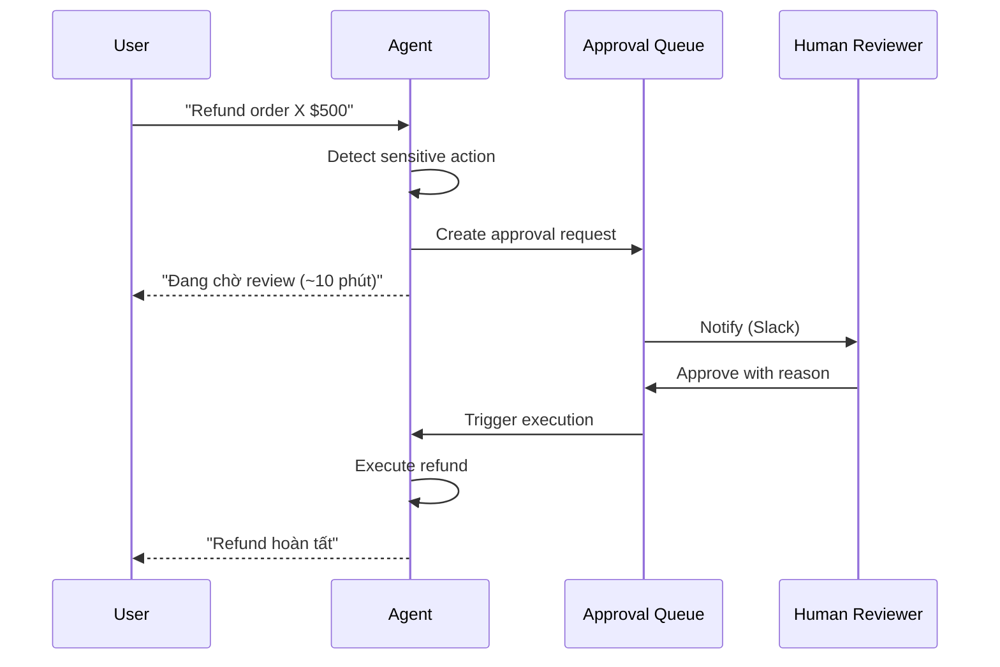

# Human-in-the-Loop là gì? Khi nào Cần

## ⚡ Tóm tắt ngắn (30s)
* **Human-in-the-Loop (HITL)** = pattern thiết kế cho AI/agent ngay tại các action **high-stakes** phải có human approve trước khi execute. Đảm bảo safety, compliance, accountability.
* **3 modes HITL**:
  1. **Sync HITL**: agent stop ở step nguy hiểm, blocking đợi human approve. UX chậm nhưng safe nhất.
  2. **Async HITL**: agent propose action, queue cho human review trong N giờ. UX nhanh hơn.
  3. **Audit-only**: agent execute, human review sau (post-hoc). Risk cao, chỉ cho action reversible.
* **Khi NÀO cần**:
  1. **Action irreversible** (refund, delete, transfer).
  2. **High value** (>threshold $).
  3. **Compliance required** (legal, medical, financial).
  4. **Low confidence** (agent uncertainty cao).
  5. **Novel situation** (chưa thấy pattern này trong training).
* **Thảm họa thực chiến**: Agent auto-execute mọi refund "vì tiện UX". Sau 1 tuần, prompt injection làm refund 200 đơn fake. Senior fix: refund > $50 → human approval; agent propose, human approve trong dashboard.

---

## 🔍 Chi tiết HITL patterns

### 1. Sync HITL

```
User: "Refund order X"
Agent: Detects sensitive action → pause
Agent: Posts to approval queue, returns user "Đang chờ review"
Human dashboard: Sees request, approves/rejects
Agent: Resumes, executes if approved
```

Latency: minutes - hours. Chỉ phù hợp non-urgent.

### 2. Async HITL

```
User: "Compose marketing email for campaign X"
Agent: Drafts email
Agent: Saves draft, notifies marketing team
Human: Reviews, edits, approves
System: Schedules send
```

Agent producitivity boost, human keep control.

### 3. Audit-only HITL

```
Agent: Auto executes (e.g. send transactional email)
System: Logs every action
Human: Daily review sample, looks for errors
```

Risk-tolerant action only.

### 4. Confidence-based routing

```java
public class HitlRouter {
    public ActionDecision decide(AgentProposal proposal) {
        double confidence = proposal.confidence();
        ActionRisk risk = riskScorer.score(proposal.action());

        if (risk == HIGH || confidence < 0.7) {
            return ActionDecision.requireApproval();
        }
        if (risk == MEDIUM && confidence < 0.9) {
            return ActionDecision.notify();  // execute + notify human
        }
        return ActionDecision.autoExecute();
    }
}
```

### 5. Approval UX

Reviewer dashboard cần:
* Context: full conversation, agent reasoning.
* Action detail: tool name, args, expected outcome.
* Risk indicators: amount, target user, time of day.
* Quick actions: approve / reject / modify-and-approve.
* SLA timer: pending > 1h → escalate.

---

## 🎨 Sơ đồ HITL



---

## 💻 Code

### 1. Approval service

```java
@Service
public class ApprovalService {
    private final JdbcTemplate jdbc;
    private final SlackNotifier slack;

    public String createRequest(String userId, String action, Map<String,Object> args, int level) {
        String requestId = UUID.randomUUID().toString();
        jdbc.update("""
            INSERT INTO approval_requests
              (id, user_id, action, args, level, status, created_at, expires_at)
            VALUES (?, ?, ?, ?::jsonb, ?, 'pending', NOW(), NOW() + INTERVAL '24 hours')
            """, requestId, userId, action, toJson(args), level);
        
        slack.notify("#approvals", "New approval request: " + requestId + " - " + action);
        return requestId;
    }

    public boolean isApproved(String requestId) {
        String status = jdbc.queryForObject(
            "SELECT status FROM approval_requests WHERE id = ?",
            String.class, requestId);
        return "approved".equals(status);
    }

    public String approve(String requestId, String approverId) {
        jdbc.update("""
            UPDATE approval_requests
            SET status = 'approved', approver_id = ?, approved_at = NOW()
            WHERE id = ? AND status = 'pending'
            """, approverId, requestId);
        
        // Trigger continuation
        eventBus.publish(new ApprovalGranted(requestId));
        return requestId;
    }

    private String toJson(Map<String,Object> args) { return ""; }
}
```

### 2. Agent integration

```java
@Tool(description = "Refund order. Requires approval if amount > 100.")
public RefundResult refundOrder(String orderId, double amount) {
    String userId = currentUserId();
    
    if (amount > 100) {
        // Check if we have approval token
        String approvalId = currentApprovalContext();
        if (approvalId == null) {
            String newId = approval.createRequest(userId, "refund",
                Map.of("orderId", orderId, "amount", amount), 3);
            return RefundResult.pendingApproval(newId);
        }
        if (!approval.isApproved(approvalId)) {
            return RefundResult.pendingApproval(approvalId);
        }
    }
    
    // Execute
    return refundService.execute(orderId, amount);
}
```

### 3. Continuation pattern (async)

```java
@KafkaListener(topics = "approval.granted")
public void onApprovalGranted(ApprovalGrantedEvent event) {
    // Resume agent task
    AgentTask task = taskStore.getByApprovalId(event.requestId());
    
    // Re-invoke agent với approval token
    agentExecutor.resume(task.id(), event.requestId());
}
```

---

## 📊 Risk-based HITL matrix

| Action | Confidence > 0.9 | Confidence 0.7-0.9 | Confidence < 0.7 |
| :--- | :---: | :---: | :---: |
| Read | Auto | Auto + log | Auto + log |
| Write idempotent | Auto + log | Notify | Approval |
| Write irreversible | Approval | Approval | Approval + 2-eye |
| Money < $100 | Notify | Approval | Approval |
| Money > $1000 | 1-eye approval | 1-eye approval | 2-eye approval |

---

## ⚠️ Gotchas

1. **Approver fatigue**: 100/day approve mù → defeat purpose. Auto-batch low-risk; only show high-risk.
2. **SLA timeout**: pending request > N hours → auto-escalate to manager.
3. **Bypass via emergency**: dev "ưu tiên" skip approval → log + alert nếu happens.

**Interviewer: "User phàn nàn approval chậm. UX bad. Trade-off thế nào?"**
1. Phân loại: action nào CẦN approval, action nào CHẤP NHẬN auto.
2. Risk-based: low risk auto, high risk approval.
3. Pre-approval: user có thể pre-approve patterns (e.g. "auto refund <$50 cho tôi").
4. SLA: approval < 30 min target; escalation if exceed.
5. Self-service alternative: user có thể "I want immediate execution, accept risk".
