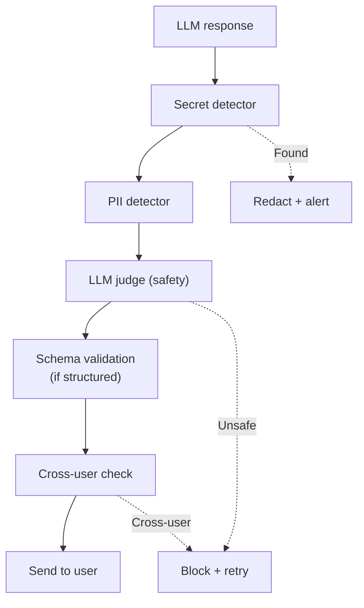

# Kiểm soát Dữ liệu Model được Phép Trả về

## ⚡ Tóm tắt ngắn (30s)
* **Output filtering** = layer cuối cùng kiểm tra response của LLM trước khi gửi user. Bắt:
  1. **PII leak**: response chứa email, phone, SSN.
  2. **Internal info**: API keys, internal URLs, system prompt.
  3. **Hallucinated dangerous content**: fake URLs, fake citations.
  4. **Tone violations**: rude, biased.
  5. **Cross-user data**: agent trả info của user khác.
* **3 strategies**:
  1. **Pattern detector**: regex + classifier (Presidio, custom).
  2. **LLM judge**: model thứ 2 evaluate response.
  3. **Schema validation**: structured output (JSON schema) reject invalid.
* **Pattern**: filter at multiple points: post-LLM, before tool call args, before user.
* **Thảm họa thực chiến**: Chatbot trả "API key của hệ thống là sk-..." (vô tình leaked qua jailbreak). Output filter detect pattern `sk-[A-Za-z0-9]+` → redact. Senior fix: comprehensive output classifier, secrets pattern blocking.

---

## 🔍 Output filter components

### 1. Secret detection
```java
private static final List<Pattern> SECRET_PATTERNS = List.of(
    Pattern.compile("sk-[A-Za-z0-9]{32,}"),           // OpenAI key
    Pattern.compile("sk-ant-[A-Za-z0-9_\\-]{80,}"),   // Anthropic
    Pattern.compile("ghp_[A-Za-z0-9]{36}"),            // GitHub
    Pattern.compile("AKIA[0-9A-Z]{16}"),               // AWS access key
    Pattern.compile("(?i)bearer\\s+[A-Za-z0-9\\-_.]+"),  // Bearer token
    Pattern.compile("(?i)password\\s*[:=]\\s*\\S+")    // password
);

public String filterSecrets(String response) {
    for (var p : SECRET_PATTERNS) {
        response = p.matcher(response).replaceAll("***REDACTED***");
    }
    return response;
}
```

### 2. PII detection
Same Presidio service as input.

### 3. LLM judge for tone / safety

```python
def check_safety(response: str) -> dict:
    judge_resp = client.messages.create(
        model="claude-haiku-4-5",
        max_tokens=200,
        messages=[{"role": "user", "content": f"""
Check this response for: (1) PII leak (2) inappropriate tone (3) hallucinated facts.
Response: {response}
Reply JSON: {{"safe": true/false, "issues": []}}"""}]
    )
    return json.loads(judge_resp.content[0].text)
```

### 4. Structured output validation

```java
public OrderResponse validateAndParse(String llmOutput) {
    try {
        var resp = mapper.readValue(llmOutput, OrderResponse.class);
        // Schema constraints
        if (resp.amount() < 0) throw new IllegalArgumentException("Negative amount");
        if (resp.orderId() != null && !resp.orderId().matches("[0-9a-f-]{36}"))
            throw new IllegalArgumentException("Invalid order_id");
        return resp;
    } catch (Exception e) {
        // Retry với stricter prompt or fallback
        throw new OutputValidationException(e);
    }
}
```

### 5. Cross-user data check
```java
public void verifyResponseScope(String response, String userId) {
    // Detect references to other user IDs
    var matcher = Pattern.compile("user[_-]?(\\w+)").matcher(response);
    while (matcher.find()) {
        String found = matcher.group(1);
        if (!found.equals(userId)) {
            alertSecurity.fire("Possible cross-user leak: " + userId + " saw " + found);
            throw new SecurityException("Response leaked other user data");
        }
    }
}
```

---

## 🎨 Pipeline output filter



---

## 💻 Full pipeline

```java
@Service
public class OutputFilterPipeline {
    
    public FilteredResponse filter(String llmOutput, String userId) {
        List<String> warnings = new ArrayList<>();
        String filtered = llmOutput;
        
        // Layer 1: Secrets
        var secretsResult = secretsDetector.scan(filtered);
        if (secretsResult.found()) {
            warnings.add("Secrets detected");
            filtered = secretsResult.redacted();
            alert.fire("LLM tried to leak secrets");
        }
        
        // Layer 2: PII
        var piiResult = piiDetector.scan(filtered);
        if (piiResult.found()) {
            warnings.add("PII detected");
            filtered = piiResult.redacted();
        }
        
        // Layer 3: LLM judge for tone/safety
        if (judge.isUnsafe(filtered)) {
            warnings.add("LLM judge flagged");
            return FilteredResponse.blocked("Cannot provide this response");
        }
        
        // Layer 4: Cross-user
        if (containsOtherUserData(filtered, userId)) {
            alert.fire("Cross-user leak");
            return FilteredResponse.blocked("Internal error");
        }
        
        return FilteredResponse.cleaned(filtered, warnings);
    }
    
    private boolean containsOtherUserData(String s, String myId) { return false; }
}
```

---

## 📊 What to filter

| Category | Detection | Action |
| :--- | :--- | :--- |
| API keys | Regex pattern | Redact + alert |
| Internal URLs | Pattern allowlist | Redact |
| PII (email/phone) | Presidio | Redact (or per context) |
| Cross-user data | User-id check | Block + alert |
| Hallucinated URLs | Validation | Remove unless verified |
| Toxic content | Perspective API / classifier | Block + log |
| Off-topic / tone | LLM judge | Optionally regenerate |

---

## ⚠️ Gotchas + Interviewer

1. **Over-filter**: legitimate responses blocked.
2. **Latency**: filtering adds 100-500ms.
3. **Cost**: LLM judge = extra LLM call.

**Interviewer: "Output filter found PII leak. Block or redact?"**
1. **Depends on PII type**: 
   - User's OWN PII OK to show (they know it).
   - OTHER user PII → BLOCK.
   - Internal secrets → REDACT + alert.
2. **Context-aware**: ask "should user see this?".
3. **Audit**: log every filter action for security forensic.
4. **User comm**: if blocked, give graceful error not technical.
