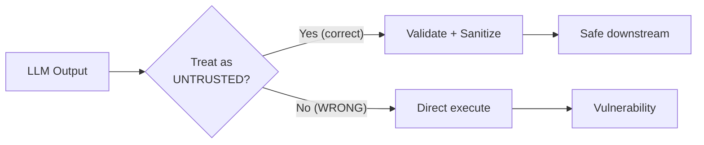

# Insecure Output Handling

## ⚡ Tóm tắt ngắn (30s)
* **OWASP LLM02**: LLM output đi vào downstream system (SQL execute, code eval, HTML render, shell command) mà **không validate** → arbitrary code execution / injection.
* **Vector tấn công**:
  1. **LLM output → SQL** (text2SQL): nếu execute raw → SQL injection.
  2. **LLM → JavaScript eval**: XSS.
  3. **LLM → shell command**: command injection.
  4. **LLM → HTML render**: XSS.
  5. **LLM → URL redirect**: open redirect, SSRF.
  6. **LLM → file path**: path traversal.
* **Defense**: treat LLM output như USER INPUT — validate, sanitize, parameterize.
* **Thảm họa thực chiến**: Text2SQL feature execute raw SQL from LLM. User prompt-inject → LLM gen `DROP TABLE users; --`. Senior fix: SQL parser validate (only SELECT, allowlist tables), read-only DB user, statement timeout.

---

## 🔍 Common patterns + defenses

### 1. SQL từ LLM
```python
# BAD
sql = llm.gen("Generate SQL: " + user_query)
db.execute(sql)  # Direct execute!

# GOOD
sql = llm.gen("Generate SELECT SQL only: " + user_query)
# Validate
parsed = sqlparse.parse(sql)[0]
if parsed.get_type() != "SELECT":
    raise SecurityException("Only SELECT")
tables = extract_tables(parsed)
if not all(t in ALLOWLIST for t in tables):
    raise SecurityException("Table not allowed")
# Execute with restricted user + timeout
with readonly_db.cursor() as cur:
    cur.execute("SET statement_timeout = 5000")
    cur.execute(sql)
```

### 2. Code generation + execute
```python
# BAD
code = llm.gen("Write Python: " + user_request)
exec(code)  # Arbitrary code execution!

# GOOD
code = llm.gen("Write Python: " + user_request)
# AST validate: no imports, no exec, no eval, no file ops
tree = ast.parse(code)
for node in ast.walk(tree):
    if isinstance(node, (ast.Import, ast.ImportFrom)):
        raise SecurityException("No imports")
    if isinstance(node, ast.Call):
        if hasattr(node.func, 'id') and node.func.id in {'exec', 'eval', 'open'}:
            raise SecurityException("Dangerous function")
# Execute in sandbox (firejail, gVisor, separate container)
result = subprocess.run(["sandboxed_python", "-c", code],
                       timeout=10, capture_output=True)
```

### 3. HTML render

```javascript
// BAD
document.getElementById("output").innerHTML = llmResponse;  // XSS!

// GOOD
import DOMPurify from "dompurify";
const sanitized = DOMPurify.sanitize(llmResponse);
document.getElementById("output").innerHTML = sanitized;
// Or even safer: textContent only
document.getElementById("output").textContent = llmResponse;
```

### 4. Shell command
```python
# BAD
os.system(llm.gen("write shell command"))

# GOOD
# Don't let LLM gen shell directly
# Use predefined commands with whitelisted params
# Or sandbox heavy: gVisor + restricted seccomp
```

### 5. URL handling
```python
# BAD
url = llm.gen("redirect to ...")
redirect(url)  # Could be malicious URL

# GOOD
url = llm.gen("redirect to ...")
if not url.startswith(("https://app.mycompany.com/", "https://other-trusted.com/")):
    raise SecurityException("Invalid redirect target")
redirect(url)
```

### 6. File paths
```python
# BAD
filename = llm.gen("filename for output")
open(f"/data/{filename}", "w")  # Path traversal!

# GOOD
filename = llm.gen("filename for output")
if not re.match(r"^[a-zA-Z0-9_\-.]+$", filename):
    raise SecurityException("Invalid filename")
# Ensure stays in /data
safe_path = os.path.realpath(os.path.join("/data", filename))
if not safe_path.startswith("/data/"):
    raise SecurityException("Path traversal")
```

---

## 🎨 Mental model



---

## 📊 Bảng common LLM → downstream

| Output goes to | Risk | Defense |
| :--- | :---: | :--- |
| SQL query | SQL injection | Parser validate + parameterize |
| Code eval | RCE | AST validate + sandbox |
| HTML render | XSS | DOMPurify / textContent |
| Shell command | Command injection | Avoid; allowlist params |
| URL redirect | Open redirect, SSRF | Domain allowlist |
| File path | Path traversal | Realpath check |
| LDAP query | LDAP injection | Parameterize |
| JSON parse | DOS via huge nesting | Size + depth limit |
| XML parse | XXE | Disable external entities |

---

## ⚠️ Gotchas + Interviewer

1. **Trusting LLM output** = #1 mistake. Always validate.
2. **Schema validation insufficient**: JSON valid ≠ semantically safe.
3. **Sandbox escape**: even sandbox can be bypassed; defense in depth.

**Interviewer: "LLM generate SQL for analytics. Allow or not?"**
1. **Yes but with guardrail**:
   - Readonly DB user.
   - Allowlist tables.
   - SELECT only (parser check).
   - Statement timeout 30s.
   - Row limit (10k).
   - No system tables.
   - Audit every query.
2. **Alternative**: pre-defined queries with LLM filling parameters (parameter binding) — safer.
3. **Hybrid**: LLM proposes SQL, human reviews complex queries.
