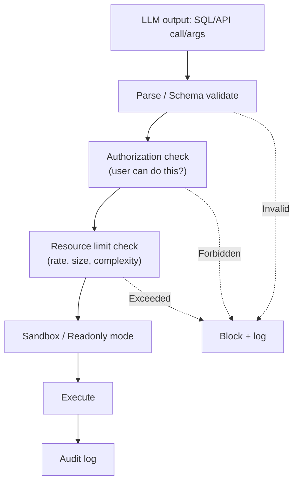

# LLM Output dùng để Generate SQL/API Call — Rủi ro

## ⚡ Tóm tắt ngắn (30s)
* **Khi LLM output drive downstream action** (SQL, API call, tool execute), risks:
  1. **Injection** (SQL/command/JSON).
  2. **Authorization bypass**: LLM gen request với user ID không phải caller.
  3. **Cost/resource abuse**: LLM gen query consume nhiều resource.
  4. **Data leakage**: LLM gen query trả về data không có quyền.
  5. **Side effect attack**: LLM gen multiple write calls.
* **Defense** = "**LLM output is untrusted user input**":
  1. **Validate schema strict**.
  2. **Parameterize** thay vì string concat.
  3. **Allowlist** operations/tables/endpoints.
  4. **Authorization check** at execution.
  5. **Sandbox / readonly** when possible.
  6. **Audit** every action.
* **Thảm họa thực chiến**: Text2SQL với LLM gen filter clause. User prompt "show my orders WHERE 1=1 OR true" → bypass filter → see all users. Senior fix: parser validate filter clause, force WHERE include user_id.

---

## 🔍 Risk scenarios

### 1. SQL gen
LLM gen `WHERE user_id = ALICE` but attacker prompts → `WHERE 1=1`.

### 2. API URL gen
LLM gen URL → could include path traversal, SSRF.

### 3. Function args
Tool calling args from LLM → unvalidated execute.

### 4. Authorization
LLM "knows" user ID from context → could gen call with other user's ID.

### 5. Resource exhaustion
LLM gen `SELECT * FROM huge_table` without LIMIT → DB hang.

---

## 💻 Safe patterns

### 1. SQL gen with validation

```java
@Service
public class SafeTextToSqlService {

    public List<Map<String,Object>> query(String userId, String questionText) {
        // Generate SQL
        String sql = llm.prompt()
            .system("""
                Generate SELECT query.
                ONLY tables: users, orders, products.
                Always WHERE user_id = :userId.
                Max LIMIT 1000.
                """)
            .user(questionText)
            .call().content();

        // Validate parser
        Statement parsed = CCJSqlParserUtil.parse(sql);
        if (!(parsed instanceof Select)) {
            throw new SecurityException("Only SELECT");
        }

        // Validate tables
        var tables = extractTables(parsed);
        if (!ALLOWED_TABLES.containsAll(tables)) {
            throw new SecurityException("Forbidden tables: " + tables);
        }

        // Ensure user_id filter present
        if (!containsUserIdFilter(parsed, userId)) {
            throw new SecurityException("Missing user_id filter");
        }

        // Ensure LIMIT
        sql = ensureLimit(sql, 1000);

        // Execute with readonly user + timeout
        return readOnlyJdbc.queryForList(sql + " LIMIT 1000",
            Map.of("userId", userId));
    }
}
```

### 2. API call from LLM

```java
@Tool(description = "Call internal user-info API")
public UserInfo getUserInfo(@ToolParam String userId) {
    // Verify caller has permission for this userId
    String caller = currentUserId();
    if (!caller.equals(userId) && !isAdmin(caller)) {
        throw new AccessDeniedException("Cannot access other user's info");
    }
    // Internal call
    return userInfoService.get(userId);
}
```

### 3. JSON tool args validation

```java
@Tool(description = "Update profile field")
public void updateProfile(@ToolParam String field, @ToolParam String value) {
    // Whitelist allowed fields
    Set<String> allowedFields = Set.of("displayName", "bio", "language");
    if (!allowedFields.contains(field)) {
        throw new IllegalArgumentException("Field not editable: " + field);
    }
    // Validate value
    if (value.length() > 200) throw new IllegalArgumentException("Too long");
    
    userService.update(currentUserId(), field, value);
}
```

### 4. URL validation

```python
import urllib.parse

ALLOWED_DOMAINS = {"api.mycompany.com", "trusted-partner.com"}

def safe_call_url(url_from_llm: str):
    parsed = urllib.parse.urlparse(url_from_llm)
    if parsed.scheme not in ("https",):
        raise SecurityException("HTTPS only")
    if parsed.hostname not in ALLOWED_DOMAINS:
        raise SecurityException(f"Domain not allowed: {parsed.hostname}")
    if any(seg in (".", "..", "") for seg in parsed.path.split("/")):
        raise SecurityException("Path traversal")
    # Call with timeout + size limit
    return httpx.get(url_from_llm, timeout=10).content[:1_000_000]
```

---

## 🎨 Validation pipeline



---

## 📊 Validation checklist for each output type

| Output type | Must validate |
| :--- | :--- |
| SQL | Statement type, tables, WHERE clause, LIMIT, parameterize |
| API call | Endpoint allowlist, method, params schema |
| Tool args | Type, format, value range, business rules |
| URL | Scheme, domain, path safety |
| File path | Realpath, prefix check, extension allowlist |
| Shell cmd | Don't allow; use allowlist commands with bound params |

---

## ⚠️ Gotchas + Interviewer

1. **Schema valid but semantically dangerous**: e.g. `SELECT *` on user_table with all WHERE 1=1.
2. **Race condition**: validate then execute — state can change.
3. **Sandbox escape**: even sandbox sometimes breakable.

**Interviewer: "Bạn build text2SQL feature. Common mistakes?"**
1. **Direct execute without parsing**: parser is mandatory.
2. **No table allowlist**: LLM may query sensitive tables.
3. **No row-level security**: query may return cross-user data.
4. **No statement timeout**: long query hang DB.
5. **No result size cap**: massive result memory issues.
6. **No audit**: hard to investigate later.
7. **Trusting prompt**: e.g. "show my orders" → assume user_id from context; verify.
