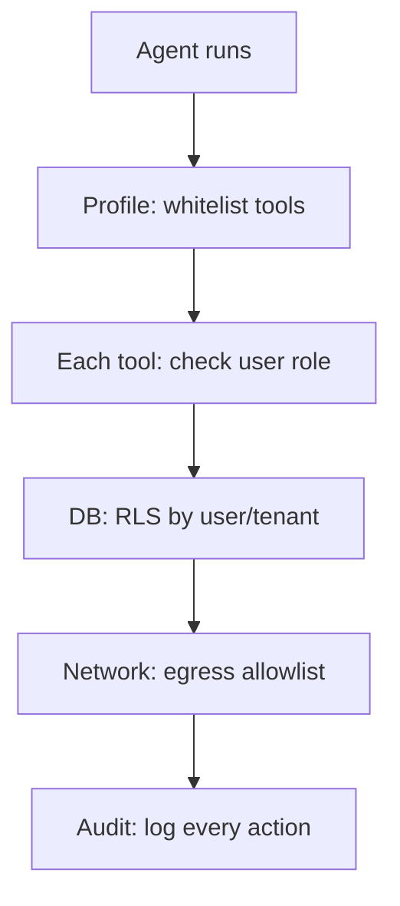

# Agent có Quyền quá Rộng — Nguy hiểm

## ⚡ Tóm tắt ngắn (30s)
* **Agent over-privileged** = agent có quyền vượt nhu cầu task → bị prompt injection sẽ làm bất kỳ gì.
* **Risk cụ thể**:
  1. **Privilege escalation**: agent gọi admin API thay vì user API.
  2. **Cross-user data**: agent đọc/ghi data của user khác.
  3. **Cross-tenant leak**: agent truy cập tenant khác.
  4. **System modification**: agent change config, delete data.
  5. **Money loss**: agent execute payment/refund tự do.
* **Defense Senior**: **Principle of Least Privilege** ở mọi tầng:
  1. **Service account**: agent SA = empty permissions, inherit user context.
  2. **Per-tool permission**: each tool checks user role.
  3. **Whitelist tools per agent profile**.
  4. **Network policy**: agent egress restricted.
  5. **Audit every action**.
* **Thảm họa thực chiến**: Agent dùng admin service account (dev "convenient"). Prompt injection → agent delete data của 100 users. Senior fix: agent SA empty; mỗi tool authorize theo user JWT.

---

## 🔍 Risk patterns

### Bad pattern 1: Agent SA = admin
```java
// BAD: agent has admin token
String agentToken = adminAuthService.getServiceAccountToken();
// Agent calls any API with this admin token
// Prompt injection → admin power
```

### Bad pattern 2: User context lost
```java
// BAD: agent doesn't propagate user
agentService.executeTool("get_user", Map.of("user_id", "any"));
// Agent CAN get any user
```

### Bad pattern 3: Tool with no permission check
```java
@Tool void deleteAccount(String userId) {
    accountService.delete(userId);  // No check!
}
```

### Bad pattern 4: Excessive tools registered
Agent profile has 50 tools "just in case". Most never used. Surface area huge.

---

## 🎨 Layered Least Privilege



---

## 💻 Least privilege code

### 1. Empty SA + user propagation

```java
@Service
public class LeastPrivilegeAgent {
    
    public String run(String userMessage, Authentication userAuth) {
        // Set user context (agent SA has NO permissions by itself)
        SecurityContextHolder.getContext().setAuthentication(userAuth);
        
        return chatClient.prompt()
            .user(userMessage)
            .call().content();
    }
}

@Tool(description = "Get order info")
public OrderInfo getOrder(String orderId) {
    // Get user from security context (set above)
    String userId = SecurityContextHolder.getContext()
        .getAuthentication().getName();
    
    // Permission check
    if (!orderService.belongsTo(orderId, userId)) {
        throw new AccessDeniedException();
    }
    
    return orderService.get(orderId);
}
```

### 2. Profile whitelist

```java
@Component
public class AgentProfileRegistry {
    
    public Set<String> allowedTools(String profile) {
        return switch (profile) {
            case "customer-self-service" -> Set.of(
                "get_my_orders", "search_faq", "update_my_profile"
            );
            case "csr-tier1" -> Set.of(
                "get_order", "search_faq", "create_ticket", "escalate"
            );
            case "csr-tier2" -> Set.of(
                "get_order", "search_faq", "create_ticket",
                "refund_propose", "cancel_order_propose"
            );
            default -> throw new SecurityException("Unknown profile");
        };
    }
}
```

### 3. Network policy K8s

```yaml
apiVersion: networking.k8s.io/v1
kind: NetworkPolicy
metadata:
  name: agent-egress-allowlist
spec:
  podSelector:
    matchLabels:
      app: ai-agent
  policyTypes: [Egress]
  egress:
    - to:
        - namespaceSelector:
            matchLabels: {name: api-services}
      ports: [{protocol: TCP, port: 443}]
    - to:
        # LLM provider only
        - ipBlock: {cidr: 104.18.0.0/16}  # Cloudflare/Anthropic
      ports: [{protocol: TCP, port: 443}]
    # Implicit deny all else
```

---

## 📊 Privilege levels

| Level | Description | Tool example |
| :--- | :--- | :--- |
| 0 | Read public | searchFaq |
| 1 | Read user's own | getMyOrders |
| 2 | Update user's own | updateMyProfile |
| 3 | Propose action (need approval) | proposeRefund |
| 4 | Read other user (CSR) | getCustomerInfo (rate-limited) |
| 5 | Write affecting others | createTicket |
| 6 | Execute irreversible | NEVER auto — always approval |

---

## ⚠️ Gotchas + Interviewer

1. **Convenience over security**: "Just give agent admin, easier".
2. **Permission creep**: profile grows over time, never pruned.
3. **Test only happy path**: don't test "what if agent compromised".

**Interviewer: "Agent compromised. Damage in 5 min?"**
With LP: 
- Limited tools (5 read-only) → max impact = small data leak (1 user).
- Network policy → can't exfil to attacker.
- Audit → see immediately.

Without LP:
- Admin SA → can delete all data, exfil all PII, transfer money.
- No network policy → exfil anywhere.
- No audit → undetected for days.

**LP is the difference between minor incident and company-ending breach.**
