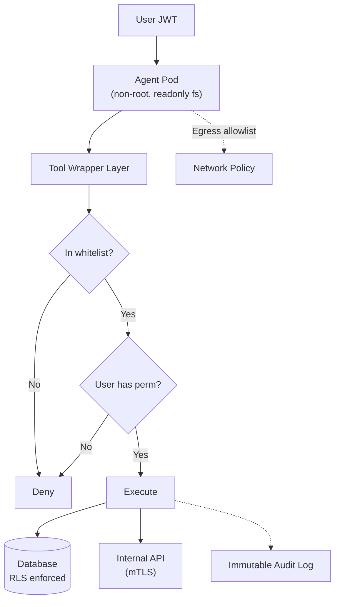

# Áp dụng Least Privilege cho AI Agent

## ⚡ Tóm tắt ngắn (30s)
* **Least Privilege (LP)** = mỗi agent chỉ có quyền **tối thiểu cần thiết** cho task của nó. Default DENY, allow specific.
* **Checklist LP cho agent**:
  1. **Empty service account** — không có quyền tự thân.
  2. **Inherit user context** — actions on behalf of user, check user's role.
  3. **Whitelist tools** per agent profile.
  4. **Tool-level permission check**.
  5. **DB row-level security** (RLS).
  6. **Network egress allowlist**.
  7. **Filesystem readonly** in container.
  8. **Audit log everything**.
* **Test**: assume compromised; what's blast radius?
* **Thảm họa thực chiến**: Agent có 1 admin DB token shared. Prompt injection → SQL injection → drop tables. Senior fix: removed shared token, agent uses per-request user JWT for DB; DB RLS enforce.

---

## 🔍 LP layers chi tiết

### Layer 1: Identity
- No shared service account.
- Per-request, propagate user JWT.
- Agent itself = no identity = no power.

### Layer 2: Tool whitelist
- Profile registry maps role → allowed tools.
- Reject unknown tools.

### Layer 3: Tool permission check
- Each tool re-verifies user has permission.
- Don't trust profile alone; check at execution.

### Layer 4: DB RLS
- Postgres RLS policies based on session context.
- App can't bypass.

### Layer 5: Network policy
- K8s NetworkPolicy: allowlist egress (only API services + LLM provider).
- Deny direct internet.

### Layer 6: Filesystem
- Container runs as non-root.
- Readonly rootfs.
- Tmp volume only.

### Layer 7: Resource limits
- CPU/memory caps.
- Process / thread limits.
- Timeout per request.

### Layer 8: Audit
- Every tool call logged immutably.

---

## 🎨 LP architecture



---

## 💻 Complete LP implementation

```java
@Configuration
@EnableMethodSecurity
public class AgentSecurityConfig {
    // Empty service account
    // No @PreAuthorize on @Tool methods is default deny via @PreAuthorize at controller level
}

@RestController
public class AgentController {
    
    @PostMapping("/api/agent/chat")
    @PreAuthorize("hasAuthority('AGENT_USER')")  // Authn at entry
    public String chat(@AuthenticationPrincipal Jwt jwt, @RequestBody ChatReq req) {
        // Set RLS session context for DB
        rlsContext.setForUser(jwt.getSubject(), jwt.getClaim("tenant"), jwt.getClaimAsStringList("roles"));
        
        try {
            // Determine profile based on user roles
            String profile = profileRegistry.profileFor(jwt.getClaimAsStringList("roles"));
            
            // Build agent with whitelisted tools only
            var agent = agentFactory.create(profile);
            return agent.run(req.message());
        } finally {
            rlsContext.reset();
        }
    }
}

@Component
public class AgentFactory {
    public ChatClient create(String profile) {
        var allowedToolNames = profileRegistry.allowedTools(profile);
        var tools = allTools.stream()
            .filter(t -> allowedToolNames.contains(t.name()))
            .toList();
        return chatBuilder.defaultTools(tools.toArray()).build();
    }
}

@Component
public class SafeTool {
    @Tool(description = "...")
    @PreAuthorize("@authService.canExecute(authentication, 'get_order', #orderId)")
    public OrderInfo getOrder(String orderId) {
        // Permission already checked above
        // DB query with RLS active
        return orderRepo.findById(orderId)
            .orElseThrow(() -> new AccessDeniedException("Not found or no permission"));
    }
}
```

```sql
-- Postgres RLS
ALTER TABLE orders ENABLE ROW LEVEL SECURITY;
ALTER TABLE orders FORCE ROW LEVEL SECURITY;
CREATE POLICY orders_user_policy ON orders
    USING (
        user_id = current_setting('app.current_user_id', true)::uuid
        OR
        'admin' = ANY(string_to_array(current_setting('app.current_user_roles', true), ','))
    );
```

---

## 📊 Bảng LP checklist

| Item | Check |
| :--- | :--- |
| Agent SA permissions | Empty / null |
| User context propagation | Yes (every tool call) |
| Tool whitelist per profile | Yes |
| Tool permission check | @PreAuthorize or similar |
| DB RLS active | Yes, FORCE ROW LEVEL |
| Network egress policy | Allowlist only |
| Container security | Non-root, readonly fs |
| Resource limits | CPU/mem/time caps |
| Audit log | Immutable, includes user_id |
| Penetration test cross-tenant | Pass in CI |

---

## ⚠️ Gotchas + Interviewer

1. **One bypass = whole LP fails**: defense in depth.
2. **LP harder to debug**: more permission errors.
3. **Permission audit**: who has what; periodic review.

**Interviewer: "Audit agent's blast radius. Tool?"**
1. Static: list tools, list permission scopes.
2. Test: try invoke each tool with various user roles, verify denied.
3. Penetration: red team simulate prompt injection attacks.
4. Production: review audit log for permission denied count → unusual activity.
5. Compliance: SOC 2 or pentest reports.
