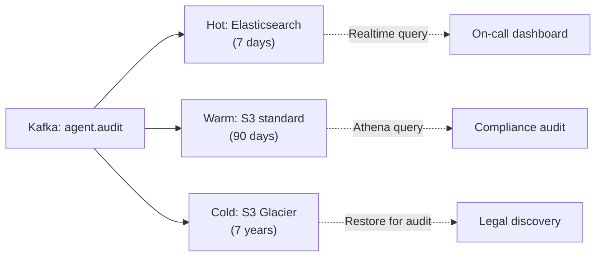

# Audit mọi Tool Call của Agent

## ⚡ Tóm tắt ngắn (30s)
* **Audit log mọi tool call** là **bắt buộc** cho:
  1. **Compliance**: SOC 2, GDPR, HIPAA require audit trail.
  2. **Security forensic**: investigate incident.
  3. **Debug**: trace bug.
  4. **Cost analysis**: per-tool, per-tenant usage.
  5. **Anomaly detection**: pattern bất thường = early breach signal.
* **5 fields BẮT BUỘC log**:
  1. timestamp + trace_id + session_id.
  2. user_id (hashed) + tenant_id.
  3. tool_name + args_redacted.
  4. result_status + summary.
  5. approval_id (nếu có).
* **Storage**: Kafka → tiered (Elastic hot 7d, S3 warm 90d, Glacier cold 7y).
* **Immutability**: S3 Object Lock (WORM) cho compliance.
* **Thảm họa thực chiến**: Customer dispute refund → "I never approved this". Không log → không chứng minh. Auditor fine. Senior fix: structured audit, immutable storage.

---

## 🔍 Log schema

```json
{
  "log_id": "uuid",
  "timestamp": "ISO 8601",
  "trace_id": "otel",
  "session_id": "agent-session-uuid",
  "agent_step_idx": 3,
  "user_id_hash": "sha256",
  "tenant_id": "uuid",
  "agent_profile": "csr-tier1",
  "tool_name": "refund_propose",
  "tool_args_redacted": {"order_id": "abc", "amount": "<NUMERIC>"},
  "approval_id": "uuid-or-null",
  "result_status": "success|error|denied",
  "result_summary": "200 chars",
  "latency_ms": 234,
  "cost_usd": 0.05,
  "agent_reasoning_snippet": "500 chars"
}
```

---

## 💻 Implementation

### 1. AOP-based auto-audit

```java
@Aspect
@Component
public class ToolAuditAspect {
    private final KafkaTemplate<String, AuditEvent> kafka;
    
    @Around("@annotation(org.springframework.ai.tool.annotation.Tool)")
    public Object aroundTool(ProceedingJoinPoint pjp) throws Throwable {
        long start = System.currentTimeMillis();
        var ctx = AgentContextHolder.current();
        
        var event = AuditEvent.builder()
            .logId(UUID.randomUUID())
            .timestamp(Instant.now())
            .traceId(ctx.traceId())
            .sessionId(ctx.sessionId())
            .userIdHash(hash(ctx.userId()))
            .tenantId(ctx.tenantId())
            .agentProfile(ctx.profile())
            .toolName(pjp.getSignature().getName())
            .toolArgsRedacted(redactArgs(pjp.getArgs()))
            .approvalId(ctx.approvalId());
        
        try {
            Object result = pjp.proceed();
            event.resultStatus("success")
                 .resultSummary(truncate(result.toString(), 200));
            return result;
        } catch (Exception e) {
            event.resultStatus(e instanceof AccessDeniedException ? "denied" : "error")
                 .errorMessage(e.getMessage());
            throw e;
        } finally {
            event.latencyMs(System.currentTimeMillis() - start);
            kafka.send("agent.audit", event.build());
        }
    }

    private Map<String,Object> redactArgs(Object[] args) { return Map.of(); }
    private String truncate(String s, int n) { return ""; }
    private String hash(String s) { return ""; }
}
```

### 2. Immutable storage

```java
@Service
@KafkaListener(topics = "agent.audit")
public class ImmutableAuditWriter {
    private final S3Client s3;
    
    public void onAudit(AuditEvent event) {
        String key = String.format("audit/%s/%s.json",
            LocalDate.now(), event.logId());
        
        s3.putObject(b -> b
            .bucket("agent-audit-immutable")
            .key(key)
            .objectLockMode(ObjectLockMode.COMPLIANCE)
            .objectLockRetainUntilDate(Instant.now().plus(Duration.ofDays(2555))),  // 7y
            RequestBody.fromString(toJson(event)));
    }
}
```

### 3. Query interfaces

```java
@RestController
@PreAuthorize("hasAuthority('AUDIT_VIEWER')")
public class AuditQueryController {
    
    @GetMapping("/audit/by-user/{userId}")
    public List<AuditEvent> byUser(@PathVariable String userId,
                                    @RequestParam Instant from,
                                    @RequestParam Instant to) {
        return auditRepo.query(hash(userId), from, to);
    }
    
    @GetMapping("/audit/by-trace/{traceId}")
    public List<AuditEvent> byTrace(@PathVariable String traceId) {
        return auditRepo.queryByTrace(traceId);
    }
}
```

---

## 🎨 Storage tiers



---

## 📊 Audit dashboard

| Metric | Value |
| :--- | :---: |
| Tool calls last 24h | 1.2M |
| Denied calls (permission) | 1500 |
| Anomalies flagged | 12 |
| Pending approvals | 8 |
| Avg tool latency | 120ms |
| Top tools | get_order (40%), search_faq (30%) |

---

## ⚠️ Gotchas + Interviewer

1. **Audit storage = leak risk**: encrypt at rest, strict access.
2. **High volume**: 100k tool calls/min → Kafka + Elastic carefully scaled.
3. **PII in audit**: redact at source.

**Interviewer: "Customer claims agent did action X. Prove or refute?"**
1. Query audit by user_id_hash + time range.
2. Find trace_id of session.
3. Pull full session: every tool call.
4. Verify action did occur (or didn't).
5. Provide redacted log to customer / legal.
6. SLA: response within 7-30 days.
7. Integrity: checksum/signature trên log records.
