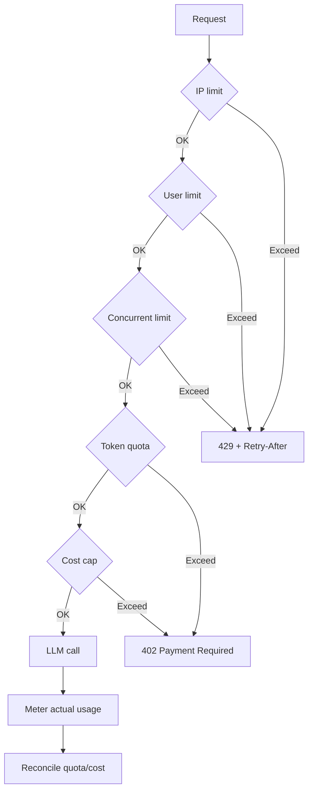

# Rate Limit AI Endpoint

## ⚡ Tóm tắt ngắn (30s)
* **AI endpoint phải rate limit nhiều chiều**, không chỉ request count:
  1. **IP rate limit**: 10-30 req/phút, chống bot scan.
  2. **User rate limit**: 30-200 req/giờ.
  3. **Token quota**: 100k-1M token/ngày/user (cost-based).
  4. **Concurrent**: max 2-5 simultaneous requests per user.
  5. **Cost cap**: $X/user/day.
* **Algorithm**: Sliding window log (Redis sorted set) cho accuracy; token bucket cho burst.
* **Tools**: Redis Lua scripts cho atomic; Bucket4j Java; Kong API Gateway.
* **Thảm họa thực chiến**: AI endpoint không rate limit. 1 user (script kiddie) gửi 10k req/giờ → cost $100/giờ $2400/ngày. Senior fix: tiered rate limit + cost cap + alert.

---

## 🔍 Multi-dimensional rate limit

```
Layer 1: API Gateway (WAF, IP block)
   ↓ 10 req/min per IP
Layer 2: Authn (JWT verify)
   ↓
Layer 3: User rate limit
   ↓ 100 req/hour per user
Layer 4: Token quota
   ↓ 500k token/day
Layer 5: Concurrent limit
   ↓ 3 simultaneous
Layer 6: Cost cap
   ↓ $5/day max
   ↓
   LLM call
```

---

## 💻 Implementation

### 1. Sliding window log (Redis Lua)

```lua
-- /scripts/sliding_window.lua
local key = KEYS[1]
local now = tonumber(ARGV[1])
local window_ms = tonumber(ARGV[2])
local limit = tonumber(ARGV[3])

local clear_before = now - window_ms
redis.call('ZREMRANGEBYSCORE', key, 0, clear_before)

local count = redis.call('ZCARD', key)
if count < limit then
    redis.call('ZADD', key, now, now .. ':' .. math.random())
    redis.call('PEXPIRE', key, window_ms)
    return 1
end
return 0
```

### 2. Multi-layer rate limiter

```java
@Service
public class AiRateLimiter {
    private final SlidingWindowRateLimiter sliding;
    private final TokenQuotaService quota;
    private final CostCapService costCap;

    public RateLimitResult check(String ip, String userId, int estimatedTokens, double estimatedCost) {
        // Layer 1: IP
        if (!sliding.allow("ip:" + ip, 10, 60_000)) {
            return RateLimitResult.deny("IP rate limit");
        }
        
        // Layer 2: User
        if (!sliding.allow("user:" + userId, 100, 3_600_000)) {
            return RateLimitResult.deny("User rate limit");
        }
        
        // Layer 3: Concurrent
        if (concurrentCount(userId) >= 3) {
            return RateLimitResult.deny("Too many concurrent");
        }
        
        // Layer 4: Token quota
        if (!quota.reserve(userId, estimatedTokens)) {
            return RateLimitResult.deny("Daily token quota exceeded");
        }
        
        // Layer 5: Cost cap
        if (!costCap.reserve(userId, estimatedCost)) {
            return RateLimitResult.deny("Daily cost cap exceeded");
        }
        
        return RateLimitResult.allow();
    }
}
```

### 3. Reconciliation post-call

```java
public void reconcile(String userId, int actualTokens, double actualCost) {
    quota.adjust(userId, actualTokens - estimatedTokens);
    costCap.adjust(userId, actualCost - estimatedCost);
}
```

---

## 🎨 Rate limit layers



---

## 📊 Tiered rate limits

| Tier | IP/min | User/hr | Token/day | Cost/day |
| :--- | :---: | :---: | :---: | :---: |
| Anonymous | 5 | - (req login) | 0 | 0 |
| Free | 20 | 50 | 100k | $0.20 |
| Pro | 40 | 500 | 1M | $5 |
| Enterprise | 200 | 5000 | 20M | $50 |
| Internal | 1000 | unlimited | unlimited | tracked |

---

## ⚠️ Gotchas + Interviewer

1. **Single dimension insufficient**: req count OK but tokens vọt.
2. **No reconciliation**: estimate sai → over/under count.
3. **NAT users share IP**: be careful.

**Interviewer: "User báo bị rate limit dù chỉ gửi vài req. Debug?"**
1. Check user trace - which layer triggered (IP/user/token/cost)?
2. Log every rate limit decision.
3. If shared IP (corp NAT) → rely user-level more.
4. If token quota: maybe few long prompts consumed all.
5. If concurrent: check if previous requests not cancelled.
6. Provide user-facing quota dashboard.
