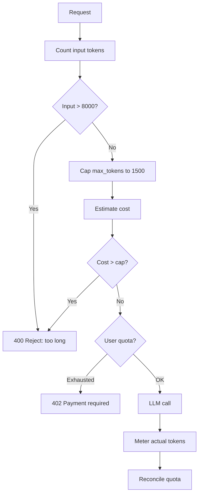

# Chống Prompt dùng quá nhiều Token gây Tốn Cost

## ⚡ Tóm tắt ngắn (30s)
* **Token DoS** = attacker craft prompt dài + max_tokens cao → mỗi request tốn $X. Spam = cháy budget.
* **Defense**:
  1. **Input token limit**: reject prompt > N token TRƯỚC khi gửi LLM.
  2. **max_tokens cap**: ép giới hạn output.
  3. **Total budget per request**: input + output ≤ cap.
  4. **Per-user token quota** (daily).
  5. **Cost-aware estimation**: estimate cost trước khi call.
* **Thảm họa thực chiến**: Attacker paste 100k token prompt + ask "explain in detail" với max_tokens unset. Cost $5/request × 100 req = $500. Senior fix: reject input > 8k token, cap max_tokens 1000.

---

## 🔍 Token DoS attack patterns

1. **Prompt huge**: paste book → 50k input token = $0.50 just for input.
2. **Max tokens unset**: default 4096 → spend all of it = $0.20 output.
3. **Repeated low-cost**: 10k req/giờ × $0.01 = $100/giờ.
4. **Tool spam**: agent loops 50 times = $2.50/request.

---

## 💻 Token budget guard

```java
@Service
public class TokenBudgetGuard {

    private static final int MAX_INPUT_TOKENS = 8000;
    private static final int MAX_OUTPUT_TOKENS = 1500;
    private static final double MAX_COST_USD = 0.50;
    
    private final TokenCounter counter;
    private final TokenQuotaService quota;
    
    public void validateOrThrow(String userId, String prompt, int requestedMaxTokens) {
        // Check input size
        int inputTokens = counter.count(prompt);
        if (inputTokens > MAX_INPUT_TOKENS) {
            throw new IllegalArgumentException(
                "Prompt too long: " + inputTokens + " > " + MAX_INPUT_TOKENS);
        }
        
        // Cap max_tokens
        int outputCap = Math.min(requestedMaxTokens, MAX_OUTPUT_TOKENS);
        
        // Estimate cost
        double estCost = estimateCost(inputTokens, outputCap);
        if (estCost > MAX_COST_USD) {
            throw new IllegalArgumentException("Cost exceeds cap: $" + estCost);
        }
        
        // Check user quota
        if (!quota.reserve(userId, inputTokens + outputCap)) {
            throw new QuotaExceededException();
        }
    }
    
    private double estimateCost(int input, int output) {
        // gpt-4o-mini pricing
        return input * 0.15 / 1_000_000 + output * 0.60 / 1_000_000;
    }
}
```

### 2. Streaming with running token count

```java
public Flux<String> stream(LlmRequest req) {
    AtomicInteger emittedTokens = new AtomicInteger();
    int maxTokens = 1000;
    
    return llmClient.stream(req)
        .takeWhile(chunk -> {
            int total = emittedTokens.addAndGet(estimateChunkTokens(chunk));
            return total < maxTokens;
        });
}
```

### 3. Pre-flight cost estimation

```java
@RestController
public class ChatController {
    
    @PostMapping("/chat")
    public Mono<String> chat(@RequestBody ChatReq req, @AuthenticationPrincipal Jwt jwt) {
        // Reject early if too expensive
        budget.validateOrThrow(jwt.getSubject(), req.message(), req.maxTokens());
        
        // Call LLM
        return llmService.chat(req);
    }
}
```

---

## 🎨 Flow



---

## 📊 Cost guard tiers

| Tier | Input cap | Output cap | Per-req cost cap |
| :--- | :---: | :---: | :---: |
| Anonymous | 1000 | 200 | $0.005 |
| Free | 4000 | 500 | $0.05 |
| Pro | 8000 | 2000 | $0.50 |
| Enterprise | 32000 | 8000 | $5 |

---

## ⚠️ Gotchas + Interviewer

1. **Tokens != chars** for non-English (Vietnamese ~2x).
2. **RAG context counts**: input tokens include retrieved docs.
3. **Multi-turn**: history accumulates; cap per-turn vs cumulative.

**Interviewer: "Cost spike during a campaign. Diagnose?"**
1. Dashboard: cost per user/tenant.
2. Find top spenders.
3. Inspect: legitimate burst or abuse?
4. Throttle if abuse.
5. Communicate if legit (offer upgrade).
6. Post: tighten caps if needed.
