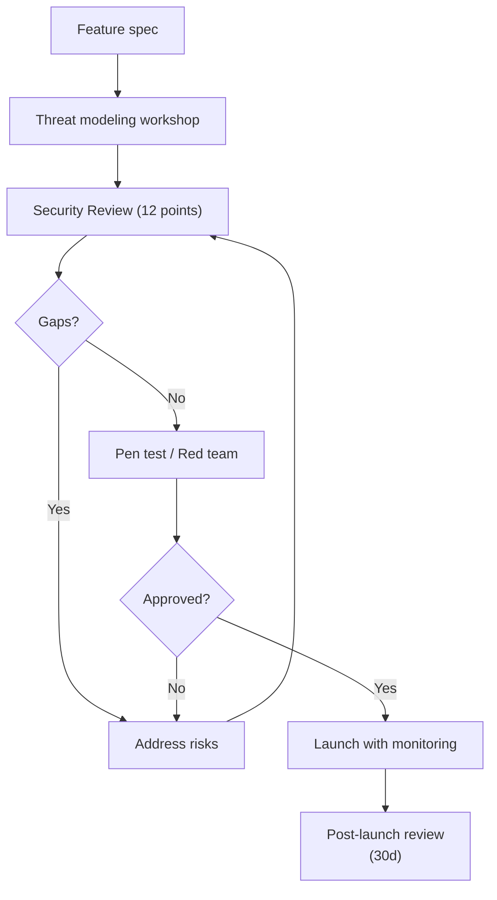

# AI Feature cần Security Review những gì trước khi Release

## ⚡ Tóm tắt ngắn (30s)
* **Pre-release AI security review checklist (12 categories)**:
  1. **Threat model**: define attack surface, attackers, vectors.
  2. **Prompt injection defense**: layers (filter, classifier, output check).
  3. **Authn/Authz**: JWT validation, per-action permission.
  4. **Tool permissions**: whitelist, scopes, least privilege.
  5. **Data flow**: where PII goes, who sees, retention.
  6. **Provider DPA**: compliance with provider terms.
  7. **Rate limiting / cost cap**: prevent abuse.
  8. **Output filter**: PII, secrets, dangerous patterns.
  9. **Audit log**: completeness, immutability.
  10. **Network isolation**: egress, mTLS.
  11. **Incident response plan**: who to call, playbook.
  12. **Compliance**: GDPR, SOC 2, HIPAA as applicable.
* **Standard tools**: OWASP LLM Top 10, MITRE ATLAS, threat modeling workshop.
* **Thảm họa**: Skip review → ship → prompt injection drains $50k. Senior policy: NO AI feature ships without security review.

---

## 🔍 12-point checklist detail

### 1. Threat Model
- Attackers: external user, insider, automated bot.
- Assets: PII, money, business data.
- Attack vectors: prompt injection, exfil, jailbreak, DoS.

### 2. Prompt Injection Defense
- Input filter (Lakera/Rebuff)?
- System prompt with strict rules?
- Delimiter for untrusted content?
- Output classifier?

### 3. Authn/Authz
- JWT verified each request?
- Tool-level permission?
- DB RLS active?
- Cross-tenant penetration tested?

### 4. Tool Permissions
- Whitelist (not allowlist all)?
- Sensitive actions require approval?
- Service account least privilege?
- Tool description prevents misuse?

### 5. Data Flow
- PII redacted before LLM?
- Data residency compliance?
- Retention policy documented?
- Right-to-deletion implemented?

### 6. Provider DPA
- DPA signed?
- No training clause?
- Sub-processor list reviewed?
- Audit rights?

### 7. Rate Limiting
- IP rate limit?
- User rate limit?
- Token quota?
- Cost cap per user?
- Concurrent limit?

### 8. Output Filter
- Secrets pattern detector?
- PII output scanner?
- LLM-as-judge for safety?
- HTML sanitize for rendering?

### 9. Audit Log
- Every action logged?
- Includes user_id, args, result?
- Immutable storage?
- Retention sufficient (7y for compliance)?
- Searchable?

### 10. Network Isolation
- mTLS service-to-service?
- Egress allowlist?
- Container non-root?
- Secrets via Vault not env?

### 11. Incident Response
- Kill switch documented?
- On-call rotation?
- Playbook for: data leak, prompt injection breach, cost spike?
- Communication plan (legal, users)?

### 12. Compliance
- GDPR right-to-deletion?
- SOC 2 controls?
- HIPAA BAA if PHI?
- PCI-DSS if cards?
- Region restrictions?

---

## 💻 Security review template

```markdown
# AI Feature Security Review: [Feature Name]

## Threat Model
- Attackers: [list]
- Assets at risk: [list]
- Attack surface: [endpoints, data flows]

## Defenses
| Category | In place | Notes |
| Input filter | ✓ Lakera + heuristic | |
| Authn | ✓ JWT | OAuth2 flow |
| Tool whitelist | ✓ csr-tier1 profile | |
| ...

## Open Risks
1. [Risk 1]: Mitigation plan + owner
2. [Risk 2]: ...

## Approval
- Security: [name + sign]
- Product: ...
- Legal (if PII): ...

## Test Plan
- Pentest: scheduled YYYY-MM-DD
- Eval suite: golden cases + adversarial
- Load test: 10k concurrent
```

---

## 🎨 Review workflow



---

## 📊 Severity-based gating

| Severity | Gating |
| :--- | :--- |
| Critical | Block release |
| High | Block unless mitigation accepted by leadership |
| Medium | Address within 30 days post-launch |
| Low | Tracked, address in backlog |
| Info | Document only |

---

## ⚠️ Gotchas + Interviewer

1. **Review fatigue**: every PR doesn't need full review; risk-based gating.
2. **False sense of security**: passed review ≠ no bugs.
3. **Compliance ≠ secure**: meet checkboxes but still vulnerable.

**Interviewer: "Bạn là senior, review AI feature ai. Top 3 questions ask?"**
1. **"What's the worst thing a malicious user could do?"** — surface threat model.
2. **"Where does data go and who can access it?"** — data flow + access control.
3. **"How do you know it's working safely after launch?"** — monitoring + incident response.

Bonus: "Show me a successful jailbreak attempt you've already blocked" — tests if they've actually red-teamed.
