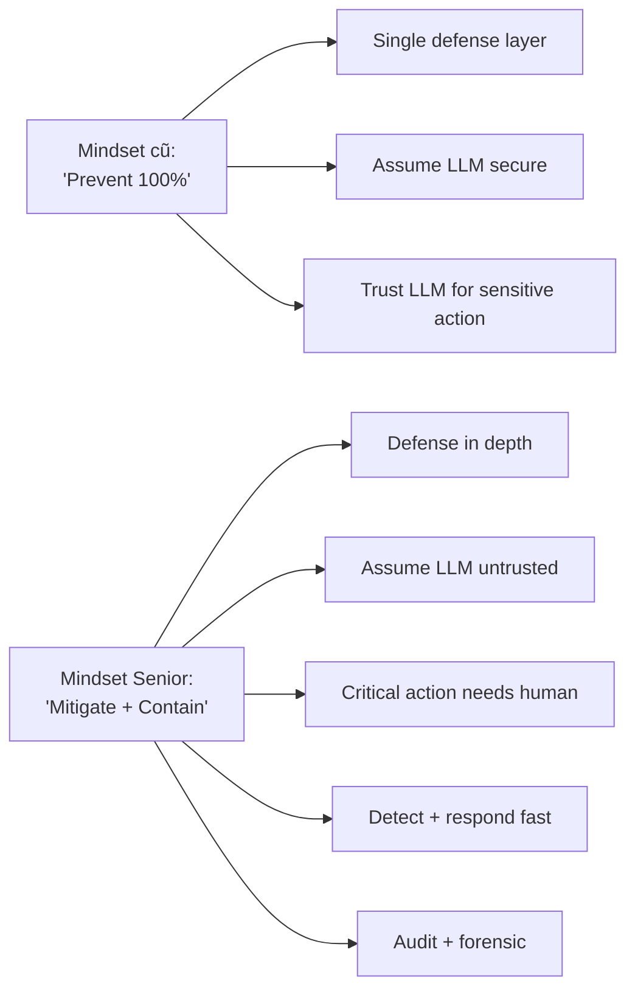

# Có thể Chống Prompt Injection Hoàn Toàn không

## ⚡ Tóm tắt ngắn (30s)
* **KHÔNG**. Prompt injection là **vấn đề mở** chưa được giải quyết hoàn toàn về mặt khoa học.
* **Lý do**: LLM xử lý input ở **cùng level** (natural language token) — không có syntactic separation giữa "data" và "instruction" như SQL. Attacker creative vô tận với natural language.
* **Best practice**: defense-in-depth giảm attack surface 80-95%, KHÔNG 100%. Goal là **mitigate**, không **eliminate**.
* **Mindset Senior**: 
  1. Assume attack will succeed somewhere.
  2. Design system để **limit blast radius** khi bị inject.
  3. Detect + respond quickly.
  4. No irreversible action via LLM alone.
* **Thảm họa thực chiến**: Team tự tin "đã có Lakera, an toàn 100%". Triển khai agent có direct refund tool. Attacker bypass Lakera (encoded prompt) → refund $5000. Senior fix: principle of "even if injection succeeds, blast radius minimal" — refund không direct, qua approval.

---

## 🔍 Why impossible 100%

### 1. Natural language ambiguity
"Show me how X works" có thể là legitimate hoặc social engineering. Không có syntactic boundary.

### 2. Creative attacks
- Multilingual injection.
- Encoded (base64, ROT13).
- Hidden in metadata, images.
- Role-play scenarios.
- Hypothetical framing ("imagine you can...").

### 3. Model training limit
LLM trained on web data; web has examples of "ignore previous instructions" → model "learns" this is a pattern. Provider hardening helps but not perfect.

### 4. Defender vs Attacker asymmetry
Defender must cover ALL vectors; attacker needs ONLY ONE that works.

### 5. Future attacks unknown
New jailbreak techniques discovered every month.

---

## 🎨 Mindset shift



---

## 💻 Containment strategies

### 1. Minimize blast radius

```java
// Bad: LLM has direct delete capability
@Tool void deleteUser(String userId) { userService.delete(userId); }

// Good: LLM can only propose; admin executes
@Tool 
DeletionProposal proposeUserDeletion(String userId, String reason) {
    return approval.createProposal(userId, "delete_user", reason);
}
```

### 2. Detect compromise quickly

```java
@Component
public class AnomalyDetector {
    public void monitor(AgentSession session) {
        if (session.toolsCalled().size() > 5 * session.avgPattern()) {
            alert.fire("Possible compromise: " + session.id());
            session.suspend();
        }
    }
}
```

### 3. Reverse incident playbook

```
1. Freeze agent (kill switch).
2. Identify compromised session.
3. Revert side effects (reverse transactions, cancel emails).
4. Notify affected users.
5. Patch defense.
6. Postmortem.
```

---

## 📊 Realistic protection levels

| Defense | % attack blocked |
| :--- | :---: |
| No defense | 0% |
| Basic heuristic filter | 30-50% |
| + ML classifier | 70-85% |
| + Output filter | 80-90% |
| + Constrained tools | 85-92% |
| + Multi-agent isolation | 90-95% |
| + Sandbox + monitoring | 95-98% |
| (Theoretical max) | ~99% |

100% impossible.

---

## ⚠️ Gotchas + Interviewer

1. **Overconfidence**: "We use Lakera, we're safe".
2. **Defense theatre**: layers that look good but bypassable easily.
3. **Forgot containment**: focus on prevention, ignore "what if".

**Interviewer: "User báo data bị leak qua prompt injection. Bạn handle thế nào?"**
1. **Verify**: confirm via logs + reproduce.
2. **Contain**: suspend session, freeze agent.
3. **Assess scope**: how many users affected?
4. **Notify**: legal + privacy team.
5. **Communicate**: affected users (GDPR 72h).
6. **Patch**: update filter, retrain classifier, add layer.
7. **Postmortem**: root cause, prevention plan.
8. **Disclose**: bug bounty / responsible disclosure if found by external.
9. **Test**: red-team exercise post-fix.
