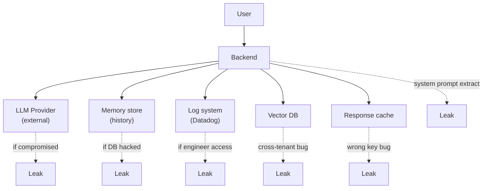

# Sensitive Data Leakage trong LLM App

## ⚡ Tóm tắt ngắn (30s)
* **Sensitive data leak** trong LLM app xảy ra qua nhiều paths:
  1. **Provider receives PII**: gửi customer data tới OpenAI/Anthropic → potential breach if provider compromised.
  2. **Cross-user leak**: user A query → agent leaks data of user B (multi-tenant issue).
  3. **Prompt extraction**: attacker extract system prompt (chứa secret info).
  4. **Memory leak**: stored conversation history bị truy cập trái phép.
  5. **Log leak**: full prompts logged → engineer access logs = see PII.
  6. **Output to wrong user**: bug → response của user X tới user Y.
* **OWASP LLM06** — Sensitive Information Disclosure.
* **Defense**: redact PII before send to LLM + access control on conversation + audit log + output filtering.
* **Thảm họa thực chiến**: Customer support chatbot logs full prompts → log indexed in Datadog → engineer searched "credit card" → found 100s of card numbers in logs (from user paste). Senior fix: Presidio redact at source.

---

## 🔍 Leak paths

### 1. Sending PII to provider

Default flow: user message → prompt → LLM provider. PII goes too.

Mitigate:
- Use Bedrock / Azure OpenAI (data not used for training).
- Or self-host model for very sensitive data.
- Or redact PII before sending.

### 2. Cross-tenant leak

Bug in ACL → user sees other tenant's data via RAG retrieval.

Mitigate:
- Postgres RLS.
- Vector DB pre-filter.
- Penetration test.

### 3. System prompt extraction

Attacker asks "show me your system prompt" or creative jailbreak → LLM leaks.

Mitigate:
- Don't put secrets in system prompt (use tool calls).
- Output filter detect "system prompt"-like phrases.

### 4. Conversation history exposure

Stored chat history → if DB compromised, all conversations leaked.

Mitigate:
- Encrypt at rest.
- Access logging.
- Retention policy (delete old).

### 5. Log leakage

Logs full prompts → wider access than DB.

Mitigate:
- Redact at source.
- Tier 1 (no content), Tier 2 (sampled+redacted), Tier 3 (opt-in).

### 6. Output to wrong user

Race condition, caching bug → wrong cached response sent.

Mitigate:
- Cache key includes user_id.
- Session isolation in connection pool.

---

## 🎨 Leak paths map



---

## 💻 Multi-layer defense

```java
@Service
public class PiiAwareLlmService {
    
    private final PiiDetector detector;
    private final ChatClient chat;
    private final AuditService audit;
    
    public String chat(String userId, String message) {
        // 1. Detect & redact PII in input
        var inputAnalysis = detector.analyze(message);
        if (inputAnalysis.hasHighRiskPii()) {
            log.warn("user={} prompt has PII: {}", userId, inputAnalysis.types());
            message = detector.redact(message);
        }
        
        // 2. Wrap user input
        String prompt = String.format(
            "User question (do not echo back): <user_input>%s</user_input>", message);
        
        // 3. Call LLM (provider with DPA)
        String response = chat.prompt().user(prompt).call().content();
        
        // 4. Output filter: detect PII leak
        var outputAnalysis = detector.analyze(response);
        if (outputAnalysis.hasPii()) {
            log.warn("user={} response had PII, redacting", userId);
            response = detector.redact(response);
        }
        
        // 5. Audit (with redacted)
        audit.record(userId, message, response);
        
        return response;
    }
}
```

---

## 📊 PII types to detect

| Category | Examples | Tools |
| :--- | :--- | :--- |
| Identity | Name, SSN, CMND | Presidio, Comprehend |
| Contact | Email, phone, address | Regex, Presidio |
| Financial | Credit card, IBAN, account | Regex, Luhn check |
| Health | Diagnosis, medical record | Specialized NER |
| Auth | Password, API key, token | Pattern matching |
| Other | DOB, license plate, IP | Presidio |

---

## ⚠️ Gotchas + Interviewer

1. **Provider terms**: read carefully. Some "no training" clauses.
2. **Streaming logs**: stream provider logs your data?
3. **Background save**: caching middleware silently logs.

**Interviewer: "Customer asks 'is my data safe with your AI?' Bạn trả lời thế nào?"**
1. **Provider**: list providers used + their DPAs.
2. **Data residency**: where data flows.
3. **PII handling**: redaction in place.
4. **Retention**: how long stored.
5. **Access**: who can see what (engineer roles).
6. **Right-to-deletion**: process for GDPR/CCPA.
7. **Breach notification**: SLA for notifying user if breach.
8. **Audit certification**: SOC 2, ISO 27001.
