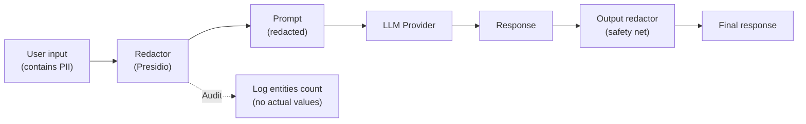

# Mask/Redact Dữ liệu trước khi Gửi Model

## ⚡ Tóm tắt ngắn (30s)
* **Mask/Redact PII** = thay PII bằng placeholder/token trước khi gửi tới LLM provider. Giảm exposure to provider + breach blast radius.
* **3 strategies**:
  1. **Placeholder substitution**: `john@x.com → <EMAIL>`. Đơn giản, không recover được.
  2. **Tokenization (reversible)**: `john@x.com → TOKEN_1` → after response, replace back. Preserve flow but reduce provider exposure.
  3. **Hashing (deterministic)**: `john@x.com → sha256(john@x.com)`. Để cross-reference cross-log nhưng không reverse.
* **Tools**:
  * **Microsoft Presidio**: open-source, 30+ entity types.
  * **AWS Comprehend PII**: managed, paid.
  * **Google DLP**: managed, comprehensive.
  * **Regex** for domain-specific (employee ID, internal codes).
* **Quan trọng**: redaction trade-off accuracy. Model có thể trả lời kém nếu thiếu context. Test trên golden set.
* **Thảm họa thực chiến**: Customer feedback app, redact too aggressive (mask cả product name) → LLM trả "I cannot help without more info". Senior fix: tune entity list, only redact actual PII not domain terms.

---

## 🔍 Strategies chi tiết

### 1. Placeholder substitution
```
Before: "John Smith (john@x.com) ordered iPhone yesterday"
After: "<PERSON> (<EMAIL>) ordered iPhone yesterday"
```

LLM still understands structure but loses identifier.

### 2. Tokenization (reversible)
```
Before: "John Smith (john@x.com)"
Map: {TOKEN_PERSON_1: "John Smith", TOKEN_EMAIL_1: "john@x.com"}
Prompt: "TOKEN_PERSON_1 (TOKEN_EMAIL_1)"
LLM response: "TOKEN_PERSON_1's order..."
After reverse: "John Smith's order..."
```

Useful for user-facing response.

### 3. Hashing (one-way)
```
Before: john@x.com
After: 9e8a..ed1f (sha256)
```

LLM sees consistent token. Can't reverse. Useful for analytics across logs.

### 4. Partial mask
```
Before: "Phone: +84 987 654 321"
After: "Phone: +84 *** *** ***"
```

Preserve format hints (country code) without disclosing.

---

## 💻 Production-grade redaction

### 1. Presidio FastAPI service

```python
from presidio_analyzer import AnalyzerEngine
from presidio_anonymizer import AnonymizerEngine
from presidio_anonymizer.entities import OperatorConfig
from fastapi import FastAPI
from pydantic import BaseModel

analyzer = AnalyzerEngine()
anonymizer = AnonymizerEngine()
app = FastAPI()

class RedactReq(BaseModel):
    text: str
    language: str = "en"
    entities: list[str] = None

@app.post("/redact")
def redact(req: RedactReq):
    entities = req.entities or [
        "PERSON", "EMAIL_ADDRESS", "PHONE_NUMBER",
        "US_SSN", "CREDIT_CARD", "IP_ADDRESS", "LOCATION"
    ]
    results = analyzer.analyze(req.text, entities=entities, language=req.language)
    anon = anonymizer.anonymize(
        text=req.text,
        analyzer_results=results,
        operators={
            "EMAIL_ADDRESS": OperatorConfig("replace", {"new_value": "<EMAIL>"}),
            "PHONE_NUMBER": OperatorConfig("replace", {"new_value": "<PHONE>"}),
            "PERSON": OperatorConfig("replace", {"new_value": "<PERSON>"}),
            "CREDIT_CARD": OperatorConfig("mask", {
                "chars_to_mask": 12, "masking_char": "X", "from_end": False
            }),
            "US_SSN": OperatorConfig("replace", {"new_value": "<SSN>"}),
            "default": OperatorConfig("replace", {"new_value": "<PII>"})
        }
    )
    return {"redacted": anon.text, "entities_found": len(results)}
```

### 2. Reversible tokenization (Java)

```java
@Service
public class TokenizationService {
    
    private final Map<String, String> sessionMap = new HashMap<>();
    private final AtomicInteger counter = new AtomicInteger();
    
    public String tokenize(String text) {
        // Find emails
        text = text.replaceAll("[\\w.+-]+@[\\w-]+\\.[\\w-.]+",
            match -> {
                String token = "TOKEN_EMAIL_" + counter.incrementAndGet();
                sessionMap.put(token, match.group());
                return token;
            });
        // Find phones, names, etc. similarly
        return text;
    }
    
    public String reverse(String tokenized) {
        for (var e : sessionMap.entrySet()) {
            tokenized = tokenized.replace(e.getKey(), e.getValue());
        }
        return tokenized;
    }
}
```

### 3. Integration in LLM call

```java
@Service
public class PrivateLlmService {
    
    private final PresidioClient presidio;
    private final ChatClient llm;
    
    public String safeChat(String userMessage) {
        // Redact input
        var inputResult = presidio.redact(userMessage);
        log.info("Input PII entities found: {}", inputResult.entitiesFound());
        
        // Call LLM with redacted
        String llmResp = llm.prompt().user(inputResult.redacted()).call().content();
        
        // Optionally redact output too (e.g. if RAG return PII)
        var outputResult = presidio.redact(llmResp);
        
        return outputResult.redacted();
    }
}
```

---

## 🎨 Flow



---

## 📊 Strategy comparison

| Strategy | Reversible | Use case |
| :--- | :---: | :--- |
| Placeholder | No | Pure analytics, no user-facing context |
| Tokenization (session) | Yes | User-facing response with PII context |
| Hashing | No (cross-ref) | Cross-log correlation |
| Partial mask | Partial | Display purposes, debugging |
| Encryption (FPE) | Yes (with key) | High security, compliant pseudonymization |

---

## ⚠️ Gotchas + Interviewer

1. **Over-redact**: model confused, low quality response.
2. **Under-detect**: novel PII formats (custom IDs) missed.
3. **Performance**: Presidio ~50-200ms per call → add latency.

**Interviewer: "Redaction wrong: missed someone's name. Bạn handle thế nào?"**
1. **Layer 2 defense**: even if redact miss, provider has DPA + no-training agreement.
2. **Detect post-hoc**: scan logs for missed entity types.
3. **Improve detector**: add custom NER for domain (e.g. employee IDs).
4. **User feedback channel**: report missed redaction.
5. **Test golden set**: synthetic PII examples; track detection rate.
6. **Disclose**: if PII actually leaked via provider → compliance assessment.
