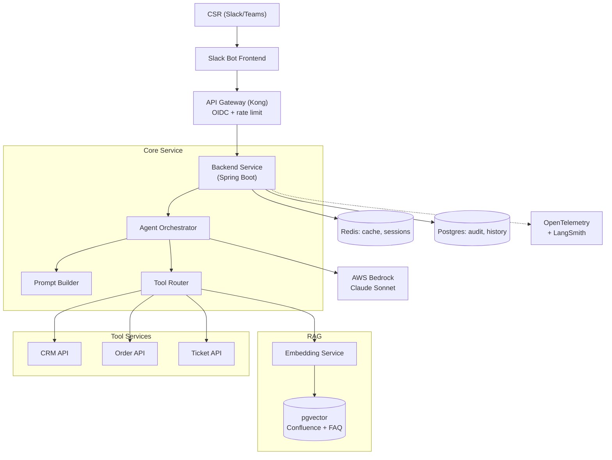

# Thiết kế AI Chatbot Nội bộ cho Support Team

## ⚡ Tóm tắt ngắn (30s)
* **Yêu cầu**: Chatbot trợ giúp internal support team (CSR) trả lời customer faster, lookup info, escalate khi cần.
* **Architecture**: Slack/Teams interface → API Gateway → AI Backend (RAG + agent) → Internal APIs (CRM, Order, FAQ).
* **Components**:
  1. **RAG**: Confluence + FAQ + product docs.
  2. **Agent**: tools = getOrder, getCustomer, searchFaq, createTicket.
  3. **Memory**: per-CSR session.
  4. **Permission**: CSR role-based (tier1, tier2).
* **Scale**: 500 CSR × 50 queries/day = 25k queries/day.
* **Stack**: Spring AI, pgvector, Anthropic Sonnet, Redis, Postgres, OpenTelemetry, LangSmith.
* **Thảm họa nếu thiếu**: không có ACL → CSR thấy customer khác; không có audit → compliance fail; không có rate limit → cost runaway.

---

## 🔍 Chi tiết kiến trúc

### Functional requirements
* CSR ask in natural language; bot retrieves info from CRM + Confluence + FAQ.
* Bot can execute safe actions: create ticket, fetch order status.
* Bot escalates if cannot resolve (no LLM action irreversible).
* Multi-tenant: support multiple business units.

### Non-functional
* QPS: 25k/day = ~0.3 QPS avg, peak ~5 QPS (Mondays).
* Latency: p99 < 5s.
* Uptime: 99.5%.
* Compliance: SOC 2; PII redacted in logs.

### Components

1. **Slack/Teams Bot Frontend**: receives message, formats response.
2. **API Gateway** (Kong): auth (OIDC), rate limit, route.
3. **Backend** (Spring Boot): orchestrator, agent loop.
4. **RAG Service**: pgvector store of Confluence + FAQ.
5. **Tool Services**: getOrder, getCustomer, searchFaq, createTicket.
6. **LLM**: Anthropic Sonnet 4.6 via Bedrock (VPC, compliance).
7. **Storage**: Postgres (sessions, audit), Redis (cache, rate limit).
8. **Observability**: OpenTelemetry → Datadog, LangSmith for LLM traces.

---

## 🎨 Architecture diagram



---

## 💻 Key code

```java
@RestController
@RequestMapping("/slack")
public class SlackWebhookController {
    
    private final SupportChatAgent agent;
    
    @PostMapping("/events")
    public ResponseEntity<Void> onSlackEvent(@RequestBody SlackEvent event,
                                              @RequestHeader("X-Slack-Signature") String sig) {
        if (!signatureVerifier.verify(sig, event.rawBody())) {
            return ResponseEntity.status(403).build();
        }
        
        String csrId = event.user();
        String message = event.text();
        
        // Process async to avoid timeout
        CompletableFuture.runAsync(() -> {
            try {
                String response = agent.handle(csrId, message);
                slackClient.postMessage(event.channel(), response);
            } catch (Exception e) {
                slackClient.postMessage(event.channel(),
                    "Sorry, something went wrong. Ticket created: " + ticketService.createForError(csrId, e));
            }
        });
        
        return ResponseEntity.ok().build();  // 200 immediately to avoid Slack retry
    }
}

@Service
public class SupportChatAgent {
    
    private final ChatClient chatClient;
    
    public SupportChatAgent(ChatClient.Builder b, SupportTools tools) {
        this.chatClient = b
            .defaultSystem(SYSTEM_PROMPT)
            .defaultTools(tools)
            .build();
    }
    
    private static final String SYSTEM_PROMPT = """
            You are a support assistant for company ABC's CSR team.
            Use tools to lookup: orders, customers, knowledge base.
            
            RULES:
            - Always verify CSR has permission for customer data they query.
            - Cite sources for all factual claims.
            - When unsure, escalate to tier 2.
            - Cannot execute refunds — only propose.
            """;
    
    public String handle(String csrId, String message) {
        // Set RLS context, retrieve session memory
        return chatClient.prompt()
            .user(message)
            .call().content();
    }
}
```

---

## 📊 Key Design Decisions

| Decision | Alternative | Chose | Rationale |
| :--- | :--- | :--- | :--- |
| LLM | OpenAI gpt-4o | Anthropic Sonnet via Bedrock | Compliance (VPC), strong reasoning |
| Vector DB | Pinecone | pgvector | Already use Postgres, simpler ops |
| Frontend | Custom web | Slack | CSR lives in Slack, zero training |
| Tool exec | Direct API | Wrapper layer | Auth + audit + idempotency |
| RAG source | Just FAQ | Confluence + FAQ + product docs | Comprehensive |
| Async | Sync | Async with status | Avoid Slack 3s timeout |

---

## ⚠️ Gotchas + Interviewer

1. **Slack 3s response time**: must ACK fast, async process.
2. **Permission inheritance**: agent action on behalf of CSR's permission.
3. **Compliance**: PII in conversation → log careful.

**Interviewer: "Scale to 100 CSR teams across 20 countries. What changes?"**
1. **Per-region deployment**: data residency (EU, US, APAC).
2. **Per-tenant Slack workspace**: bot installed independently.
3. **Tenant isolation**: separate vector collections + RLS.
4. **i18n**: multilingual prompt + Sonnet handles VN/EN/JP natively.
5. **Centralized observability** (cross-region trace).
6. **Cost per tenant**: track + bill.
