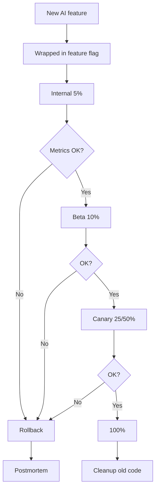

# Thiết kế AI Feature có Feature Flag và Rollback

## ⚡ Tóm tắt ngắn (30s)
* **Feature flag cho AI** = canary roll-out + easy rollback. Bắt buộc cho mọi AI feature mới.
* **Components**:
  1. **Feature flag service** (LaunchDarkly/GrowthBook): % rollout, targeting rules.
  2. **A/B test framework**: compare new vs old AI feature trên business metrics.
  3. **Kill switch**: instant disable if breach/incident.
  4. **Monitoring**: per-cohort metrics (cost, latency, quality, user feedback).
  5. **Auto-rollback**: trigger if regression > threshold.
* **Targeting**:
  * Internal team first (5%).
  * Beta users (10%).
  * 50% A/B test (1 week).
  * 100% rollout.
* **Thảm họa thực chiến**: Deploy AI feature 100% without flag. Bug 5% case → 5% users affected = thousands. Senior fix: feature flag 1% → 10% → 50% → 100% with metric gates.

---

## 🔍 Rollout stages

### Stage 1: Internal dogfooding (5%)
- Engineers + PM + designers.
- Aggressive monitoring.
- Daily review.

### Stage 2: Beta opt-in (10%)
- Customers who explicitly opt-in.
- Feedback survey active.

### Stage 3: Gradual canary (25%, 50%, 100%)
- Random 25% → monitor 24h → 50% → monitor → 100%.
- Auto-pause if metric regress.

### Stage 4: Cleanup
- Remove old code paths.
- Document new behavior.

---

## 🎨 Flow



---

## 💻 Implementation

### 1. GrowthBook integration

```java
@Service
public class AiFeatureService {
    
    private final GrowthBook growthbook;
    
    public ChatResponse chat(String userId, String message) {
        var ctx = Map.<String, Object>of(
            "userId", userId,
            "tenantTier", tenantService.getTier(userId),
            "deviceType", request().header("X-Device-Type")
        );
        
        if (growthbook.isOn("ai_chat_v3", ctx)) {
            return newChatService.chat(userId, message);
        } else {
            return oldChatService.chat(userId, message);
        }
    }
}
```

### 2. Metrics emission per cohort

```java
@Component
public class AiMetricsCollector {
    
    public void recordRequest(String featureVersion, AiRequestResult result) {
        registry.timer("ai.request.duration",
            "version", featureVersion,
            "status", result.status())
            .record(result.duration());
        
        registry.counter("ai.request.count",
            "version", featureVersion).increment();
        
        if (result.userFeedback() != null) {
            registry.counter("ai.feedback",
                "version", featureVersion,
                "rating", result.userFeedback())
                .increment();
        }
    }
}
```

### 3. Auto-rollback rule

```java
@Component
@Scheduled(fixedRate = 60_000)
public class AutoRollbackMonitor {
    
    public void check() {
        var v3Error = metrics.getRate("ai.request.count", Map.of("version", "v3", "status", "error"));
        var v2Error = metrics.getRate("ai.request.count", Map.of("version", "v2", "status", "error"));
        
        if (v3Error > v2Error * 1.5) {
            log.error("v3 error rate {}% vs v2 {}% → AUTO ROLLBACK", v3Error, v2Error);
            growthbook.killSwitch("ai_chat_v3");
            alert.pageOncall("Auto rollback ai_chat_v3");
        }
    }
}
```

### 4. Kill switch

```bash
# Manual emergency disable
curl -X POST https://api.growthbook.io/api/v1/features/ai_chat_v3 \
  -d '{"defaultValue": false, "rules": []}'
```

---

## 📊 Metrics to track per cohort

| Metric | Threshold for rollback |
| :--- | :--- |
| Error rate | > 1.5x baseline |
| p99 latency | > 2x baseline |
| Cost per request | > 1.5x baseline |
| User thumbs-down rate | > 1.3x baseline |
| Hallucination flag rate | > 2x baseline |
| Escalation rate | > 1.5x baseline |

---

## ⚠️ Gotchas + Interviewer

1. **Flag debt**: remove old paths after 100%.
2. **Targeting bias**: 5% internal not representative.
3. **Sample size**: small % needs longer time for stat sig.

**Interviewer: "Show end-to-end rollout plan for new RAG-based feature."**
1. Week 0: Internal 5%, monitor 3 days.
2. Week 1: Beta opt-in 10%, gather user feedback.
3. Week 2: Random 25%, A/B vs old.
4. Week 3: 50%, monitor.
5. Week 4: 100%.
6. Week 5: Cleanup old code, write postmortem.
7. **Gates**: each step needs metric review + GO from PM.
8. **Always**: kill switch + monitoring + on-call rotation.
