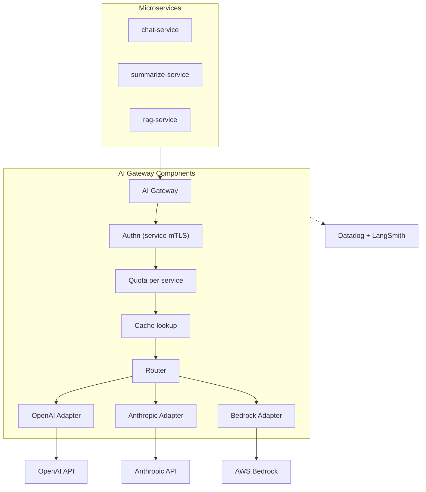

# Thiết kế AI Gateway / Service Layer cho nhiều Model Provider

## ⚡ Tóm tắt ngắn (30s)
* **AI Gateway** = abstraction layer thống nhất API cho multiple LLM providers (OpenAI, Anthropic, Bedrock, Gemini, self-host).
* **Lợi ích**:
  1. **Provider failover**: 1 down → switch.
  2. **Cost optimization**: route theo task type → model rẻ phù hợp.
  3. **Centralized auth/quota/audit**.
  4. **Unified observability**.
  5. **Easy A/B test new provider**.
* **Pattern**: gateway tự host (Kong + custom plugin) hoặc managed (Portkey, OpenRouter, AWS Bedrock).
* **Components**: provider adapter, router (cost/capability), rate limit, cache, observability.
* **Thảm họa thực chiến**: 10 microservices direct call OpenAI/Anthropic/Bedrock độc lập → lock-in, không có single quota, no observability. Senior fix: centralized AI gateway.

---

## 🔍 Components

### 1. Provider adapter (Interface)
Refer to c5_s2_q13 — canonical types + per-provider adapter.

### 2. Router
- Static config: purpose → provider mapping.
- Cost-based: cheap model for simple tasks.
- A/B test: 5% traffic Anthropic vs OpenAI.
- Failover: primary fail → secondary.

### 3. Auth + Quota
- Service auth (JWT/mTLS).
- Per-service quota.
- Per-tenant quota.

### 4. Cache
- Semantic cache + exact match.

### 5. Observability
- Unified tracing.
- Cost dashboard per provider, service, tenant.

---

## 🎨 Architecture



---

## 💻 Gateway service

```java
@RestController
@RequestMapping("/v1")
public class AiGatewayController {
    
    @PostMapping("/chat/completions")
    public Mono<UnifiedResponse> chat(
        @RequestHeader("X-Service-ID") String serviceId,
        @RequestHeader("X-Tenant-ID") String tenantId,
        @RequestBody UnifiedRequest req
    ) {
        // 1. Authn (mTLS or service JWT)
        var service = serviceRegistry.verify(serviceId);
        
        // 2. Quota
        if (!quotaService.allow(serviceId, req.estimatedTokens())) {
            return Mono.error(new QuotaExceededException());
        }
        
        // 3. Cache
        var cached = cache.lookup(req);
        if (cached.isPresent()) return Mono.just(cached.get());
        
        // 4. Route
        var provider = router.select(req, service);
        
        // 5. Call + record
        return provider.chat(req)
            .doOnNext(resp -> {
                cache.store(req, resp);
                costTracker.record(serviceId, tenantId, resp);
                quotaService.consume(serviceId, resp.totalTokens());
            });
    }
}
```

---

## 📊 Routing examples

| Task | Route to |
| :--- | :--- |
| chat_general | gpt-4o-mini (cheap, fast) |
| chat_reasoning | claude-opus-4-7 |
| summarize_short | claude-haiku-4-5 |
| code_review | claude-sonnet-4-6 |
| compliance_data | Bedrock (regional, no train) |
| long_context | gemini-2 (1M context) |

---

## ⚠️ Gotchas + Interviewer

1. **Gateway = SPOF**: redundancy critical.
2. **Adapter feature gap**: provider-specific features (e.g. OpenAI JSON mode) need fallback in canonical.
3. **Latency overhead**: minimize (target <10ms gateway overhead).

**Interviewer: "Implement A/B test new model via gateway?"**
1. Router config: 10% traffic to new provider.
2. Track outcome metrics per provider.
3. Eval daily: quality, cost, latency.
4. Rollout if A/B winner.
5. Easy rollback via config.
