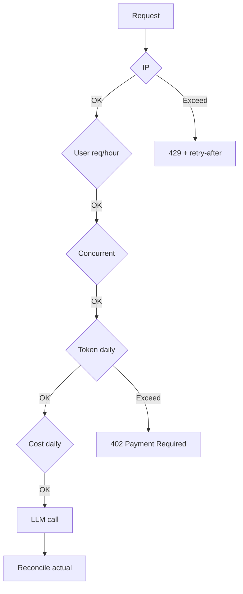

# Thiết kế Rate Limit và Quota cho AI Endpoint

## ⚡ Tóm tắt ngắn (30s)
Refer to c5_s2_q8 + c5_s5_q18 for details.

* Multi-dimensional: IP, user, tenant, token, cost.
* Algorithm: Sliding window log (Redis Lua) cho accuracy.
* Tiers: free/pro/enterprise với caps khác nhau.
* Reconcile post-call: estimated vs actual tokens.
* Anomaly detection: cost spike alert.

---

## 🔍 Multi-layer

| Layer | Limit type | Cap example (pro tier) |
| :--- | :--- | :--- |
| IP | req/min | 40 |
| User | req/hour | 500 |
| Concurrent | per user | 3 |
| Token | per day | 1M |
| Cost | per day | $5 |

---

## 🎨 Layers



---

## 💻 Sliding window Lua

```lua
local key = KEYS[1]
local now = tonumber(ARGV[1])
local window = tonumber(ARGV[2])
local limit = tonumber(ARGV[3])

redis.call('ZREMRANGEBYSCORE', key, 0, now - window)
local count = redis.call('ZCARD', key)
if count < limit then
    redis.call('ZADD', key, now, now .. ':' .. math.random())
    redis.call('PEXPIRE', key, window)
    return 1
end
return 0
```

## 💻 Cost cap

```java
public boolean canAfford(String userId, double estCost) {
    String key = "cost:" + userId + ":" + LocalDate.now();
    Double current = redisTemplate.opsForValue().get(key);
    double total = (current != null ? current : 0) + estCost;
    double cap = tierService.dailyCostCap(userId);
    return total <= cap;
}

public void recordActual(String userId, double actualCost) {
    String key = "cost:" + userId + ":" + LocalDate.now();
    redisTemplate.opsForValue().increment(key, actualCost);
    redisTemplate.expire(key, Duration.ofDays(2));
}
```

---

## ⚠️ Gotchas

1. **Estimate sai**: reconcile after actual.
2. **Multi-tenant**: tenant cap khác user cap.
3. **Tier transitions**: user upgrade mid-day → quota tăng.

**Interviewer: "Cost spike detect?"**
1. Per-minute aggregate.
2. Compare with 7-day baseline.
3. > 3x = alert + auto-throttle.
4. Top spenders dashboard.
