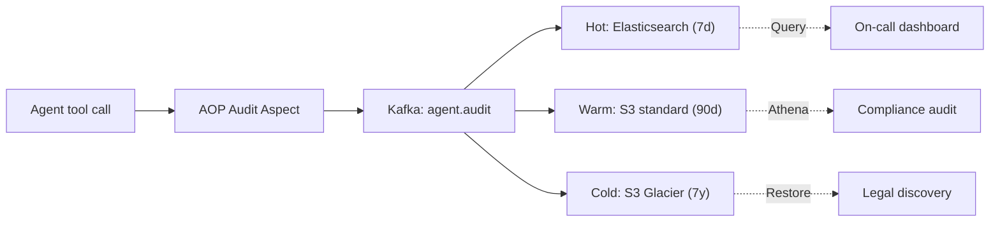

# Thiết kế Audit Log cho AI Tool Calling

## ⚡ Tóm tắt ngắn (30s)
Refer to c5_s5_q15 for detail.
* Log every tool call: timestamp, trace_id, user_id_hash, tool_name, args_redacted, result, latency, cost.
* Storage tiers: Elasticsearch (hot 7d), S3 (warm 90d), Glacier (cold 7y).
* Immutability: S3 Object Lock (WORM).
* Schema: structured JSON.
* Aspect-oriented: AOP auto-audit annotation.

---

## 🔍 Schema

```json
{
  "log_id": "uuid",
  "timestamp": "ISO 8601",
  "trace_id": "otel",
  "session_id": "agent session",
  "user_id_hash": "sha256",
  "tenant_id": "uuid",
  "agent_profile": "csr-tier1",
  "tool_name": "refund_propose",
  "tool_args_redacted": {...},
  "approval_id": "uuid",
  "result_status": "success|error|denied",
  "latency_ms": 234,
  "cost_usd": 0.05
}
```

---

## 🎨 Pipeline



---

## 💻 AOP audit aspect

```java
@Aspect
@Component
public class ToolAuditAspect {
    private final KafkaTemplate<String, AuditEvent> kafka;
    
    @Around("@annotation(Tool)")
    public Object around(ProceedingJoinPoint pjp) throws Throwable {
        long start = System.currentTimeMillis();
        var ctx = AgentContextHolder.current();
        var event = AuditEvent.builder()
            .traceId(ctx.traceId())
            .userIdHash(hash(ctx.userId()))
            .toolName(pjp.getSignature().getName())
            .toolArgsRedacted(redact(pjp.getArgs()));
        try {
            Object result = pjp.proceed();
            return event.status("success").build();
        } catch (Exception e) {
            event.status("error").errorMessage(e.getMessage());
            throw e;
        } finally {
            event.latencyMs(System.currentTimeMillis() - start);
            kafka.send("agent.audit", event.build());
        }
    }
}
```

---

## ⚠️ Gotchas

1. **PII redaction**: at source, before log.
2. **Volume**: 100k tool calls/min → Kafka scale.
3. **Immutability**: WORM storage for compliance.

**Interviewer: "Customer dispute. Prove what agent did?"**
1. Query audit by user_id_hash + time.
2. Reconstruct session by trace_id.
3. Export with checksums.
4. Legal review process.
