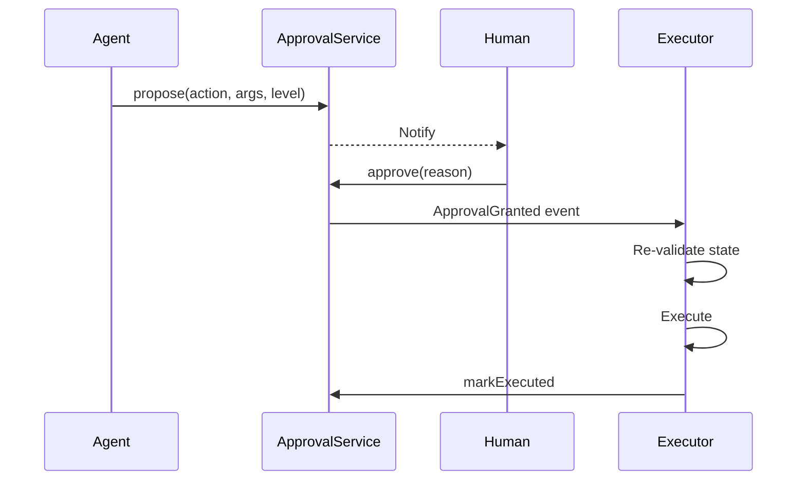

# Thiết kế Approval Workflow cho High-Risk AI Action

## ⚡ Tóm tắt ngắn (30s)
Refer to c5_s4_q18 + c5_s5_q15 for details.

* State machine: pending → approved/rejected/expired → executing → executed/failed.
* Components: proposal store, notifier, approval UI, executor, audit.
* 4-eye principle: requester != approver.
* TTL 24h default.
* Re-validate state at execute.

---

## 🔍 State machine

```
pending → approved → executing → executed
   ↓        ↓                       ↓
expired  rejected               failed
```

---

## 🎨 Flow



---

## 💻 Schema

```sql
CREATE TABLE approval_requests (
    id UUID PRIMARY KEY,
    requester_id UUID NOT NULL,
    action VARCHAR(100),
    args JSONB,
    level INT,
    status VARCHAR(20) DEFAULT 'pending',
    approver_id UUID,
    approval_reason TEXT,
    created_at TIMESTAMPTZ DEFAULT NOW(),
    expires_at TIMESTAMPTZ DEFAULT NOW() + INTERVAL '24 hours',
    approved_at TIMESTAMPTZ,
    executed_at TIMESTAMPTZ,
    execution_result JSONB
);
```

---

## 💻 Approval service

```java
@Service
public class ApprovalService {
    
    public String createRequest(String userId, String action, Map<String,Object> args, int level) {
        String id = UUID.randomUUID().toString();
        jdbc.update("INSERT INTO approval_requests (id, requester_id, action, args, level) VALUES (?, ?::uuid, ?, ?::jsonb, ?)",
            id, userId, action, toJson(args), level);
        notifier.notifyReviewers(level, id, action);
        return id;
    }
    
    @Transactional
    public boolean approve(String reqId, String approverId, String reason) {
        int rows = jdbc.update("""
            UPDATE approval_requests
            SET status = 'approved', approver_id = ?::uuid, approval_reason = ?,
                approved_at = NOW()
            WHERE id = ?::uuid
              AND status = 'pending'
              AND expires_at > NOW()
              AND requester_id != ?::uuid
            """, approverId, reason, reqId, approverId);
        if (rows == 0) return false;
        eventBus.publish(new ApprovalGrantedEvent(reqId));
        return true;
    }
}
```

---

## ⚠️ Gotchas + Interviewer

1. **Self-approve**: enforce 4-eye.
2. **Stale state**: re-validate at execute.
3. **Approver fatigue**: smart batching.

**Interviewer: "Scale to 1000 approvals/day?"**
1. Auto-batch similar requests.
2. Tiered review (T1 low risk, manager high).
3. Risk auto-scoring → some auto-approve.
4. Mobile app for fast review.
5. SLA: 30 min for high-risk.
