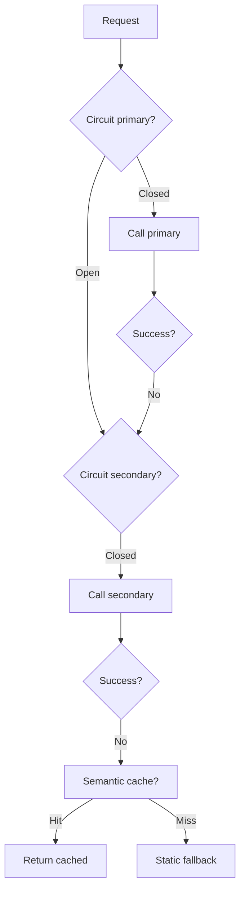

# Thiết kế Fallback khi LLM Provider Down

## ⚡ Tóm tắt ngắn (30s)
Refer to c5_s2_q11.

* **5 strategies fallback**:
  1. Graceful error message + retry-after.
  2. Semantic cache hit.
  3. Static template for known intents.
  4. Multi-provider failover (Anthropic ↔ OpenAI ↔ Bedrock).
  5. Async queue for non-urgent tasks.
* **Circuit breaker** prevents cascade.
* **Status page webhook** for proactive open circuit.

---

## 🎨 Layers



---

## 💻 Failover service

```java
@Service
public class FailoverLlmService {
    @CircuitBreaker(name = "primary", fallbackMethod = "trySecondary")
    public Mono<LlmResponse> chat(LlmRequest req) {
        return primaryProvider.chat(req);
    }
    
    @CircuitBreaker(name = "secondary", fallbackMethod = "tryTertiary")
    private Mono<LlmResponse> trySecondary(LlmRequest req, Throwable t) {
        return secondaryProvider.chat(adjustForSecondary(req));
    }
    
    private Mono<LlmResponse> tryTertiary(LlmRequest req, Throwable t) {
        return cache.lookup(req)
            .switchIfEmpty(Mono.just(staticFallback(req)));
    }
}
```

---

## ⚠️ Gotchas

1. **Cascade load**: secondary not provisioned.
2. **Quality diff**: flag fallback usage.
3. **Status page webhook**: proactively open circuit on known outage.

**Interviewer: "Test fallback path?"**
1. Game day: monthly intentional block primary.
2. Synthetic monitoring: 1 req/min via fallback path.
3. CI test: mock primary down.
