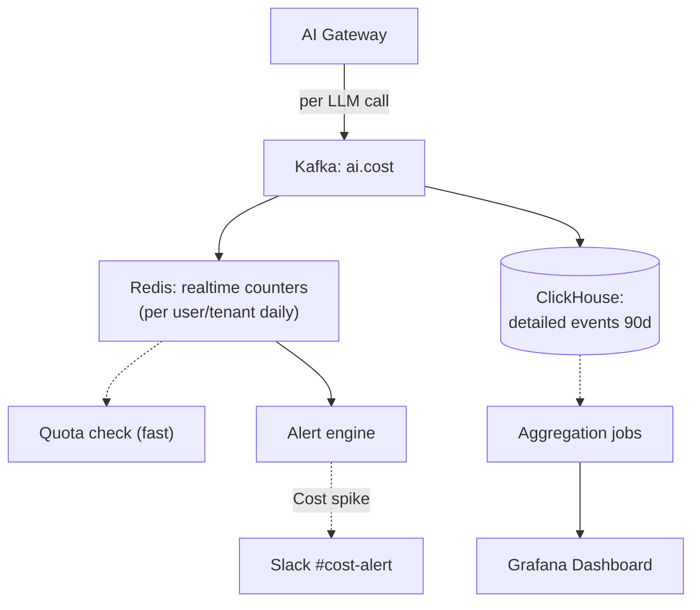

# Thiết kế Cost Dashboard cho AI Usage

## ⚡ Tóm tắt ngắn (30s)
* **Yêu cầu**: real-time + historical cost tracking per user, tenant, service, model.
* **Components**:
  1. **Metering**: emit cost event per LLM call.
  2. **Storage**: time-series DB (Timescale, ClickHouse).
  3. **Aggregation**: by user/tenant/model/service/day.
  4. **Dashboard**: Grafana or custom UI.
  5. **Alerts**: cost spike, budget breach.
* **Metrics**: tokens_in, tokens_out, cost_usd, latency, model, purpose, tenant.
* **Stack**: Kafka + ClickHouse + Grafana, or Datadog APM.

---

## 🔍 Components

### 1. Metering at AI Gateway
Every LLM call → emit event to Kafka.

### 2. Stream processing
Aggregate per minute → ClickHouse for analytical queries.

### 3. Real-time aggregation
Redis counters for instant lookups (current daily cost per user).

### 4. Historical store
ClickHouse keeps detailed events 90d, aggregates 1y.

### 5. Dashboard
Grafana panels:
- Today's cost.
- Cost per tenant top 20.
- Cost per service.
- Cost per model.
- Trend last 7/30 days.
- Alert config.

---

## 🎨 Architecture



---

## 💻 Cost event schema

```json
{
  "timestamp": "ISO 8601",
  "service_id": "chat-service",
  "tenant_id": "uuid",
  "user_id_hash": "sha256",
  "model": "claude-sonnet-4-6",
  "provider": "anthropic",
  "purpose": "summarize",
  "input_tokens": 2500,
  "output_tokens": 300,
  "cost_usd": 0.0125,
  "latency_ms": 1234,
  "request_id": "uuid"
}
```

---

## 💻 Cost tracker

```java
@Service
public class CostTracker {
    private final KafkaTemplate<String, CostEvent> kafka;
    private final StringRedisTemplate redis;
    
    public void record(String serviceId, String tenantId, String userId,
                        LlmResponse resp) {
        // Emit event for analytics
        kafka.send("ai.cost", buildEvent(serviceId, tenantId, userId, resp));
        
        // Realtime counters (Redis)
        String date = LocalDate.now().toString();
        String userKey = String.format("cost:user:%s:%s", userId, date);
        String tenantKey = String.format("cost:tenant:%s:%s", tenantId, date);
        
        redis.opsForValue().increment(userKey, (long)(resp.costUsd() * 1_000_000));  // micro-cents
        redis.expire(userKey, Duration.ofDays(2));
        redis.opsForValue().increment(tenantKey, (long)(resp.costUsd() * 1_000_000));
        redis.expire(tenantKey, Duration.ofDays(2));
    }
    
    public double getDailyCost(String userId) {
        String key = "cost:user:" + userId + ":" + LocalDate.now();
        Long microcents = redis.opsForValue().get(key);
        return microcents != null ? microcents / 1_000_000.0 : 0;
    }
}
```

---

## 💻 ClickHouse aggregation

```sql
-- Schema
CREATE TABLE ai_cost_events (
    timestamp DateTime,
    service_id String,
    tenant_id String,
    user_id_hash String,
    model String,
    provider String,
    purpose String,
    input_tokens UInt32,
    output_tokens UInt32,
    cost_usd Float64,
    latency_ms UInt32
) ENGINE = MergeTree ORDER BY (timestamp, tenant_id);

-- Materialized view: daily aggregates
CREATE MATERIALIZED VIEW ai_cost_daily ENGINE = SummingMergeTree
ORDER BY (date, tenant_id, model)
POPULATE
AS SELECT
    toDate(timestamp) AS date,
    tenant_id, model,
    sum(cost_usd) AS total_cost_usd,
    sum(input_tokens + output_tokens) AS total_tokens,
    count() AS request_count
FROM ai_cost_events
GROUP BY date, tenant_id, model;

-- Query: top spenders today
SELECT tenant_id, total_cost_usd
FROM ai_cost_daily
WHERE date = today()
ORDER BY total_cost_usd DESC LIMIT 20;
```

---

## 📊 Dashboard panels

| Panel | Source | Refresh |
| :--- | :--- | :--- |
| Today's total cost | Redis | 10s |
| Cost per tenant top 20 | ClickHouse | 1 min |
| Cost trend 7d | ClickHouse | 5 min |
| Tokens per service | ClickHouse | 1 min |
| Anomaly: tenant spike | Compare 7d baseline | 1 min |
| Cost per model | ClickHouse | 1 min |

---

## ⚠️ Gotchas + Interviewer

1. **Estimate vs actual**: reconcile after LLM call.
2. **PII in events**: hash user_id.
3. **Volume**: 1M events/day OK; 100M → partition + retention.

**Interviewer: "Detect cost runaway in 5 min?"**
1. Redis counter / minute window.
2. Compare with rolling 7-day baseline.
3. If > 3x baseline → page on-call + auto-throttle.
4. Investigate: which tenant/user/feature?
5. Action: tighten limit, fix bug, communicate.
