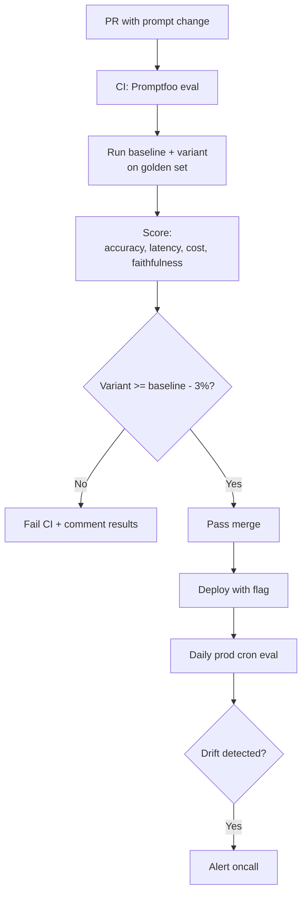

# Thiết kế Evaluation Pipeline cho Prompt/Model Regression

## ⚡ Tóm tắt ngắn (30s)
* **Eval pipeline** = run new prompt/model trên golden set → score → block deploy nếu regress.
* **3 components**:
  1. **Golden dataset**: 100-1000 representative Q&A với expected output.
  2. **Eval runners**: chạy prompt/model variant, parallel.
  3. **Scorers**: LLM-as-judge, deterministic checks, BLEU/ROUGE, faithfulness, latency, cost.
* **Triggers**:
  * **CI**: every PR touch prompts/.
  * **Daily**: prod cron run trên live system → detect drift.
  * **Pre-release**: full suite + adversarial.
* **Tools**: LangSmith, Promptfoo, Ragas, OpenAI Evals.

---

## 🔍 Pipeline

```
1. Golden dataset stored in git or LangSmith.
2. CI trigger on prompt change.
3. Run variant + baseline parallel.
4. Score per metric.
5. Diff: if regress > 3%, fail CI.
6. Pass → merge → deploy with feature flag.
7. Daily prod eval → drift detection.
```

---

## 🎨 Flow



---

## 💻 Promptfoo config

```yaml
description: chat_prompt v3.1 eval
prompts:
  - file://prompts/chat_v3.1.md
  - file://prompts/chat_v3.0.md  # baseline
providers:
  - anthropic:claude-sonnet-4-6
tests:
  - vars: {user: "How do I refund?"}
    assert:
      - type: llm-rubric
        value: "Polite, mentions 14-day window, refers to /refunds page"
      - type: not-contains
        value: ["I cannot help"]
  # ... 100 more cases
```

---

## 💻 Custom Java eval

```java
@Component
public class RagEvalRunner {
    
    @Scheduled(cron = "0 0 3 * * *")  // daily 3am
    public void runDailyEval() {
        var golden = goldenSetRepo.loadAll();
        var results = new ArrayList<EvalResult>();
        
        for (var case_ : golden) {
            var traceA = ragService.answer(case_.question(), "prompt-v3.0");
            var traceB = ragService.answer(case_.question(), "prompt-v3.1");
            
            var scoreA = scorer.score(traceA, case_.expected());
            var scoreB = scorer.score(traceB, case_.expected());
            
            results.add(new EvalResult(case_.id(), scoreA, scoreB));
        }
        
        var summary = summarize(results);
        if (summary.regression() > 0.03) {
            alerts.fire("Prompt v3.1 regression: " + summary);
        }
        evalRepo.save(summary);  // dashboard
    }
}
```

---

## 📊 Metrics

| Metric | Detection |
| :--- | :--- |
| Accuracy | LLM-as-judge or exact-match |
| Faithfulness | Ragas faithfulness score |
| Latency p95 | timer |
| Cost per query | token count × price |
| Refusal rate | % "I don't know" |
| Hallucination | citation validator |

---

## ⚠️ Gotchas + Interviewer

1. **Golden bias**: representative real users?
2. **LLM-judge bias**: same provider biases.
3. **Cost eval**: 1000 cases × 2 variants × $0.01 = $20/run.

**Interviewer: "Build eval for new RAG feature in 2 weeks?"**
1. Week 1: Curate 50 golden Q&A from support tickets + manual annotation.
2. Promptfoo setup with eval cases.
3. CI gate config.
4. Week 2: Daily cron + Grafana dashboard.
5. Adversarial set (prompt injection, edge cases).
6. Document baseline metrics + targets.
