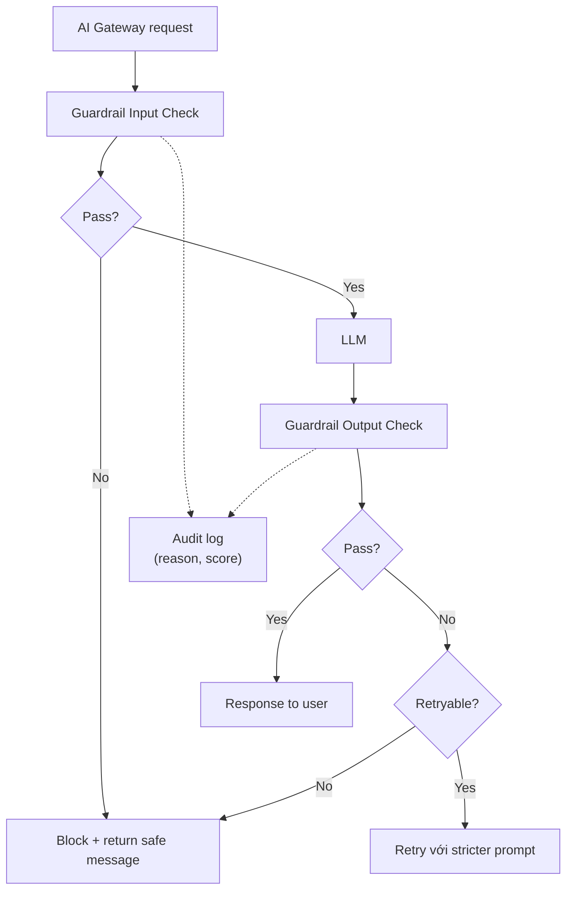

# Thiết kế Guardrail Service cho Prompt/Response

## ⚡ Tóm tắt ngắn (30s)
* **Guardrail service** = centralized service kiểm tra mọi prompt input + LLM output cho safety + compliance.
* **Functions**:
  1. **Input filter**: prompt injection, hate speech, PII detection.
  2. **Output filter**: PII leak, secrets, hallucinated facts, format validation.
  3. **Tool args validation**: schema, business rules.
  4. **Content moderation**: toxic, illegal content.
* **Stack**: Lakera Guard, OpenAI Moderation, NeMo Guardrails, Presidio.
* **Pattern**: API service used by AI Gateway + business services.

---

## 🔍 Components

### Input checks
- Lakera Guard / Rebuff: prompt injection.
- OpenAI Moderation API: hate/violence/sexual.
- Custom classifier: domain-specific (e.g. "ask about competitor").
- Presidio: PII detection.

### Output checks
- Secrets pattern (API keys, tokens).
- PII pattern.
- Hallucination flag (citation validation).
- Tone classifier.
- Structured output schema validation.

---

## 🎨 Architecture



---

## 💻 Guardrail service API

```java
@RestController
@RequestMapping("/guardrail/v1")
public class GuardrailService {
    
    @PostMapping("/check-input")
    public CheckResult checkInput(@RequestBody CheckRequest req) {
        var results = new ArrayList<DetectorResult>();
        
        // Run multiple detectors in parallel
        var lakeraFuture = CompletableFuture.supplyAsync(() ->
            lakera.check(req.text()));
        var moderationFuture = CompletableFuture.supplyAsync(() ->
            openaiModeration.check(req.text()));
        var piiFuture = CompletableFuture.supplyAsync(() ->
            presidio.detect(req.text()));
        
        var lakera = lakeraFuture.join();
        var moderation = moderationFuture.join();
        var pii = piiFuture.join();
        
        boolean safe = !lakera.flagged() && !moderation.flagged();
        var redactedText = pii.found() ? pii.redacted() : req.text();
        
        return new CheckResult(safe, redactedText,
            List.of(lakera, moderation, pii));
    }
    
    @PostMapping("/check-output")
    public CheckResult checkOutput(@RequestBody CheckRequest req) {
        // Check secrets, PII, hallucination, schema
        var secretsCheck = secretsDetector.scan(req.text());
        var piiCheck = presidio.detect(req.text());
        var citationCheck = req.expectedCitations() != null ?
            citationValidator.validate(req.text(), req.expectedCitations()) :
            CheckResult.passed();
        
        // ...
        return CheckResult.combine(secretsCheck, piiCheck, citationCheck);
    }
}
```

---

## 💻 Integration in AI Gateway

```java
@Service
public class GuardedAiService {
    
    public String chat(String userMessage, UserContext user) {
        // Input guardrail
        var inputCheck = guardrail.checkInput(userMessage);
        if (!inputCheck.safe()) {
            return "I cannot process this request.";
        }
        
        String prompt = inputCheck.redactedText();
        
        // Call LLM
        String response = llm.chat(prompt);
        
        // Output guardrail
        var outputCheck = guardrail.checkOutput(response);
        if (!outputCheck.safe()) {
            // Retry once with stricter
            response = llm.chat(prompt + "\n\nIMPORTANT: do not include any PII or secrets.");
            outputCheck = guardrail.checkOutput(response);
            if (!outputCheck.safe()) {
                return "Sorry, I cannot provide a safe response.";
            }
        }
        
        return outputCheck.redactedText();
    }
}
```

---

## 📊 Detectors

| Type | Tool | Latency |
| :--- | :--- | :---: |
| Prompt injection | Lakera Guard | 50ms |
| Moderation | OpenAI Moderation | 100ms |
| PII | Presidio (self) | 50ms |
| Secrets | Regex | <5ms |
| Citation validity | Custom | 10ms |
| Toxicity | Perspective API | 200ms |

---

## ⚠️ Gotchas + Interviewer

1. **Latency overhead**: parallel + cache common patterns.
2. **False positive**: tune threshold.
3. **Multi-language**: detector quality varies.

**Interviewer: "Guardrail blocked legit user. How handle?"**
1. Log + manual review false positive.
2. Adjust threshold or add exception rule.
3. UX: don't say "blocked" technical; offer escalation to human.
4. Feedback loop: user can dispute → review → if legit, fix detector.
