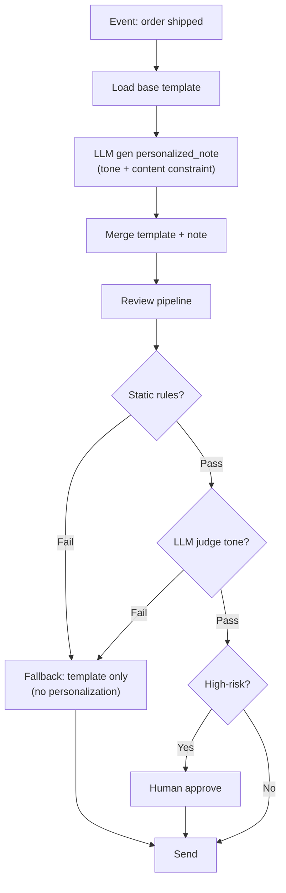

# Thiết kế AI Notification Generator (Kiểm soát Tone/Content)

## ⚡ Tóm tắt ngắn (30s)
* **Yêu cầu**: AI tạo notification (email, SMS, push) personalized, but content phải controlled (tone, brand, compliance).
* **Architecture**:
  1. **Template + Variable substitution** baseline.
  2. **LLM enriches** with personalization (greeting, context).
  3. **Multi-layer review**: rules + LLM judge + optional human.
  4. **Send only after pass**.
* **Risk**: AI generates wrong tone, leaks PII, fake promises, sends sensitive data wrong recipient.
* **Stack**: Spring Boot, Anthropic Sonnet, Liquid templates, content moderation.

---

## 🔍 Components

### 1. Base template
```
Hi {{customer_name}},

Your order {{order_id}} has been shipped. Track at {{tracking_url}}.

{{#personalized_note}}{{personalized_note}}{{/personalized_note}}

Thanks,
Team ABC
```

### 2. LLM generates `personalized_note`
- Tone constraint: friendly, brand-aligned.
- Content constraint: no promises, no PII outside template.
- Length: 1-2 sentences.

### 3. Review pipeline
- Static rules (length, no profanity).
- LLM judge: tone/brand check.
- Optional human review for high-risk (mass campaign).

### 4. Send
- Verify recipient: correct email/phone in DB.
- Idempotency.
- A/B test variants.

---

## 🎨 Flow



---

## 💻 Code

```java
@Service
public class AiNotificationGenerator {
    
    private static final String NOTE_SYSTEM = """
            You are notification writer for ABC Company.
            
            RULES:
            - 1-2 sentences max.
            - Friendly but professional tone.
            - NO promises, discounts, refunds.
            - NO PII beyond what's provided in context.
            - Match brand voice: warm, concise.
            
            Output ONLY the note, no preamble.
            """;
    
    public NotificationDraft generate(NotificationContext ctx) {
        // 1. Load template
        var template = templateRepo.load(ctx.type());
        
        // 2. LLM generates personalized note
        String note = llm.prompt()
            .system(NOTE_SYSTEM)
            .user("Customer: " + ctx.customerName() +
                  "\nEvent: " + ctx.eventDescription() +
                  "\nContext: " + ctx.contextHint())
            .options(ChatOptions.builder().temperature(0.5).maxTokens(80).build())
            .call().content();
        
        // 3. Review pipeline
        if (!staticRules.pass(note)) return NotificationDraft.fallback(template, ctx);
        var judge = llmJudge.checkTone(note);
        if (!judge.ok()) return NotificationDraft.fallback(template, ctx);
        
        // 4. Render
        String body = templating.render(template,
            Map.of(
                "customer_name", ctx.customerName(),
                "order_id", ctx.orderId(),
                "personalized_note", note,
                "tracking_url", ctx.trackingUrl()
            ));
        
        return NotificationDraft.builder()
            .recipient(ctx.email())
            .body(body)
            .reviewRequired(ctx.isHighRisk())
            .build();
    }
}
```

---

## 📊 Risk-based gating

| Notification type | Auto-send | Human review |
| :--- | :---: | :---: |
| Transactional (order shipped) | ✓ | ✗ |
| Promo to single user | ✓ | ✗ |
| Mass campaign > 10k | ✗ | ✓ |
| Compliance-related (legal, financial) | ✗ | ✓ |
| Crisis comm | ✗ | ✓ |

---

## ⚠️ Gotchas + Interviewer

1. **Wrong recipient**: verify email/phone with DB before send.
2. **Tone violation**: LLM judge mandatory.
3. **Hallucinated facts**: only allow variables from context.

**Interviewer: "AI sent wrong tone in mass email. Defense?"**
1. **Pre-send sample**: 1% sample human review before bulk send.
2. **A/B test**: small cohort first.
3. **Tone classifier**: blocking gate.
4. **Easy recall**: ability to halt mid-send batch.
5. **Postmortem**: improve tone training data.
