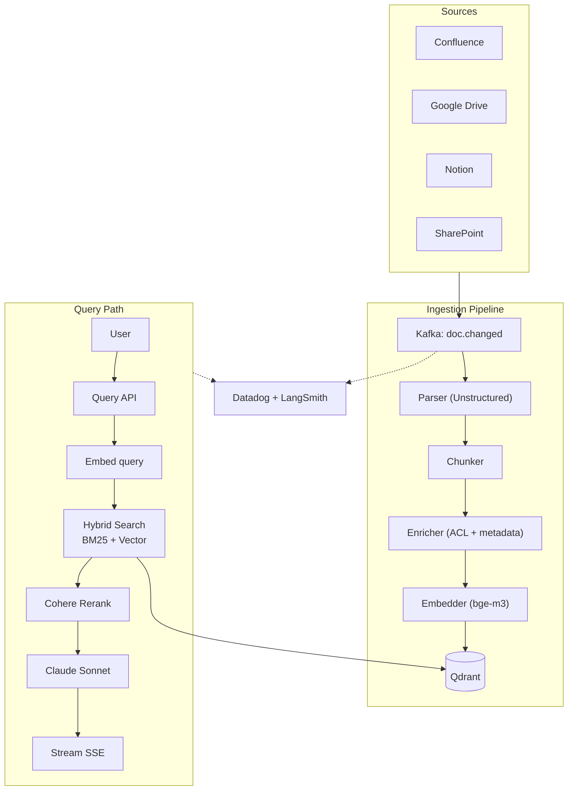

# Thiết kế RAG System cho Tài liệu Công ty

## ⚡ Tóm tắt ngắn (30s)
* **Yêu cầu**: Internal Q&A trên 100k+ company documents (Confluence, Google Drive, SharePoint, Notion).
* **Architecture**: Source connectors → Ingestion pipeline → Vector DB → Search API → LLM.
* **Components chính**:
  1. **Ingestion**: event-driven (webhook) + cron sweep, parse (Unstructured.io), chunk, embed (bge-m3 multilingual), store.
  2. **ACL**: sync permission from source → metadata.
  3. **Query**: hybrid (BM25 + vector) + rerank (Cohere) + LLM.
  4. **Multi-tenant**: per-tenant collection.
* **Scale**: 100k docs × ~10 chunks = 1M vectors initially.
* **Stack**: Kafka, Spring Boot, Unstructured.io, bge-m3, Qdrant, Anthropic Sonnet, Cohere rerank.

---

## 🔍 Components

### 1. Source Connectors
* Confluence: webhook on page update + cron for missed.
* Google Drive: pubsub notifications.
* SharePoint: change feed.
* Notion: webhook.
Output → Kafka topic `doc.changed`.

### 2. Ingestion Pipeline
* Consumer: parse (Unstructured for PDF/DOCX, native for markdown).
* Smart chunking: respect section/code boundaries.
* Enrich: tenant_id, ACL roles, last_updated.
* Embed: bge-m3 self-host (multilingual VN/EN).
* Store: Qdrant với pre-filter.

### 3. ACL Sync
* Webhook on permission change.
* Periodic full sync.
* Cache permission TTL 15 min.

### 4. Query API
* Embed query (bge-m3 with prefix).
* Hybrid: BM25 + vector top-50.
* RRF merge.
* Cohere rerank → top-5.
* Build prompt + Sonnet call.
* Stream SSE.

---

## 🎨 Architecture



---

## 💻 Key code

### Ingestion consumer

```java
@KafkaListener(topics = "doc.changed", concurrency = "10")
public void ingest(DocChangedEvent event) {
    if (alreadyProcessed(event.docId(), event.contentHash())) return;
    
    var parsed = parser.parse(event.sourceUrl());
    var chunks = chunker.split(parsed.text(), 500, 50);
    var embeddings = embedder.embedBatch(chunks);
    
    var atomicWrite = chunks.stream().map((text, i) -> ChunkRecord.builder()
        .tenantId(event.tenantId())
        .docId(event.docId())
        .chunkIdx(i)
        .text(text)
        .embedding(embeddings.get(i))
        .aclRoles(parsed.aclRoles())
        .metadata(parsed.metadata())
        .build())
        .toList();
    
    repo.replaceAllForDoc(event.docId(), atomicWrite);
}
```

### Query

```java
public Flux<String> answer(String question, UserContext user) {
    float[] qEmb = embedder.embed("query: " + question);  // bge-m3 prefix
    
    var bm25 = bm25Service.search(question, user.tenantId(), 50);
    var vector = qdrant.search(qEmb, user.tenantId(), user.aclRoles(), 50);
    
    var merged = rrfMerge(bm25, vector, 50);
    var top5 = cohereReranker.rerank(question, merged, 5);
    
    return chatClient.prompt()
        .system(STRICT_RAG_SYSTEM)
        .user(buildContextPrompt(top5, question))
        .stream().content();
}
```

---

## 📊 Design Decisions

| Decision | Chose | Rationale |
| :--- | :--- | :--- |
| Embedding | bge-m3 self-host | Multilingual (VN), free, recall ~84% |
| Vector DB | Qdrant | Pre-filter, scale, payload metadata |
| Rerank | Cohere rerank-3 | Best multilingual reranker |
| LLM | Sonnet 4.6 via Bedrock | Compliance + quality |
| Ingestion | Event-driven + cron sweep | Low latency + completeness |
| ACL | Sync from source | Single source of truth |
| Cache | Redis 1h TTL | Hit rate 30% |

---

## ⚠️ Gotchas + Interviewer

1. **ACL drift**: source vs cache.
2. **Stale embeddings**: docs update.
3. **Cost embedding**: 1M chunks × $0.13/1M = $130. Self-host bge-m3 free.

**Interviewer: "Scale to 100M chunks across 5000 tenants?"**
1. Qdrant cluster sharding by tenant.
2. Per-tenant collection cho large tenants.
3. Hot/cold tier: archive old docs to cheaper storage.
4. Embedding parallel workers (1k QPS achievable).
5. Per-tenant rate limit + cost cap.
6. Multi-region deployment for compliance.
