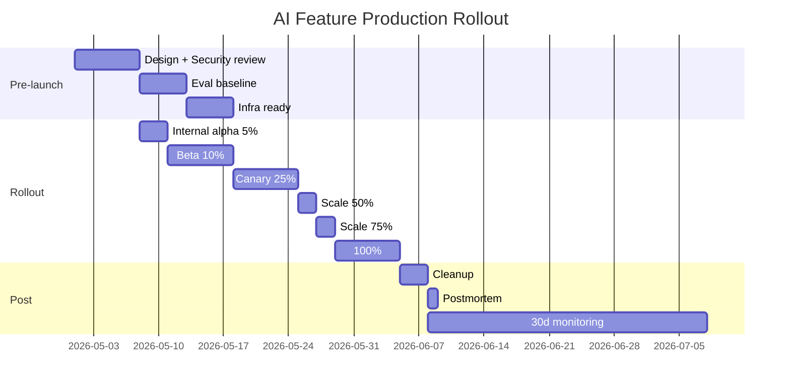

# Thiết kế Production Rollout cho AI Feature Mới

## ⚡ Tóm tắt ngắn (30s)
* **Production rollout của AI feature** = process gồm 7 phases với gates ở mỗi step.
* **Phases**:
  1. **Pre-launch**: design, security review, eval suite, infra ready.
  2. **Internal alpha** (5%): dogfood with engineers + PM.
  3. **Beta** (10% opt-in): gather feedback, fix bugs.
  4. **Canary** (25%): random users, A/B vs baseline.
  5. **Scale** (50%, 75%, 100%): metric gates each step.
  6. **Cleanup**: remove old code, document.
  7. **Post-launch monitoring**: 30d aggressive observation.
* **Critical at each gate**: metric review, rollback ready, on-call rotation.
* **Thảm họa thực chiến**: 0 → 100% deploy. Bug surface 5% case = millions affected. Senior: gradual + feature flag + auto-rollback.

---

## 🔍 7 Phases detail

### Phase 1: Pre-launch
- Design review.
- Security review (12-point checklist).
- Eval baseline (golden set 100+ cases).
- Infrastructure provisioned.
- Runbook + on-call rotation set.
- Monitoring dashboards created.
- Kill switch tested.

### Phase 2: Internal Alpha (5%, week 0)
- Engineers + PM + designers.
- Aggressive monitoring (every metric).
- Daily review.
- Fix bugs quickly.

### Phase 3: Beta (10% opt-in, week 1)
- Customers who opt-in.
- Feedback survey active.
- Gather edge cases.

### Phase 4: Canary (25% random, week 2)
- A/B test vs baseline.
- Statistical significance required.
- Monitor business metrics (revenue, CSAT, retention).

### Phase 5: Scale (week 3-4)
- 50% → monitor 2 days.
- 75% → monitor 2 days.
- 100% → monitor 1 week intensive.

### Phase 6: Cleanup
- Remove old code paths.
- Document new behavior.
- Update runbooks.

### Phase 7: Post-launch (week 5+)
- 30d aggressive observation.
- Postmortem (what went well, what to improve).
- Plan iteration.

---

## 🎨 Rollout timeline



---

## 💻 Rollout config

```yaml
# growthbook config
features:
  ai_chat_v3:
    description: "New RAG-based chat with Sonnet"
    valueType: boolean
    defaultValue: false
    rules:
      # Phase 1-2: internal
      - condition: '{"email":{"$regex":".*@mycompany.com$"}}'
        value: true
      
      # Phase 3: beta opt-in
      - condition: '{"betaProgram":"opted-in"}'
        value: true
      
      # Phase 4-5: gradual %
      - rolloutPercentage: 25  # adjust per phase
        value: true
```

---

## 💻 Auto-rollback monitor

```java
@Component
@Scheduled(fixedRate = 60_000)
public class RolloutMonitor {
    
    private final List<RolloutFeature> active;
    private final GrowthBookClient gb;
    
    public void check() {
        for (var feat : active) {
            var v3 = metrics.collect(feat.name(), "v3");
            var v2 = metrics.collect(feat.name(), "v2");
            
            // Multiple gate checks
            if (v3.errorRate() > v2.errorRate() * 1.5
                || v3.csatRate() < v2.csatRate() * 0.85
                || v3.costPerQuery() > v2.costPerQuery() * 2.0) {
                
                log.error("Auto rollback {} due to regression", feat.name());
                gb.killSwitch(feat.name());
                pageOncall("Auto rollback " + feat.name());
            }
        }
    }
}
```

---

## 📊 Gate criteria

| Phase | Gate metrics |
| :--- | :--- |
| Pre-launch | Eval pass; security signed off |
| Alpha → Beta | < 1% error rate; on-call no incidents |
| Beta → Canary | CSAT > 4/5; bug count < 5 |
| Canary → 50% | A/B winner (significance >95%); cost within budget |
| 50% → 100% | All metrics stable for 48h |
| Post-launch | 30d incident-free; lessons documented |

---

## ⚠️ Gotchas + Interviewer

1. **Rush rollout**: skip gates → outage.
2. **Vanity success**: tech metric OK, business metric down (revenue / retention).
3. **Forgot rollback test**: rollback path untested → fails when needed.

**Interviewer: "Phase 4 canary 25%, business metric drops 8%. What do?"**
1. **Pause rollout**: don't proceed to 50%.
2. **Investigate**: pull traces, compare v2 vs v3 user feedback.
3. **Hypothesis**: which metric drove drop? UX change? Slower response?
4. **Decide**:
   - Bug → fix + re-canary.
   - Inherent quality issue → rollback to v2.
   - Acceptable trade-off (e.g. lower cost compensates) → ship with disclosure.
5. **Communicate**: stakeholders + customers if impact.
