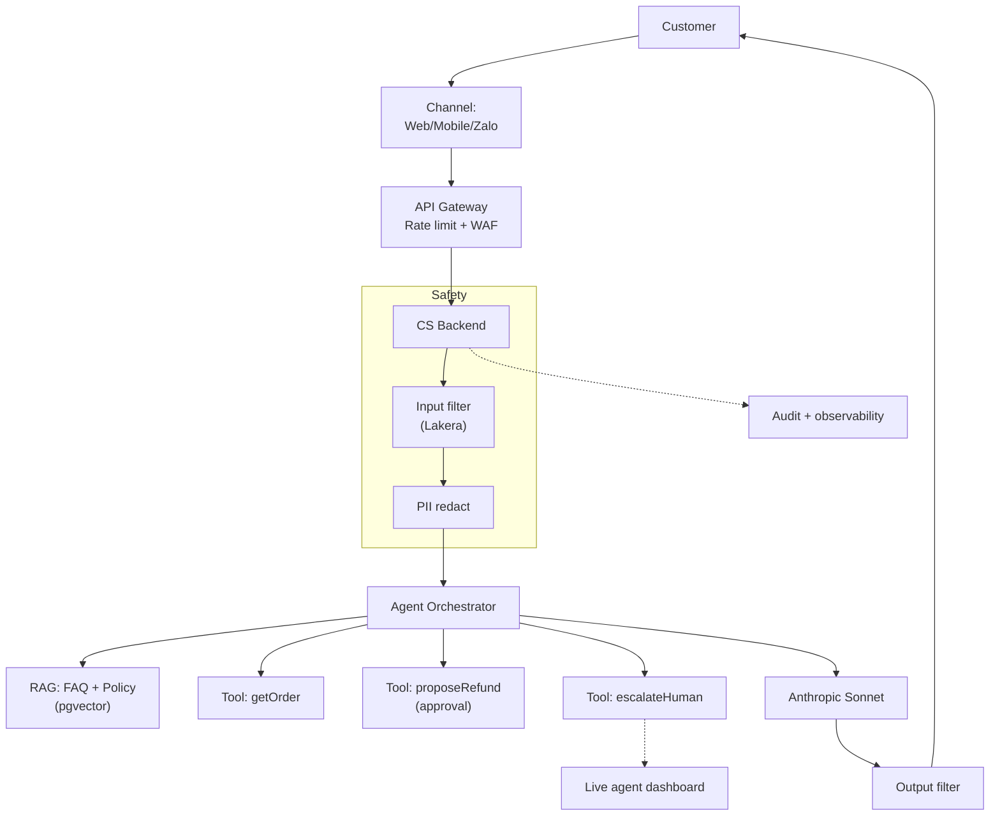

# Thiết kế AI Assistant cho Customer Service

## ⚡ Tóm tắt ngắn (30s)
* **Yêu cầu**: AI bot xử lý customer queries 24/7, escalate human khi cần. Customer-facing (B2C).
* **Architecture**: 
  * Customer chat (web/mobile/Zalo) → API Gateway → CS Agent → RAG (FAQ + policy) + tools (getOrder, createRefundProposal) → LLM → Stream response.
* **Khác internal bot**: stricter safety (prompt injection from anyone), better fallback (no human always available), PII careful.
* **Stack**: Frontend SSE chat, Spring Boot, pgvector, Anthropic Sonnet, Resilience4j, Lakera Guard, Presidio.

---

## 🔍 Components

### 1. Channel adapters
* Web widget (SSE chat).
* Mobile (WebSocket).
* Zalo/WhatsApp/Messenger webhooks.

### 2. Backend
* Auth (session or anonymous).
* Rate limit (IP + session).
* Prompt injection filter (Lakera).
* Agent orchestrator.
* RAG: product FAQ, policy.
* Tools: getOrder, getShipping, createRefundProposal, escalateToHuman, createTicket.

### 3. Safety layers
* Input filter.
* PII redact before LLM.
* Output filter.
* Hard cap step + cost per session.
* HITL for refunds.

### 4. Escalation
* If confidence low → handoff to live agent.
* Transfer context (conversation history) to CSR dashboard.

---

## 🎨 Architecture



---

## 💻 Key flow

```java
@RestController
public class CsChatController {
    
    @PostMapping(value = "/api/cs/chat", produces = MediaType.TEXT_EVENT_STREAM_VALUE)
    public Flux<String> chat(@RequestBody ChatReq req, @RequestHeader("X-Session-Id") String sessionId) {
        // 1. Rate limit
        if (!rateLimit.allow(sessionId, "cs_chat", 30, 60_000)) {
            return Flux.error(new RateLimitedException());
        }
        
        // 2. Input safety
        var safetyCheck = lakera.check(req.message());
        if (safetyCheck.flagged()) {
            return Flux.just("Hi, our chat is for product/order support. How can I help?");
        }
        
        // 3. Redact PII (we don't want to send card # to LLM)
        var redacted = presidio.redact(req.message());
        
        // 4. Get session memory
        var memory = sessionMemory.get(sessionId);
        
        // 5. Stream with agent
        return csAgent.stream(redacted.text(), memory)
            .doOnNext(chunk -> sessionMemory.append(sessionId, chunk))
            .doOnError(e -> log.error("CS chat error", e))
            .onErrorResume(e -> Flux.just("Sorry, I had trouble. Please try again or [Talk to human]"));
    }
}
```

---

## 📊 Design Decisions

| Decision | Chose | Rationale |
| :--- | :--- | :--- |
| Customer-facing safety | Multi-layer | Public exposure, prompt injection inevitable |
| Refund | Propose only | Irreversible, fraud risk |
| Auth | Optional session | Allow anonymous for general questions |
| LLM | Sonnet | Strong refusal + quality |
| Knowledge | RAG FAQ + Policy | Auto-update vs hardcode |
| Escalation | Click "Talk to human" button | Always available |
| Persistence | Optional (user can opt in) | Privacy |

---

## ⚠️ Gotchas + Interviewer

1. **Open to internet**: full prompt injection defense.
2. **PII**: customer paste credit cards → must redact.
3. **Languages**: customers may use slang, multilingual.

**Interviewer: "Customer threatens 'I'll sue if you don't refund'. Agent handle?"**
1. **Detect emotional/legal**: classifier flag.
2. **Empathy template**: "I understand this is frustrating".
3. **Auto-escalate to senior agent**: don't try to handle legal.
4. **Audit**: log carefully, expect possible legal review.
5. **NO commitments**: agent never promises beyond policy.
