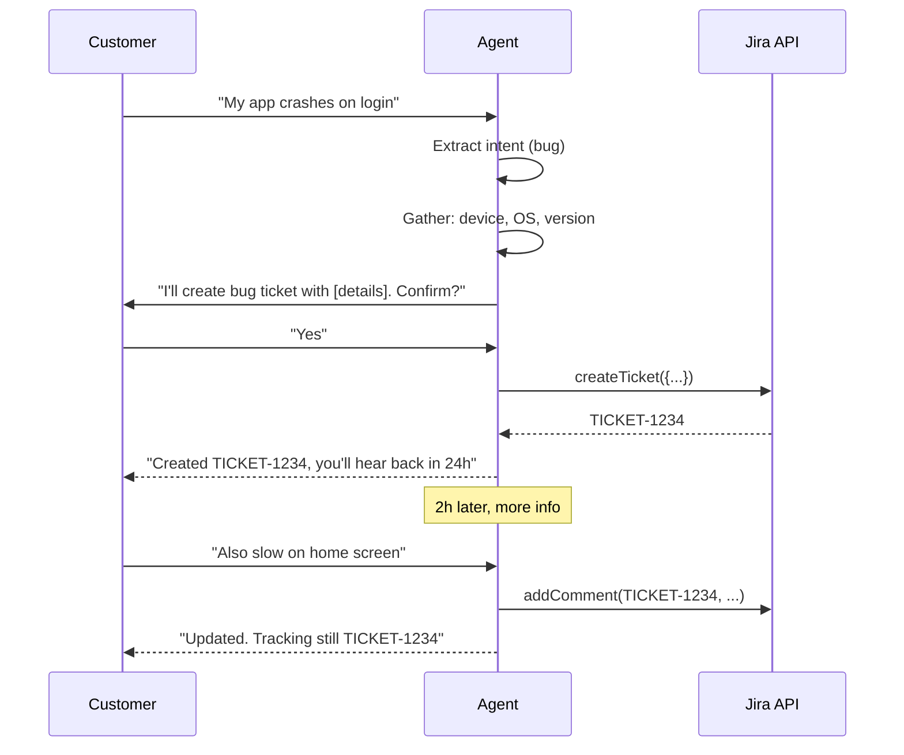

# Thiết kế AI Agent có thể Tạo Ticket và Cập nhật Ticket

## ⚡ Tóm tắt ngắn (30s)
* **Yêu cầu**: AI agent integrated với ticket system (Jira/Zendesk/Linear) tự động tạo/update ticket dựa trên customer conversation.
* **Components**:
  1. **Conversation analyzer**: extract intent + entities (priority, category).
  2. **Ticket tool**: createTicket, addComment, updateStatus.
  3. **Approval gate**: create ticket auto, but update sensitive fields (e.g. priority bump) requires CSR review.
  4. **Audit + linking**: bot ticket links to original conversation.
* **Stack**: Anthropic agent với tool calling, Jira REST API, structured output JSON schema.
* **Thảm họa nếu thiếu**: agent tạo ticket spam (1 question = 5 tickets), bypass priority thresholds, miss customer details.

---

## 🔍 Components

### Tools
```json
{
  "name": "create_ticket",
  "description": "Create new support ticket. Use ONLY after gathering: title, description, category, priority. Confirms with user first.",
  "input_schema": {
    "type": "object",
    "properties": {
      "title": {"type": "string"},
      "description": {"type": "string"},
      "category": {"enum": ["bug", "feature", "billing", "other"]},
      "priority": {"enum": ["low", "medium", "high"]},
      "customer_id": {"type": "string"}
    }
  }
}
```

```json
{
  "name": "update_ticket",
  "description": "Update existing ticket. Only allow: add comment. Status/priority changes need approval.",
  "input_schema": {...}
}
```

### Workflow
1. Customer chat → agent gathers info.
2. Agent classifies intent.
3. Agent confirms with customer ("I'll create ticket with X, Y, Z. OK?").
4. Customer confirms → agent calls createTicket.
5. Returns ticket ID to customer.
6. Later updates if more info.

### Guards
* Rate limit: max 5 tickets/customer/day.
* Dedup: similar issue from same customer in 1 hour → comment on existing, not new.
* Priority lock: customer's word "urgent" → still classify by rules.

---

## 🎨 Flow



---

## 💻 Tool implementation

```java
@Tool(description = "Create support ticket")
public TicketResult createTicket(String title, String description,
                                  String category, String priority) {
    String customerId = currentCustomerId();
    
    // Rate limit
    if (rateLimit.exceedDaily(customerId, 5)) {
        return TicketResult.error("Daily ticket limit reached");
    }
    
    // Dedup check (last hour)
    var similar = ticketRepo.findSimilarRecent(customerId, title, Duration.ofHours(1));
    if (!similar.isEmpty()) {
        // Comment on existing instead
        jiraClient.addComment(similar.get(0).id(),
            "Customer added: " + description);
        return TicketResult.dedup(similar.get(0).id(),
            "Updated existing ticket instead of creating new");
    }
    
    // Idempotency for retry
    String idemKey = "ticket:" + customerId + ":" + Instant.now().toEpochMilli() / 60000;
    
    // Create
    var ticket = jiraClient.createIssue(JiraIssue.builder()
        .project("SUPPORT")
        .summary(title)
        .description(description + "\n\n---\nCreated by AI agent from chat")
        .priority(priority)
        .labels(List.of("ai-created", "customer-" + customerId))
        .customField("customer_id", customerId)
        .idempotencyKey(idemKey)
        .build());
    
    auditLog.record(customerId, "ticket_created", ticket.id());
    
    return TicketResult.success(ticket.id());
}
```

---

## 📊 Design Decisions

| Decision | Chose | Rationale |
| :--- | :--- | :--- |
| Ticket system | Jira | Existing infra |
| Tool granularity | Create + addComment + readOnly | Sensitive ops (close, escalate) need human |
| Confirmation | User confirm before create | Prevent spam |
| Dedup window | 1 hour | Customer repeating same issue |
| Priority assignment | Rule-based + LLM | Don't trust LLM alone |
| Link conversation | Comment includes session_id | Trace back |
| Status update | Read-only via agent | Workflow needs human |

---

## ⚠️ Gotchas + Interviewer

1. **Spam tickets**: agent creates 10 for same issue. Dedup essential.
2. **Customer over-prioritizing**: claims "URGENT" for non-urgent.
3. **Privacy**: ticket may have PII; mark accordingly.

**Interviewer: "Customer says 'create 5 tickets for these 5 bugs'. Agent handle?"**
1. **Confirm each separately**: don't batch silently.
2. **Validate**: are these actually separate bugs?
3. **Rate limit**: if exceeds daily, queue or refuse.
4. **Description quality**: agent gathers details for each before create.
5. **Status return**: list of created ticket IDs.
