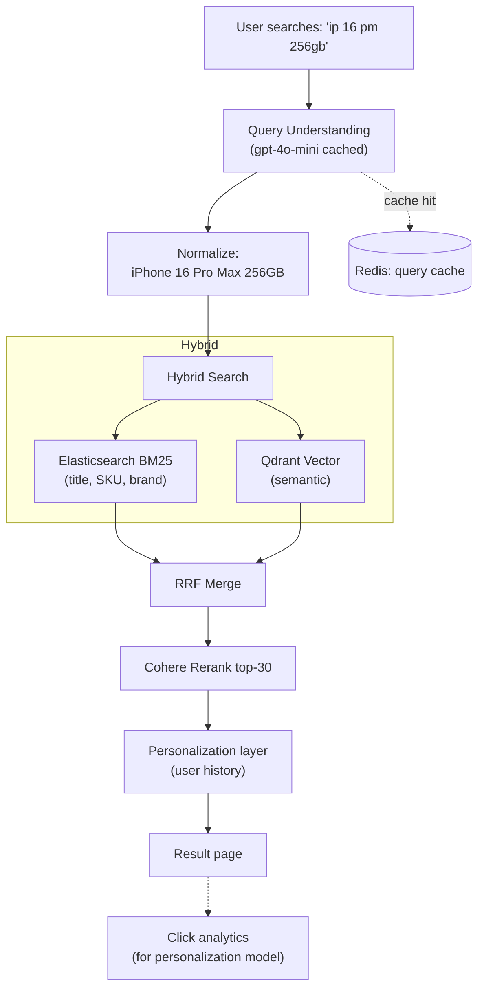

# Thiết kế AI Search cho E-commerce

## ⚡ Tóm tắt ngắn (30s)
* **Yêu cầu**: replace traditional keyword search với AI-enhanced search hiểu intent + semantic + multilingual.
* **Architecture**: User query → Query understanding (intent + entities) → Hybrid search (BM25 + vector) → Rerank → Personalization → Result page.
* **Components**:
  1. **Product indexing**: title, description, category, brand, attributes → embed bge-m3.
  2. **Query rewriting**: LLM expand abbreviation, translate, decompose.
  3. **Hybrid retrieval**: BM25 (catalog ID, brand) + vector (semantic).
  4. **Rerank**: based on user history + click model.
  5. **Personalization**: user embedding × product embedding.
* **Scale**: 10M products, 1k QPS search, < 200ms p99.
* **Stack**: Spring Boot, Elasticsearch (BM25), Qdrant (vector), Cohere rerank, gpt-4o-mini for query understanding.

---

## 🔍 Components

### 1. Indexing pipeline
* Catalog DB → Kafka → indexer.
* For each product: text (title + description + attributes) → embed.
* Store in Elastic (BM25) + Qdrant (vector).
* Re-index when product update.

### 2. Query understanding
* "ip 16 pm 256 đen" → "iPhone 16 Pro Max 256GB Black".
* LLM-based rewriter (cheap model, cached).
* Extract entities (brand, category, price range).

### 3. Hybrid retrieval
* BM25: exact match cho SKU/brand.
* Vector: semantic (synonym, paraphrase).
* RRF merge.

### 4. Rerank + personalize
* Cohere rerank top-100 → top-30.
* Personalization: weight by user history (collaborative filter score).
* Final top-20 displayed.

### 5. Caching
* Popular query → cached result (TTL 5 min).
* User-specific personalization computed at request.

---

## 🎨 Architecture



---

## 💻 Key code

```java
@Service
public class EcommerceSearchService {
    
    public SearchResponse search(String query, UserContext user) {
        // 1. Query understanding (cached)
        var normalized = queryUnderstandingCache.compute(query, q -> 
            llmQueryRewriter.rewrite(q));
        
        // 2. Hybrid search (parallel)
        var bm25Future = CompletableFuture.supplyAsync(() ->
            elasticBm25.search(normalized.text(), user.country(), 100));
        var vectorFuture = CompletableFuture.supplyAsync(() ->
            qdrant.search(normalized.embedding(), user.country(), 100));
        
        var bm25Hits = bm25Future.join();
        var vectorHits = vectorFuture.join();
        
        // 3. Merge + rerank
        var merged = rrfMerge(bm25Hits, vectorHits, 100);
        var reranked = cohereRerank.rerank(normalized.text(), merged, 30);
        
        // 4. Personalize
        var personalized = personalizer.reorder(reranked, user);
        
        return SearchResponse.builder()
            .products(personalized.subList(0, 20))
            .totalHits(merged.size())
            .normalized(normalized.text())
            .build();
    }
}
```

---

## 📊 Design Decisions

| Decision | Chose | Rationale |
| :--- | :--- | :--- |
| Query rewriting | LLM (cached) | Handle typos, abbreviation |
| BM25 | Elasticsearch | Exact match for SKU, brand |
| Vector | Qdrant | Semantic, multilingual |
| Embedding | bge-m3 self-host | Multilingual + free |
| Rerank | Cohere rerank-3 | Best multilingual reranker |
| Personalization | Embedding similarity + click score | Real-time |
| Cache | Redis 5min TTL on popular | Hit rate ~40% on common queries |

---

## ⚠️ Gotchas + Interviewer

1. **Latency**: each layer adds time. Strict budget per layer.
2. **Cold start**: new product no clicks → won't surface.
3. **A/B test**: gradual rollout vs old search.

**Interviewer: "Scale to 100M products, 10k QPS?"**
1. Sharded Qdrant by category.
2. Pre-compute frequent embeddings.
3. Cache aggressively (CDN edge for unauth).
4. Async personalization (default ranking + personalize async load).
5. Multi-region.
6. Cost: rerank API expensive at scale → self-host BGE-reranker.
