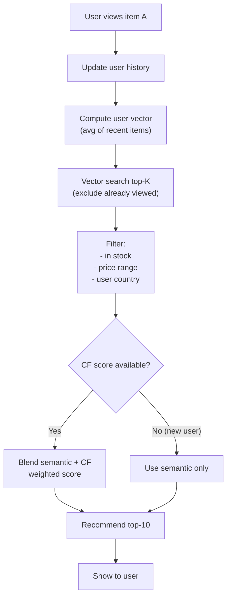

# Thiết kế Semantic Recommendation Cơ bản

## ⚡ Tóm tắt ngắn (30s)
* **Semantic recommendation** = recommend items dựa trên **embedding similarity** thay vì pure collaborative filtering.
* **2 patterns**:
  1. **Content-based**: embed item text → recommend items semantically similar to user's viewed/liked items.
  2. **Hybrid**: combine semantic + collaborative filtering (CF).
* **Use cases**: "similar products", "you might also like", related articles, related FAQs.
* **Khác với search**: search = user query; recommendation = no query, system suggests.
* **Stack**: embedding model, vector DB, user history DB, optional CF model.

---

## 🔍 Architecture options

### Option 1: Pure content-based (simple)
```
User views item A → embed A → search top-K nearest items → recommend.
```
Simple, cold start friendly (new item OK).

### Option 2: User profile embedding
```
User history: items viewed → average embeddings → user vector.
Recommend: nearest items to user vector.
```

### Option 3: Hybrid (CF + semantic)
```
CF score (Matrix Factorization) + Semantic score (cosine) → weighted blend.
```
Best quality, more complex.

---

## 🎨 Flow



---

## 💻 Implementation

```java
@Service
public class SemanticRecommendationService {
    
    public List<Item> recommend(String userId, int topK) {
        // 1. Get user vector (average of recent item embeddings)
        var history = userHistory.getRecent(userId, 20);  // last 20 items
        if (history.isEmpty()) {
            // Cold start: popular items
            return popularItems.top(topK, userCountry(userId));
        }
        
        float[] userVec = averageEmbeddings(history.stream()
            .map(Item::embedding).toList());
        
        // 2. Search candidates (exclude history)
        var candidates = qdrant.search(userVec,
            Map.of(
                "country", userCountry(userId),
                "in_stock", true
            ),
            limit: topK * 5);
        
        // Filter out items already in history
        var filtered = candidates.stream()
            .filter(c -> !history.contains(c))
            .toList();
        
        // 3. Optional: blend with CF
        var blended = blendWithCF(userId, filtered);
        
        return blended.subList(0, Math.min(topK, blended.size()));
    }
    
    private float[] averageEmbeddings(List<float[]> embeddings) {
        if (embeddings.isEmpty()) return null;
        int dim = embeddings.get(0).length;
        float[] avg = new float[dim];
        for (var e : embeddings) {
            for (int i = 0; i < dim; i++) avg[i] += e[i];
        }
        for (int i = 0; i < dim; i++) avg[i] /= embeddings.size();
        return avg;
    }
    
    private List<Item> blendWithCF(String userId, List<Item> semantic) {
        return semantic.stream()
            .map(item -> {
                double semScore = item.similarity();
                double cfScore = cfModel.score(userId, item.id());
                double blended = 0.6 * semScore + 0.4 * cfScore;
                return new ScoredItem(item, blended);
            })
            .sorted((a, b) -> Double.compare(b.score(), a.score()))
            .map(ScoredItem::item)
            .toList();
    }
}
```

---

## 📊 Design Decisions

| Decision | Chose | Rationale |
| :--- | :--- | :--- |
| Embedding | bge-m3 multilingual | Free, good quality |
| User profile | Avg of recent 20 | Simple, captures recent interest |
| Vector DB | Qdrant | Filter + fast |
| CF blend | 60% semantic + 40% CF | Balance content + behavior |
| Cold start | Popular items | Reliable fallback |
| Update freq | User vector recomputed on each view | Realtime adapt |

---

## ⚠️ Gotchas + Interviewer

1. **Filter bubble**: semantic recommends too similar → diversity needed.
2. **Cold-start item**: new item no history → use content embedding only.
3. **Embedding stale**: products change descriptions → re-embed periodically.

**Interviewer: "User watched action movies; now showing all action. How diversify?"**
1. **MMR (Maximal Marginal Relevance)**: pick items relevant but diverse.
2. **Category cap**: max 3 items same category in top-10.
3. **Explore-exploit**: 80% recommended + 20% explore new genres.
4. **Bandit algorithm**: learn user tolerance for diversity.
5. **A/B test**: measure CTR vs satisfaction.
