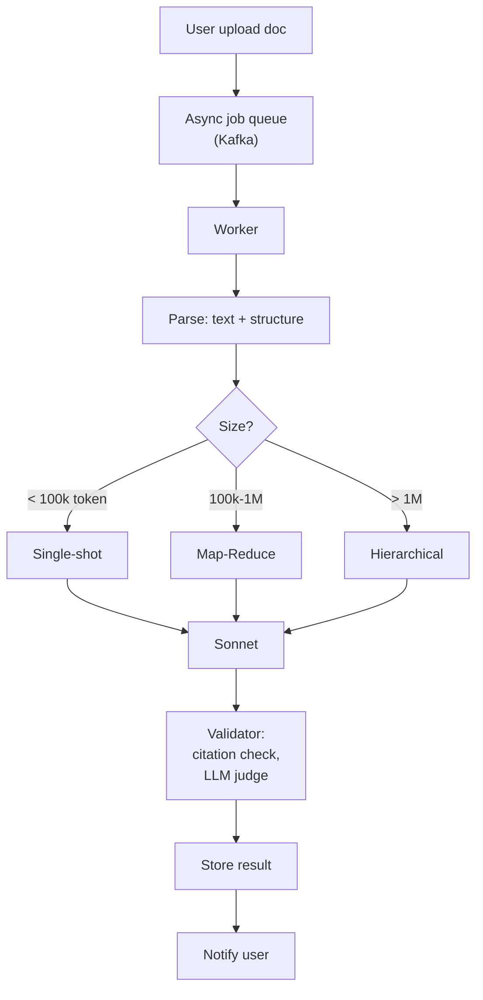

# Thiết kế AI Summarization cho Long Document

## ⚡ Tóm tắt ngắn (30s)
* **Yêu cầu**: Summarize document 50-500 pages (legal contract, research paper, financial report).
* **Patterns**:
  1. **Single-shot (small doc)**: nhồi cả doc vào context window. Cho doc <100k tokens (~50 pages).
  2. **Map-reduce**: split chunks → summarize each → merge summaries → final summary. Cho doc lớn.
  3. **Iterative refinement**: summary của chunk N kết hợp với summary so-far → refined summary.
  4. **Hierarchical**: section-level summary → doc-level summary.
* **Quality**: human eval > ROUGE/BLEU. Factual accuracy critical (financial/legal).
* **Stack**: Anthropic Sonnet (200k context), Spring Boot, async job queue, Postgres.
* **Thảm họa**: summary bịa fact, miss key clause. Senior fix: citation enforcement + LLM judge.

---

## 🔍 Patterns chi tiết

### 1. Single-shot
```python
# For doc < 100k token
summary = llm.chat(
    system="Summarize this document. Cover: main points, conclusions, recommendations.",
    user=full_doc_text,
    max_tokens=2000
)
```

### 2. Map-reduce
```
For each chunk_i: 
    chunk_summary_i = LLM_summarize(chunk_i)

combined = LLM_merge(chunk_summaries)
final = LLM_polish(combined)
```

### 3. Iterative refinement
```
running_summary = ""
for chunk in chunks:
    running_summary = LLM_refine(
        "Current summary: " + running_summary + "\nNew chunk: " + chunk
    )
return running_summary
```

### 4. Hierarchical
```
For each section:
    section_summary = LLM_summarize(section)

doc_outline = list of (section_title, section_summary)
final = LLM_synthesize(doc_outline)
```

---

## 🎨 Architecture



---

## 💻 Map-reduce implementation

```java
@Service
public class DocSummarizer {
    
    public CompletableFuture<String> summarize(Document doc) {
        if (countTokens(doc.text()) < 100_000) {
            return CompletableFuture.completedFuture(singleShot(doc.text()));
        }
        return mapReduce(doc.text());
    }
    
    private String singleShot(String text) {
        return chatClient.prompt()
            .system("Summarize comprehensively. Include: main thesis, key findings, conclusions, recommendations.")
            .user(text)
            .options(ChatOptions.builder().maxTokens(2000).temperature(0.1).build())
            .call().content();
    }
    
    private CompletableFuture<String> mapReduce(String text) {
        var chunks = chunker.split(text, 8000, 200);
        
        // Map: parallel
        var futures = chunks.stream()
            .map(chunk -> CompletableFuture.supplyAsync(() ->
                cheapLlm.summarize(chunk, 300)))  // Haiku for cheap chunk summary
            .toList();
        
        return CompletableFuture.allOf(futures.toArray(new CompletableFuture[0]))
            .thenApply(v -> {
                var chunkSummaries = futures.stream()
                    .map(CompletableFuture::join)
                    .toList();
                
                // Reduce
                String combined = String.join("\n\n---\n\n", chunkSummaries);
                return reducerLlm.synthesize(combined);  // Sonnet for quality
            });
    }
}
```

---

## 📊 Pattern selection

| Doc size | Pattern | Cost (~) | Latency |
| :--- | :--- | :---: | :---: |
| < 10k token | Single-shot Haiku | $0.005 | 1-2s |
| 10k-100k | Single-shot Sonnet | $0.30-3 | 5-30s |
| 100k-500k | Map-reduce | $1-10 | 30s-5min (parallel) |
| 500k-1M | Hierarchical | $5-50 | 1-10min |
| > 1M | Multi-pass + agent | $50+ | 10-60min |

---

## ⚠️ Gotchas + Interviewer

1. **Hallucination**: summary bịa fact. Validate with citation.
2. **Lost in middle**: long single-shot may miss middle.
3. **Cost**: long docs expensive; warn user upfront.

**Interviewer: "Legal contract summary needs 100% accurate facts. How ensure?"**
1. **Citation enforcement**: every claim cites source paragraph.
2. **LLM judge**: second model verifies faithfulness.
3. **Structured extraction**: extract specific fields (parties, dates, amounts) separately with strict schema.
4. **Human review**: critical contracts → human approve summary.
5. **Eval pipeline**: golden set of contracts + expected summaries.
6. **Disclaimer**: never replace legal counsel.
