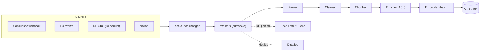

# Thiết kế Document Ingestion Pipeline

## ⚡ Tóm tắt ngắn (30s)
* Yêu cầu: ingest doc từ nhiều sources (Confluence, Drive, S3, Notion) vào RAG vector store.
* Architecture: Source connectors → Kafka → Parser → Chunker → Embedder → Vector DB writer.
* Key: idempotency, incremental (no full re-ingest), per-document ACL, multi-format support.
* Stack: Kafka, Spring Boot consumers, Unstructured.io, bge-m3, Qdrant.
* Scale: 1M docs initial, 100k updates/day. Refer to c5_s3_q3 for detailed design.

---

## 🔍 Components (refer to c5_s3_q3 for full details)

7 stages:
1. Source connector (webhook + cron).
2. Parser (Unstructured.io for PDF/DOCX, native for markdown).
3. Cleaner (strip noise).
4. Chunker (300-800 token với overlap).
5. Enricher (metadata, ACL).
6. Embedder (batch 50/request).
7. Vector store writer (atomic replace).

---

## 🎨 Architecture



---

## 💻 Key code: Idempotent ingest

```java
@KafkaListener(topics = "doc.changed", concurrency = "10")
public void ingest(DocChangedEvent event) {
    // Idempotency: skip if hash unchanged
    if (repo.existsByDocIdAndHash(event.docId(), event.contentHash())) return;
    
    var parsed = parser.parse(event.sourceUrl());
    var chunks = chunker.split(parsed.text(), 500, 50);
    
    // Batch embed (50 chunks per call)
    var chunkRecords = new ArrayList<ChunkRecord>();
    for (int batchStart = 0; batchStart < chunks.size(); batchStart += 50) {
        int end = Math.min(batchStart + 50, chunks.size());
        var batch = chunks.subList(batchStart, end);
        var embeddings = embedder.embedBatch(batch);
        
        for (int i = 0; i < batch.size(); i++) {
            chunkRecords.add(ChunkRecord.builder()
                .docId(event.docId())
                .chunkIdx(batchStart + i)
                .text(batch.get(i))
                .embedding(embeddings.get(i))
                .metadata(parsed.metadata())
                .aclRoles(parsed.aclRoles())
                .build());
        }
    }
    
    // Atomic replace: delete all chunks of doc + insert new
    repo.replaceAllForDoc(event.docId(), event.contentHash(), chunkRecords);
}
```

---

## 📊 Decisions

| Decision | Chose | Rationale |
| :--- | :--- | :--- |
| Trigger | Webhook + cron sweep | Realtime + completeness |
| Parser | Unstructured.io | Multi-format, layout aware |
| Idempotency | content_hash + doc_id key | Skip if unchanged |
| Batch embed | 50 chunks/request | Provider rate limit + cost |
| Atomic | DELETE + INSERT trong tx | Avoid orphan chunks |
| DLQ | Yes, manual retry | Recovery |

---

## ⚠️ Gotchas + Interviewer

1. **Webhook miss**: cron sweep for completeness.
2. **Parse fail (corrupt PDF)**: DLQ + manual review.
3. **Cost embedding**: 1M chunks × $0.13/1M token = $130 one-time.

**Interviewer: "Latency from source update to searchable?"**
1. Webhook delivery: 1-10s.
2. Kafka consume: <1s.
3. Parse + chunk + embed: 1-10s per doc (parallel).
4. Insert + index: 1-5s.
5. End-to-end: 5-30s p99.

Để <5s: increase worker concurrency, pre-warm embedder, optimize chunker.
