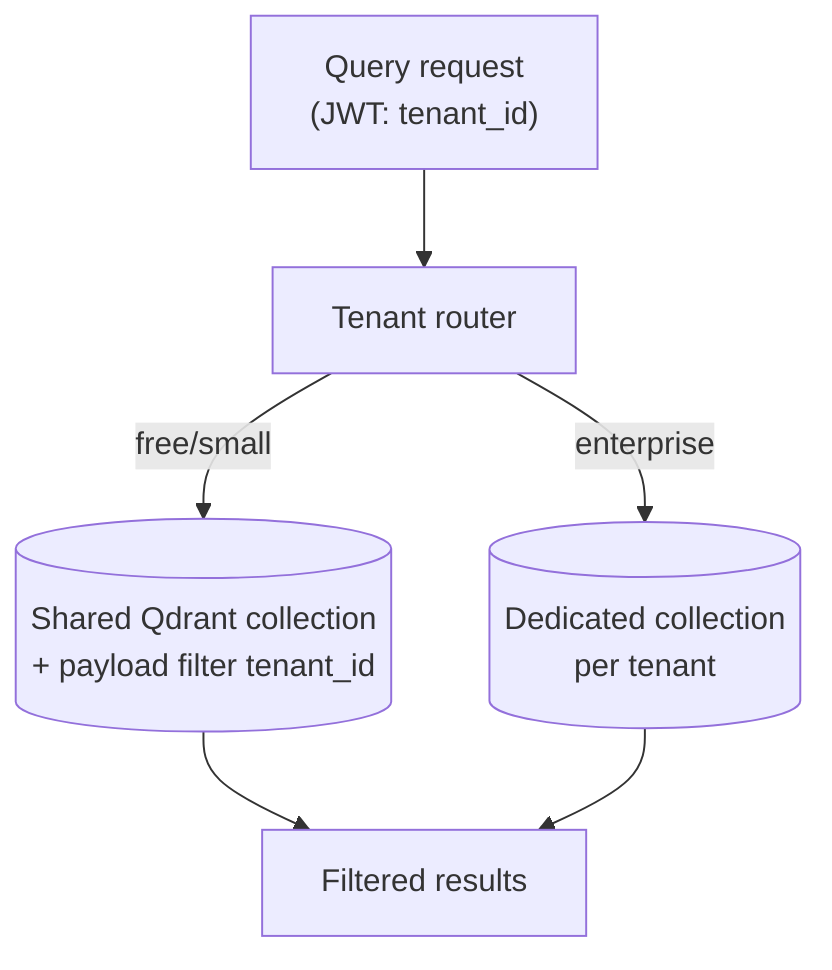

# Thiết kế Multi-tenant Vector Search

## ⚡ Tóm tắt ngắn (30s)
* **Multi-tenant vector**: 1 hệ thống, nhiều tenant, mỗi tenant data isolated.
* **3 patterns**:
  1. **Shared collection + filter**: 1 collection, `tenant_id` metadata filter. Đơn giản, scale tốt với <10k tenant.
  2. **Per-tenant collection**: mỗi tenant 1 collection. Strong isolation, ops phức tạp với >100 tenant.
  3. **Hybrid**: small tenant shared, enterprise dedicated.
* **Pinecone namespaces** built-in for multi-tenancy.
* **Khó nhất**: pre-filter in HNSW (not post-filter). Qdrant/Weaviate/pgvector native support.
* **Khác**: per-tenant embedding model possibility, per-tenant rerank.
* Refer to c5_s3_q18 for detail.

---

## 🔍 Pattern comparison

| Pattern | Tenants supported | Isolation | Ops |
| :--- | :---: | :---: | :---: |
| Shared + filter | 10k+ | Logical (RLS) | Easy |
| Per-tenant collection | 100 | Strong | Hard |
| Hybrid | 10k+ small + 100 dedicated | Mixed | Moderate |

---

## 🎨 Architecture



---

## 💻 Qdrant payload filter

```java
public Points.Filter buildTenantFilter(UUID tenantId, List<String> roles) {
    return Points.Filter.newBuilder()
        // MUST tenant_id match
        .addMust(Points.Condition.newBuilder()
            .setField(Points.FieldCondition.newBuilder()
                .setKey("tenant_id")
                .setMatch(Points.Match.newBuilder()
                    .setKeyword(tenantId.toString())
                    .build())
                .build())
            .build())
        // AND role intersect
        .addAllShould(roles.stream().map(role ->
            Points.Condition.newBuilder()
                .setField(Points.FieldCondition.newBuilder()
                    .setKey("acl_roles")
                    .setMatch(Points.Match.newBuilder()
                        .setKeyword(role).build())
                    .build()).build()
        ).toList())
        .build();
}
```

---

## 📊 Decisions

| Decision | Chose | Rationale |
| :--- | :--- | :--- |
| Storage pattern | Hybrid | Free shared, paid dedicated |
| ACL | Pre-filter in HNSW | High recall |
| Per-tenant config | embedding/chunk size customizable | Tenant flexibility |
| Cost attribution | Track per-tenant token usage | Billing |
| Onboarding | Auto-provision collection if enterprise | Self-service |

---

## ⚠️ Gotchas + Interviewer

1. **Tenant explosion**: 10k tenants in 1 collection → filter performance.
2. **Per-tenant data leak**: bug → CI test cross-tenant.
3. **Cost per tenant**: small tenant pays for shared infra.

**Interviewer: "Enterprise customer needs EU data residency. Implement?"**
1. Separate EU Qdrant cluster.
2. Tenant config marks `region: eu`.
3. API Gateway routes EU tenant to EU stack.
4. No replication US ↔ EU for tenant data.
5. Compliance: SOC 2 + GDPR cert for EU stack.
