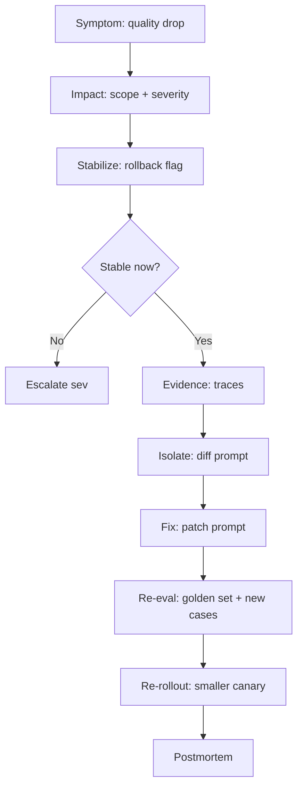

# Sau Deploy Prompt mới, Response Quality giảm mạnh

## ⚡ Tóm tắt ngắn (30s)
* **Symptom**: deploy new prompt → CSAT drop, hallucination rate increase, user complaints.
* **Quy trình xử lý 6 bước**: Impact → Stabilize → Evidence → Isolate → Fix → Prevent.
* **Hành động 5 phút đầu**:
  1. Verify scope (which users? % of traffic on new prompt).
  2. Rollback flag → revert traffic to old prompt.
  3. Verify rollback effective (sample test).
  4. Notify stakeholders.
  5. Begin RCA.
* **Common root causes**:
  - Prompt change broke specific use case (edge case).
  - Model upgrade incompatible with old prompt.
  - Removed key instruction unintentionally.
  - JSON format changed but downstream expects old.
* **Prevention**: eval suite in CI + gradual rollout + golden set coverage.

---

## 🔍 Quy trình xử lý

### Step 1: Impact assessment
- Query metrics: error rate, CSAT, refusal rate, hallucination flag.
- Affected: # users, % requests.
- Severity: SEV-1 (blocking), SEV-2 (degraded), SEV-3 (some users).

### Step 2: Stabilize
- Rollback flag → revert to previous prompt.
- Verify rollback effective via synthetic test.
- Communicate: status page, internal Slack.

### Step 3: Evidence collection
- Pull traces: bad responses since deploy.
- Compare with golden set.
- Diff prompts (v3.0 vs v3.1).

### Step 4: Isolate
- Which prompt change caused regression?
- Run eval suite on subset.
- Reproduce locally.

### Step 5: Permanent fix
- Patch prompt.
- Re-run eval suite.
- Test on extended golden set including new failure cases.

### Step 6: Prevent
- Add failed cases to golden set.
- Strengthen eval suite.
- Better rollout: smaller canary (1% → 5% → 25%).

---

## 🎨 Triage flow



---

## 💻 Quick rollback commands

```bash
# GrowthBook kill switch
curl -X POST $GB_API/features/chat_prompt_v3.1 \
  -d '{"defaultValue": false}'

# Verify
curl $APP/api/health/prompt-version
# Expect: v3.0

# Sample test
for i in 1 2 3; do
  curl $APP/api/chat -d '{"q":"How refund?"}' | jq .answer
done
```

## 💻 RCA queries

```sql
-- ClickHouse: response quality by prompt version
SELECT prompt_version, AVG(csat_score), AVG(hallucination_flag)
FROM ai_responses
WHERE timestamp >= now() - INTERVAL 24 HOUR
GROUP BY prompt_version;
```

---

## 📊 Decision matrix

| Severity | Action |
| :--- | :--- |
| SEV-1: full broken | Immediate rollback; war room |
| SEV-2: degraded | Rollback; investigate within 1h |
| SEV-3: edge case | Continue but track; fix in next deploy |

---

## ⚠️ Gotchas + Interviewer

1. **Don't rollback prematurely**: ensure actual regression vs random noise.
2. **Cache invalidation**: rollback flag may not affect cached responses.
3. **Communication**: notify customers if severe.

**Interviewer: "Postmortem questions to ask?"**
1. Why did eval suite not catch this?
2. Was rollout too aggressive?
3. Was prompt change reviewed in PR?
4. What signal would have caught earlier?
5. What new metric to monitor?
