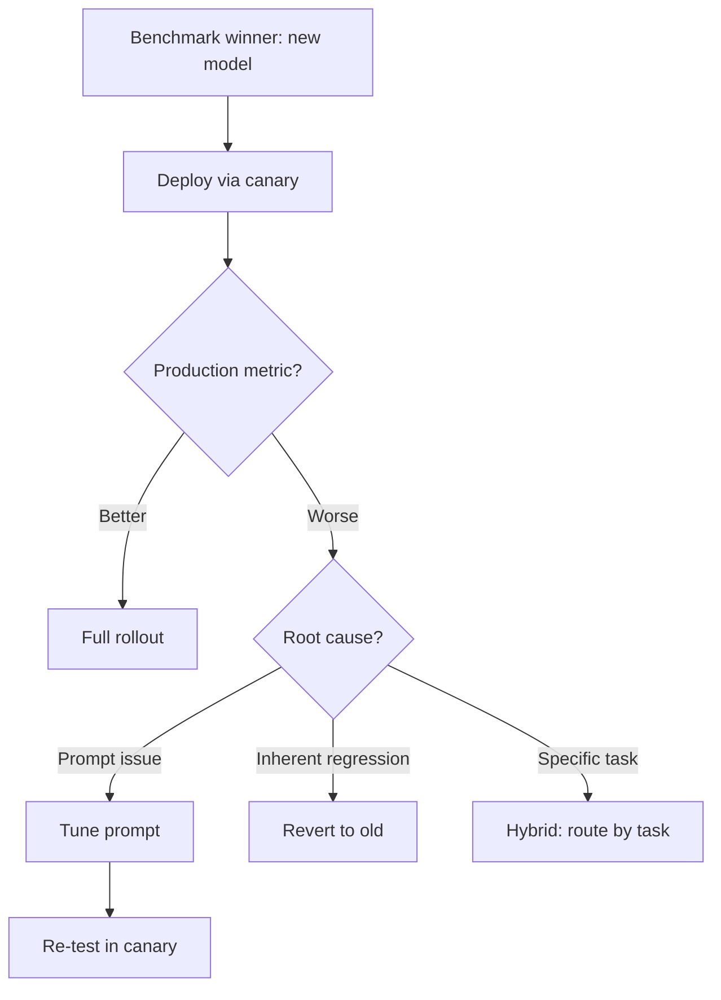

# Model mới Tốt hơn ở Benchmark nhưng Tệ hơn ở Production

## ⚡ Tóm tắt ngắn (30s)
* **Phenomenon**: benchmark scores good, real users complain. Common.
* **Causes**:
  1. **Benchmark mismatch**: benchmark not representative of real distribution.
  2. **Prompt optimization**: old prompt tuned for old model; new model needs different prompt.
  3. **Edge cases**: real users diverse vs benchmark narrow.
  4. **Tone/style change**: technically correct but different feel.
  5. **Specific feature regression**: e.g. multilingual worse.
* **Action**:
  1. Investigate which slice of users complain.
  2. Re-eval on production-like dataset.
  3. Tune prompt for new model.
  4. Consider not migrating.

---

## 🔍 Investigation

### Step 1: Quantify
- A/B compare CSAT, retention, escalation by model version.
- Stratify by user segment, query type, language.

### Step 2: Reproduce
- Sample failures from production.
- Test on new vs old model.

### Step 3: Diagnose
- Prompt issue? Try variants.
- Specific task degraded?
- Tone subtle?

### Step 4: Decide
- Tune prompt + retest.
- Or revert.
- Or partial: route specific tasks to old model.

---

## 🎨 Decision flow



---

## 💻 Per-task A/B

```java
@Service
public class ModelRouter {
    
    public String selectModel(String purpose) {
        // After A/B analysis:
        return switch (purpose) {
            case "summarize" -> "claude-haiku-4-5";    // new model wins
            case "code_review" -> "claude-sonnet-4-6"; // new model wins
            case "translation_vietnamese" -> "claude-sonnet-4-5"; // OLD wins
            default -> "claude-sonnet-4-6";
        };
    }
}
```

---

## ⚠️ Interviewer

**"Validate model migration safely?"**
1. Eval on golden set with multiple task types.
2. Canary 5% → 25% → monitor business metrics.
3. Per-task analysis (don't average).
4. User feedback collection during canary.
5. Rollback ready.
6. Don't trust public benchmark alone — test YOUR data.
