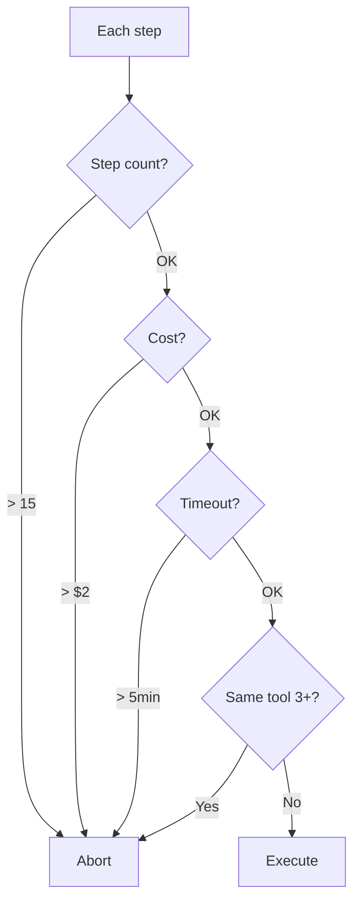

# Agent chạy Loop liên tục và gọi API nhiều lần

## ⚡ Tóm tắt ngắn (30s)
Refer to c5_s4_q10.

* **Symptom**: agent stuck calling same/similar tool repeatedly. Cost spike. API rate-limited.
* **Immediate**:
  1. Pause agent.
  2. Check audit: which tool, how many calls.
  3. Reverse side effects if needed.
* **Permanent fix**:
  1. Step cap.
  2. Repeat detection.
  3. Cost cap per task.
  4. Timeout total.

---

## 💻 Loop guard

```java
public AgentResult run(String task) {
    List<ToolCall> history = new ArrayList<>();
    double cost = 0;
    long start = System.currentTimeMillis();
    
    for (int step = 0; step < 15; step++) {
        // Timeout
        if (System.currentTimeMillis() - start > 300_000) return abort("Timeout");
        
        // Cost cap
        if (cost > 2.0) return abort("Cost cap");
        
        var resp = llm.chat();
        cost += resp.costUsd();
        
        if (resp.stopReason() == END_TURN) return success(resp.text());
        
        var tc = resp.toolCall();
        // Detect repeat (3+ same)
        if (countSameRecent(history, tc, 3) >= 3) {
            log.warn("Loop detected, abort");
            return abort("Loop detected: " + tc.name());
        }
        history.add(tc);
        // ...execute
    }
    return abort("Max steps");
}
```

---

## 🎨 Defense



---

## ⚠️ Interviewer

**"Detect loop in production?"**
1. Real-time metric: avg step per session.
2. Alert if outlier session > 3x normal.
3. Sample for human review.
4. Auto-kill if extreme.
