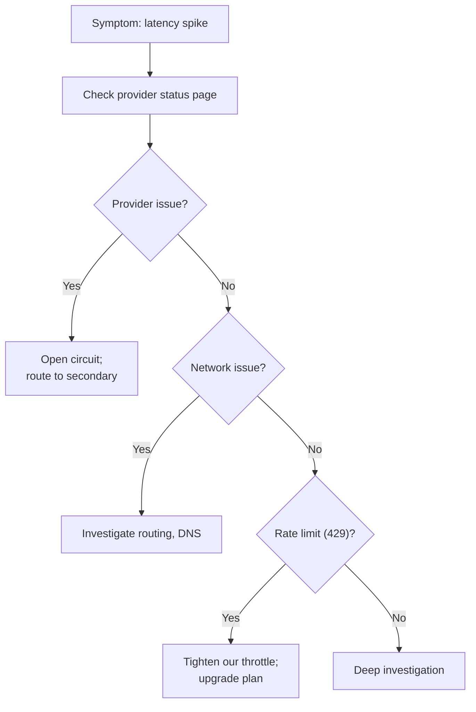

# LLM Provider tăng Latency, AI Endpoint Timeout

## ⚡ Tóm tắt ngắn (30s)
* **Symptom**: AI endpoint p99 latency jump 5x, timeout rate increase, user complaint.
* **Triage 5 minutes**:
  1. Check provider status page (statuspage.openai.com/etc.).
  2. Confirm metric: provider-side latency vs network.
  3. Open circuit breaker proactively.
  4. Failover to secondary provider.
  5. Notify users.
* **Common causes**:
  - Provider outage / degraded.
  - Network issue (DNS, peering).
  - Rate limit (your plan exceeded).
  - Long prompt accumulating.
* **Defense**: multi-provider failover + circuit breaker + cache.

---

## 🔍 Quy trình xử lý

### Step 1: Impact
- p99 latency now vs baseline.
- Error rate (timeout) %.
- Affected endpoints.

### Step 2: Stabilize
- Check provider status page.
- If provider outage → open primary circuit, route to secondary.
- If our side → check network, DNS, recent deploys.

### Step 3: Evidence
- OpenTelemetry traces: which span slow?
- Provider latency breakdown.
- Compare with historical baseline.

### Step 4: Isolate
- Provider regional issue?
- Specific model affected?
- Specific tenant pattern?

### Step 5: Fix
- Short-term: failover.
- Long-term: provider redundancy.

### Step 6: Prevent
- Multi-provider abstraction.
- Status page webhook auto-react.
- Per-tenant SLA monitor.

---

## 🎨 Triage flow



---

## 💻 Auto-failover

```java
@Component
@Scheduled(fixedRate = 30_000)
public class LatencyMonitor {
    
    public void check() {
        var p99 = metrics.percentile("llm.latency", 99, Duration.ofMinutes(5));
        var baseline = metrics.gauge("llm.latency.baseline");
        
        if (p99 > baseline * 3) {
            log.warn("Primary latency 3x baseline; opening circuit");
            circuitBreaker.transitionToOpen("openai");
            
            // Failover already configured in code
            alerts.fire("Primary LLM latency spike");
        }
    }
}
```

---

## 📊 Decision matrix

| Cause | Action |
| :--- | :--- |
| Provider outage | Failover ASAP |
| Network issue | Switch egress route / region |
| Rate limit | Throttle client + upgrade plan |
| Long prompts | Truncate / cache / batch |
| Code bug | Rollback |

---

## ⚠️ Gotchas + Interviewer

1. **Secondary capacity not provisioned**: failover cascade fail.
2. **Status page lag**: provider may not update immediately.
3. **Different model behavior**: failover provider may give different output quality.

**Interviewer: "Provider outage 2 hours. Strategy?"**
1. Failover gradual (10% → 50% → 100%).
2. Quality drift monitor.
3. Cache hits help reduce LLM calls.
4. Communication: status banner.
5. Postmortem: improve fallback playbook.
