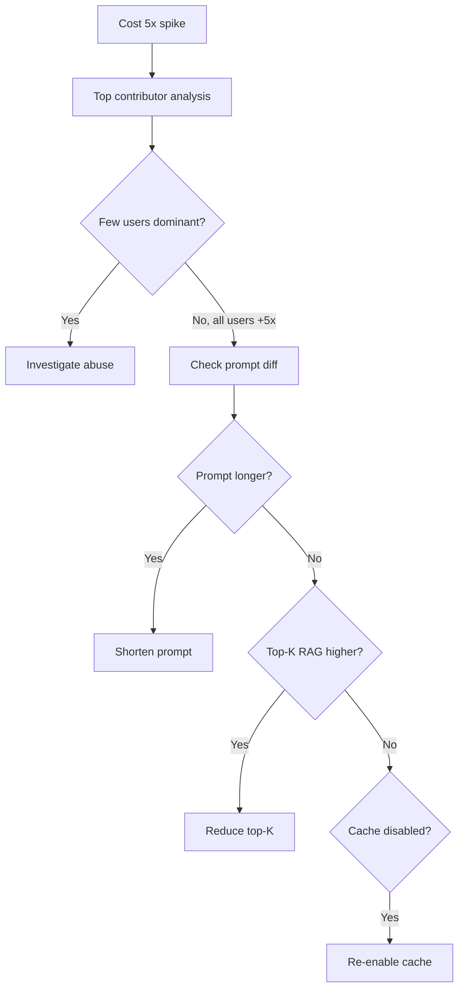

# Token Usage tăng 5 lần sau Release

## ⚡ Tóm tắt ngắn (30s)
* **Symptom**: daily token cost 5x baseline. Bill explosion.
* **Common causes**:
  1. **Prompt change**: new prompt longer.
  2. **Max_tokens raised**: bug or intentional.
  3. **RAG retrieves more chunks**: chunk size larger or top-K bigger.
  4. **Tool calling loop**: agent goes 20 steps instead of 5.
  5. **Removed cache**: cache disabled accidentally.
  6. **User abuse**: 1 user spams cost.
* **Triage**:
  1. Identify top contributor (per user, per service).
  2. Compare prompt template before/after.
  3. Check cache hit rate.
  4. Verify max_tokens config.

---

## 🔍 Diagnostic queries

```sql
-- ClickHouse: top spenders since release
SELECT user_id_hash, sum(cost_usd), count() as requests
FROM ai_cost_events
WHERE timestamp >= '2026-05-20'  -- release date
GROUP BY user_id_hash
ORDER BY sum(cost_usd) DESC
LIMIT 20;

-- Compare avg tokens per request
SELECT prompt_version, AVG(input_tokens), AVG(output_tokens)
FROM ai_cost_events
WHERE timestamp >= '2026-05-19'
GROUP BY prompt_version;
```

---

## 🎨 Flow



---

## 💻 Auto investigation script

```python
def investigate_cost_spike(release_date: str):
    # 1. Top users
    print("TOP SPENDERS:")
    cursor.execute("""
        SELECT user_id_hash, sum(cost_usd) as c
        FROM ai_cost_events WHERE timestamp >= %s
        GROUP BY user_id_hash ORDER BY c DESC LIMIT 10
    """, (release_date,))
    print(cursor.fetchall())
    
    # 2. Prompt version distribution
    cursor.execute("""
        SELECT prompt_version, AVG(input_tokens) as avg_in,
               AVG(output_tokens) as avg_out, count()
        FROM ai_cost_events WHERE timestamp >= %s GROUP BY prompt_version
    """, (release_date,))
    print("PROMPT STATS:", cursor.fetchall())
    
    # 3. Cache hit rate
    cursor.execute("""
        SELECT toDate(timestamp), cache_hit, count()
        FROM ai_requests WHERE timestamp >= %s
        GROUP BY toDate(timestamp), cache_hit
    """, (release_date,))
    print("CACHE STATS:", cursor.fetchall())
```

---

## 📊 Action by cause

| Cause | Fix |
| :--- | :--- |
| Longer prompt | Trim, use prompt caching |
| Higher max_tokens | Cap stricter |
| Top-K bigger | Tune lower, add rerank |
| Cache disabled | Re-enable + monitor |
| User abuse | Per-user quota tighter |
| Tool loop | Step limit, anomaly detect |

---

## ⚠️ Interviewer

**"Cost spike at 3 AM. Auto-mitigation?"**
1. Anomaly detector triggers.
2. Auto-throttle global rate limit -50%.
3. Page on-call.
4. Block top abusers (>3x baseline).
5. War room within 30 min.
