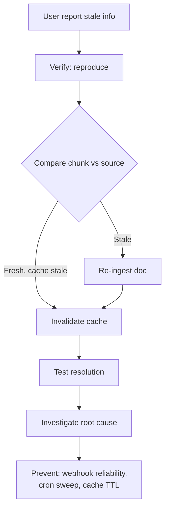

# User báo AI Trả lời sai dựa trên Document Cũ

## ⚡ Tóm tắt ngắn (30s)
* **Symptom**: user finds AI uses outdated doc info. Common: policy changed, but bot uses old policy.
* **Root cause categories**:
  1. **RAG index stale**: doc updated but not re-embedded.
  2. **Cache stale**: response cached, doc updated but cache not invalidated.
  3. **Wrong source**: RAG retrieves older version doc.
  4. **No version control**: multiple versions co-exist, no priority.
* **Quick fix**: re-ingest specific doc + clear cache.
* **Long-term**: webhook-driven re-ingest + cache invalidation event.

---

## 🔍 Triage

### Step 1: Verify
- Reproduce user query.
- Inspect retrieved chunks → which doc version?
- Check doc updated_at vs chunk updated_at.

### Step 2: Quick fix
```sql
-- Re-trigger ingestion for specific doc
INSERT INTO doc_reingest_queue (doc_id, priority) VALUES (?, 'high');
```
+ clear cache by tag.

### Step 3: Verify fix
Reproduce → confirm new content.

### Step 4: Root cause
- Why didn't webhook trigger? Check Kafka.
- Cache TTL too long?

### Step 5: Prevent
- Improve webhook reliability.
- Add cron sweep for orphans.
- Shorter cache TTL on dynamic docs.

---

## 🎨 Flow



---

## 💻 Re-ingest script

```java
public void reingestDoc(UUID docId) {
    // Fetch latest from source
    var latest = sourceClient.fetch(docId);
    
    // Atomic replace chunks
    repo.replaceAllForDoc(docId, latest.contentHash(), 
        chunker.split(latest.text()).stream()
            .map(c -> Chunk.builder()
                .docId(docId)
                .text(c)
                .embedding(embedder.embed(c))
                .build())
            .toList());
    
    // Invalidate cache
    cacheInvalidator.byDoc(docId);
    
    // Audit
    log.info("Re-ingested doc {} version {}", docId, latest.contentHash());
}
```

---

## 📊 Common causes

| Cause | Fix |
| :--- | :--- |
| Webhook lost | Retry + DLQ + cron sweep |
| Cache TTL too long | Shorter TTL on volatile doc |
| Multi-version not handled | Mark deprecated; prefer latest |
| Source connector bug | Test connector regularly |

---

## ⚠️ Interviewer

**"How to detect stale RAG proactively?"**
1. Compare doc.updated_at vs latest chunk.updated_at.
2. Cron job hourly: list docs where mismatch.
3. Auto re-ingest stale.
4. Dashboard: count of stale.
5. Alert if stale > X for > 1 hour.
