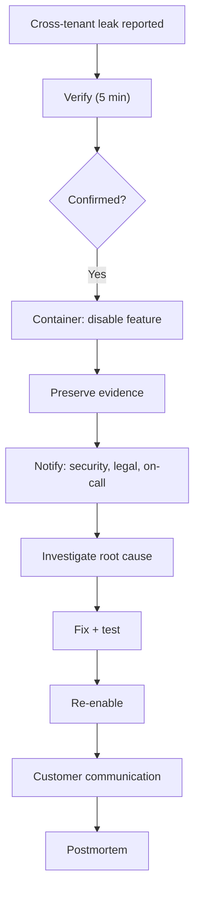

# RAG Retrieve nhầm Document của Tenant khác

## ⚡ Tóm tắt ngắn (30s)
* **Severity: CRITICAL** - data breach, GDPR/compliance violation.
* **Immediate response 15 min**:
  1. Verify scope: how many users affected, which tenants.
  2. **Disable feature** if confirmed.
  3. Preserve evidence (logs, queries).
  4. Notify security + legal + affected customers.
  5. Begin RCA.
* **Common causes**:
  - Filter clause missing in query.
  - RLS policy bug.
  - Cache wrong key (no tenant in key).
  - Index doesn't include tenant filter.
* **Fix**: enforce RLS + comprehensive testing.

---

## 🔍 Incident response

### Phase 1: Verify (5 min)
- Reproduce report.
- Check audit log: how many cross-tenant retrievals?
- Severity assessment.

### Phase 2: Contain (10 min)
- Disable affected feature via kill switch.
- Or implement emergency filter override.
- Verify containment.

### Phase 3: Investigate (1-4 hours)
- Code review: filter applied?
- DB: RLS policy active?
- Reproduce in staging.

### Phase 4: Fix (hours - days)
- Patch immediate cause.
- Add layered defense.
- Test cross-tenant penetration.

### Phase 5: Notify (24-72 hours per GDPR)
- Legal: assess obligation.
- Communicate to affected customers.
- Regulator if required.

### Phase 6: Postmortem
- Why missed in testing?
- Why no monitoring caught?
- Compensating controls.

---

## 🎨 Response flow



---

## 💻 Fix: enforce RLS

```sql
ALTER TABLE rag_chunks ENABLE ROW LEVEL SECURITY;
ALTER TABLE rag_chunks FORCE ROW LEVEL SECURITY;  -- even superuser

CREATE POLICY rag_tenant_isolation ON rag_chunks
    FOR ALL
    USING (tenant_id = current_setting('app.current_tenant_id', true)::uuid);

-- Verify
SELECT pg_policies FROM pg_policies WHERE tablename = 'rag_chunks';
```

## 💻 Cross-tenant penetration test

```java
@Test
void crossTenantLeakage_blocked() {
    UUID tenantA = setupTenantWithData("secret A");
    UUID tenantB = setupTenantWithData("secret B");
    
    loginAs(userOf(tenantA));
    var results = rag.search("secret", 10);
    
    for (var chunk : results) {
        assertEquals(tenantA, chunk.tenantId(),
            "LEAK detected: tenant A user retrieved tenant B chunk");
    }
}
```

---

## 📊 Severity matrix

| Affected | Severity | Action |
| :--- | :---: | :--- |
| 1 user, 1 doc | SEV-2 | Investigate; patch; notify |
| Multiple users, same tenant | SEV-1 | Disable + RCA |
| Cross-tenant systematic | SEV-0 | War room + immediate disable + legal |

---

## ⚠️ Interviewer

**"Discover 100 cross-tenant queries in past 6 months. Action?"**
1. Quantify exact data exposed.
2. Each affected tenant must be notified within 72h (GDPR).
3. Forensic: who saw what.
4. Compensating: free service, credit monitoring.
5. Regulator notification.
6. Major postmortem, board-level.
7. Compliance audit; review all queries.
