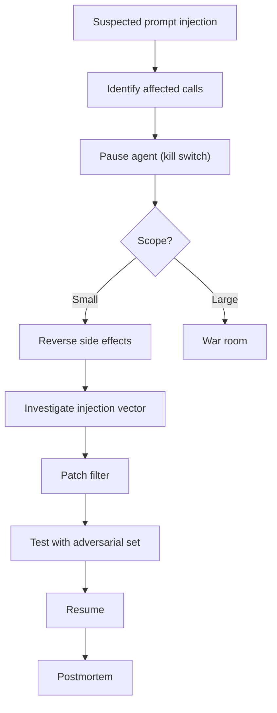

# Prompt Injection khiến Agent gọi Tool không Mong muốn

## ⚡ Tóm tắt ngắn (30s)
* **Symptom**: agent executes tool not intended by legitimate user — refund, delete, send email to wrong recipient.
* **Severity**: depends on action.
  - Reversible: SEV-2.
  - Irreversible (money, data deletion): SEV-0/1.
* **Immediate response**:
  1. Identify scope: how many tool calls affected.
  2. Pause agent (kill switch).
  3. Reverse side effects (refund reversal, restore data).
  4. Forensic: prompt log + tool call audit.
  5. Patch defense.

---

## 🔍 Triage 

### Step 1: Verify
- Pull recent agent traces.
- Find: tool calls that don't match user intent.
- Detect prompt injection: pattern match.

### Step 2: Contain
- Kill switch agent.
- Or restrict tool list (emergency mode: read-only).

### Step 3: Reverse side effects
- For each action: identify reversal procedure.
- Idempotent reversal preferred.

### Step 4: Investigate
- Which prompt pattern bypassed defense?
- Update classifier.

### Step 5: Communicate
- Customers affected by side effects (e.g. wrong email sent).

### Step 6: Patch + redeploy
- Improve filter, add LLM judge.
- Verify with eval.

---

## 🎨 Response flow



---

## 💻 Kill switch

```bash
# Disable agent
curl -X POST $GB_API/features/agent_v1 \
  -d '{"defaultValue": false}'

# Verify
grep "agent_v1=false" $APP_LOGS
```

## 💻 Reverse refund

```sql
-- Find auto-refunds in past hour
SELECT * FROM refund_transactions
WHERE created_at >= now() - interval '1 hour'
  AND initiated_by = 'agent';

-- Reverse (subject to provider support)
UPDATE refund_transactions
SET status = 'reversal_pending'
WHERE id IN (...);
```

## 💻 Forensic query

```sql
-- Audit log: find suspicious tool calls
SELECT user_id, tool_name, tool_args, agent_reasoning
FROM agent_audit
WHERE timestamp >= '2026-05-23'
  AND tool_name IN ('refund', 'delete_account')
  AND agent_reasoning LIKE '%ignore%previous%'
ORDER BY timestamp;
```

---

## 📊 Reversibility

| Action | Reversibility |
| :--- | :--- |
| Refund | Reverse transaction (provider may support) |
| Send email | Send correction; user already received |
| Delete data (soft) | Restore flag |
| Delete data (hard) | Backup restore |
| Transfer money | Reverse transaction |
| Cancel order | Re-create |

---

## ⚠️ Interviewer

**"Agent executed 50 refunds via injection. 30 minute response?"**
1. **0-5 min**: Kill agent. Confirm injection vector.
2. **5-15 min**: Reverse pending refunds; flag completed ones.
3. **15-30 min**: Customers contacted; legal notified.
4. **Day 1**: Patch filter; redeploy without auto-refund.
5. **Week 1**: Full postmortem; eval improved; bug bounty announcement.

**Lesson**: irreversible actions NEVER auto-execute. Approval required.
