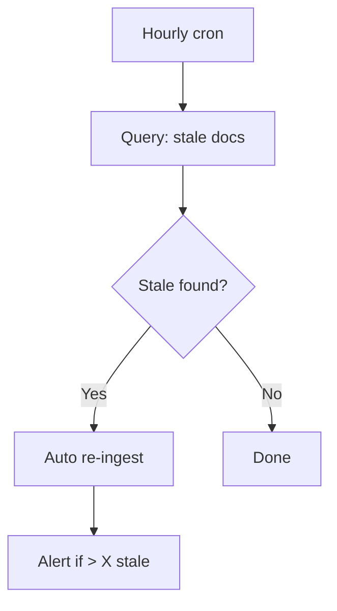

# Vector Index Stale sau Document Update

## ⚡ Tóm tắt ngắn (30s)
Refer to c5_s7_q4 + c5_s3_q13.

* **Symptom**: search returns outdated content.
* **Causes**:
  1. Webhook miss / Kafka lag.
  2. Chunk hash check fails to detect change.
  3. Embedding model upgrade incomplete.
* **Fix**: re-ingest specific doc + invalidate cache + investigate webhook reliability.

---

## 🔍 Quick fix

```java
public void emergencyReingest(UUID docId) {
    // 1. Fetch latest from source
    var latest = sourceClient.fetch(docId);
    
    // 2. Atomic replace chunks
    repo.replaceAllForDoc(docId, latest.contentHash(),
        chunker.split(latest.text()).stream()
            .map(c -> embedAndPersist(docId, c))
            .toList());
    
    // 3. Invalidate cache
    cacheInvalidator.byDoc(docId);
    
    // 4. Audit
    log.info("Emergency re-ingest doc {} version {}", docId, latest.contentHash());
}
```

## 💻 Detect stale (hourly cron)

```sql
-- Find docs where source updated but chunks not
SELECT d.id, d.updated_at, MAX(c.updated_at) AS chunk_updated
FROM documents d
JOIN rag_chunks c ON c.doc_id = d.id
WHERE d.updated_at > MAX(c.updated_at)
GROUP BY d.id
HAVING d.updated_at - MAX(c.updated_at) > INTERVAL '1 hour';
```

---

## 🎨 Detection + fix



---

## 📊 Common causes

| Cause | Fix |
| :--- | :--- |
| Webhook lost | DLQ + cron sweep |
| Embedding API rate limit | Backoff + retry queue |
| Worker crash | K8s restart + idempotent |
| Hash compare bug | Use content_hash field |

---

## ⚠️ Interviewer

**"100M chunks, daily updates 10M. How keep fresh?"**
1. Event-driven (webhook) + incremental.
2. Parallel workers autoscale.
3. Per-tenant queue priority.
4. Cron sweep for missed.
5. Monitor: queue lag, embed throughput, stale count.
6. Alert if lag > 5 min.
