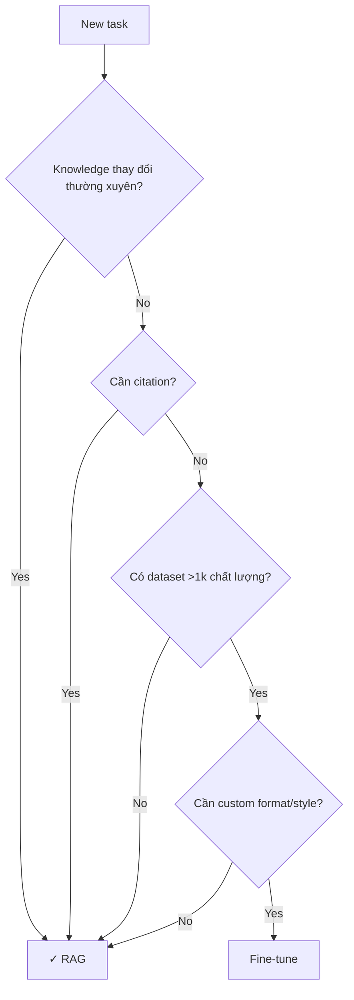

# Khi nào Chọn RAG thay vì Fine-tuning

## ⚡ Tóm tắt ngắn (30s)
* **Default**: RAG. Refer c5_s1_q13 for detail.
* **Chọn RAG khi**:
  1. **Knowledge thay đổi thường xuyên**: doc update mỗi tuần/ngày.
  2. **Cần citation/audit trail**: legal, compliance.
  3. **Knowledge nhiều và scoped (multi-tenant)**: ACL per chunk.
  4. **Domain ngôn ngữ chuẩn**: model base hiểu OK.
  5. **Limited dataset có nhãn**: < 1000 examples.
  6. **Realtime data injection cần**: news, stock, status.

---

## 🔍 Decision tree

---

## 📊 Comparison table

| Tiêu chí | RAG win | FT win |
| :--- | :--- | :--- |
| Knowledge update | ✓ realtime | ✗ retrain |
| Citation | ✓ doc-level | ✗ |
| Setup cost | ✓ low | ✗ high |
| Custom format/style | ✗ partial | ✓ |
| Runtime token cost | ✗ (context dài) | ✓ (prompt ngắn) |
| Runtime latency | ✗ retrieval +200ms | ✓ |
| Dataset cần | ✗ doc | ✓ labeled examples |

---

## ⚠️ Interviewer

**"Build chatbot for internal HR policy. RAG or FT?"**
RAG: policies update + need citation + scoped data per dept. FT not needed unless tone very specific.
