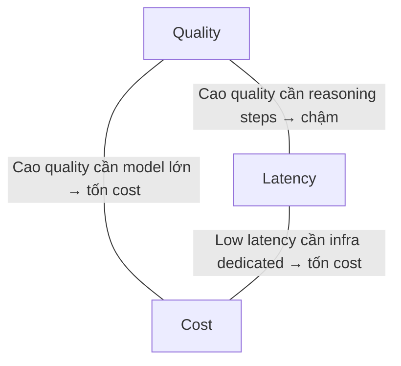

# Trade-off Quality, Latency, Cost

## ⚡ Tóm tắt ngắn (30s)
* **Triangle**: trong AI app, không thể tối ưu cả 3. Phải prioritize.
* **Examples**:
  - High quality + low latency = high cost (big model + dedicated capacity).
  - High quality + low cost = high latency (batch processing).
  - Low cost + low latency = lower quality (small model).
* **Strategy Senior**:
  1. Identify business priority (quality cho legal, latency cho UX, cost cho free tier).
  2. Tier-based routing: different tiers different tradeoffs.
  3. Caching to reduce both cost + latency on repeated.
  4. Pipeline: cheap pre-filter + expensive only when needed.

---

## 🎨 Triangle visualization



---

## 📊 Real numbers per case

| Use case | Priority | Cost | Latency | Quality |
| :--- | :--- | :---: | :---: | :---: |
| Customer chat | Latency + Quality | $0.02/req | 2s p99 | High |
| Internal FAQ | Cost | $0.005 | 3s | Medium |
| Legal review | Quality | $0.50/req | 30s | Very high |
| Batch processing | Cost | $0.001 | min | Medium |
| Realtime API | Latency | $0.05 | 500ms | High |

---

## 💻 Routing by priority

```java
public LlmConfig forUseCase(UseCase uc) {
    return switch (uc) {
        case CUSTOMER_CHAT -> LlmConfig.builder()
            .model("claude-sonnet-4-6")
            .maxTokens(800)
            .stream(true)
            .build();
        case BATCH_SUMMARIZE -> LlmConfig.builder()
            .model("claude-haiku-4-5")
            .maxTokens(500)
            .batch(true)  // batch API: cheaper, slower
            .build();
        case LEGAL_REVIEW -> LlmConfig.builder()
            .model("claude-opus-4-7")
            .maxTokens(4000)
            .stream(true)
            .build();
    };
}
```

---

## ⚠️ Interviewer

**"Free tier vs Pro tier different tradeoff?"**
- Free: cost prioritize. Haiku model, smaller context, no rerank, longer cache TTL.
- Pro: quality + latency. Sonnet model, full rerank, fresh data, no cache for personalized.
- A/B test confirm acceptable quality on cheap path.
